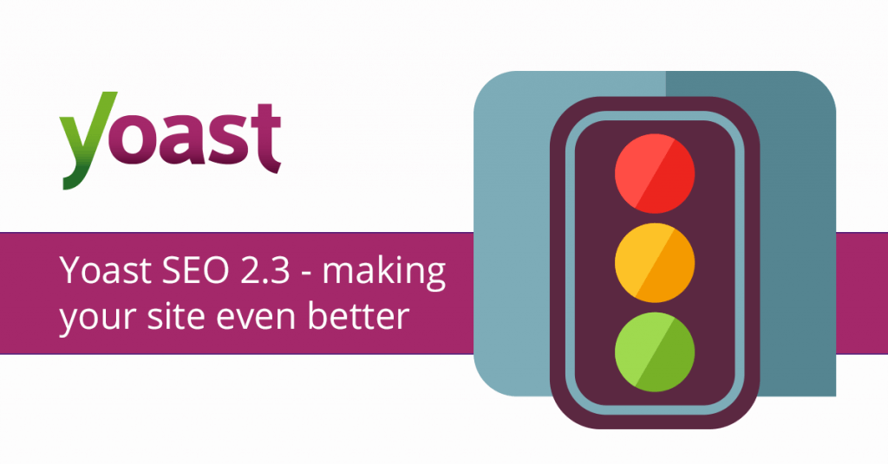

WordPress is the most popular CMS which started its journey in 2003. And now more than 35% of the total websites are powered by WordPress.

WordPress has improved a lot in the past years. But its core functions don't meet all of our needs. Most of us don't know how to code a single line. So, we need to install plugins to extend the functions of our WordPress website.

But there are 55000+ WordPress plugins! Among them 20000+ are free. So, it can easily happen that you install a vast number of unnecessary plugins and slow down your website. Doing this can even break your site and make it vulnerable to attackers.

So, I have created this list of **8 Best WordPress Plugins** to enhance your website functionality while keeping its performance and security at high.

\[fluentform id="1"\]

# 8 Best WordPress Plugins

This list of **8 Best WordPress Plugins** will help you to install only the essential WordPress plugins and not to slow down your website installing unnecessary garbage.

I have included only the top WordPress plugins. I have included the 2 best WordPress plugins for each factor, one the best and an alternative plugin in case you need something different. I have also included their prices and details to save your valuable time.

# 1\. Best WordPress Plugins for Caching

Speed is a factor that must be checked when it comes to a website. You must make your website to load under 3s (2s is better). To achieve this, you need to enable caching, minify website code, enable GZip compression, optimize your images, lazy-load your contents, and many more.

Doing all of this by yourself is a matter of headache. But these are something that must be done. So, you must hire a developer to automate the process. Or you can install a plugin that'll take care of all these for you.

## [WP Rocket](https://wp-rocket.me)

WP Rocket is the best WordPress plugin and also the most popular for speed. It'll take care of all the necessary optimization. It is full of features that you'll not need to install a second plugin for extra optimization.

#### It can:

- Automatically minify HTML, CSS & JavaScript codes
- Cache your files for faster loading speed
- Optimize images
- Lazy load your images & videos
- Enable/disable heartbeat
- Prefetch DNS
- Clean & optimize your databases

#### Pros:

- No need to install another plugin for extra optimization
- Only one-click is needed to make your site blazing fast

#### Cons:

- Doesn't have a free version

##### Price: 49$/yr. for a single site license

WPRocket is a premium plugin. It doesn't have a free plugin. It comes with a price tag of 49$ that is very reasonable.

WPRocket gives a 10% discount to all and a 20% discount to Imagify, an image optimizer plugin, users.

## Alternative Plugin

## [Swift Performance](https://swiftperformance.io)

Though Swift Performance is a new plugin and doesn't have a huge number of active installations, its capabilities are far beyond other free WordPress caching plugins. It also has a generous free version. The free version can do all the basic optimizations and also has many advanced features. You can download the free version from here.

#### It can:

- Automatically minify HTML, CSS & JavaScript codes
- Cache your files for faster loading speed
- Optimize images
- Lazy load your images & videos
- Enable/disable heartbeat
- Prefetch DNS
- Clean & optimize your databases

#### Pros:

- Has an excellent free version
- The best alternative to WP Rocket

#### Cons:

- Not that popular

##### Price: Free/ 39$/yr. for a single site license

The free version is enough for most of the bloggers. It is loaded with all the basic features you'll need. The premium version unlocks more features such as Image Optimization, Compute API, WP Cron Job management, Whitelabel, etc.

You can get a 40% discount by applying the promo code 'SEMDEV40'.

### What WordPress Caching Plugin Should You Choose?

Both WP Rocket & Swift Performance are very good at optimizing your website for performance. You'll not need to install another plugin for extra optimization. You should go for Swift Performance Lite if you want a free plugin.

# 2\. Best WordPress Plugins for SEO

SEO is a must for every blog if you want to drive more organic traffic to your website. You must do proper keyword research, get links to your website, design your website beautifully, etc.

Off-page SEO is not everything. On-page SEO or technical SEO is more important. If you haven't optimized your website for on-page SEO, you can't even qualify for off-page SEO.

On-page SEO includes submitting your XML sitemaps to search engines, optimizing your content for keywords, optimizing your URL, title, and meta description which is shown in the SERP.

## [RankMath SEO](https://rankmath.com/wordpress/plugin/seo-suite/)

RankMath is the ultimate suite for your on-page SEO. It is the swiss army knife of SEO (what its tagline says). Though it is a new plugin in its field, there is no doubt that it is the best WordPress plugin for SEO available.

According to rankmath.com RankMath has a total of 128 features! It has all the basic features important for on-page SEO. RankMath has many advanced features like a 404-page monitor, SEO audit tool, role manager, redirection manager, external link manager, etc. It also has special SEO for WooCommerce. It'll provide you with real-time insights while you are writing a post.

#### It can:

- Optimize your content for up to 5 focus keywords!
- Provide you real-time insights
- Manage redirections
- Monitor 404 pages
- Audit your website SEO
- Manage user roles
- Nofollow all of your external links with a single click
- Optimize your WooCommerce site
- Automatically generate & submit your sitemaps to Google, Bing, Yandex, Baidu, Pinterest, etc.
- Help you optimize your title, URL & meta description
- Show your Google Search Console data on your WordPress dashboard

#### Pros:

- Fully free with all features included
- Has some advanced features that other plugins don't have
- Can optimize your content up to 5 keywords
- Automatically configures your site for the best option
- Shows Google Search Console data on your WordPress Dashboard
- Constantly improving itself to add more features
- RankMath can be integrated with Elementor

#### Cons:

- Nothing!

##### Price: Free

Though RankMath is full of powerful features, it is fully free. It'll not cost you a single penny.

## Alternative Plugin

## [Yoast SEO](https://yoast.com/wordpress/plugins/seo/)

Yoast SEO is the most popular SEO plugin in the WordPress repository with more than 5 million+ active installation. It was the best SEO plugin in the past.

Yoast has all the key features important for SEO. It'll submit sitemaps to search engines and optimize your content for your preferred keyword.

Comparing to RankMath it doesn't have the advanced features that RankMath has. You can only optimize your content for 1 keyword in the free version while you can choose 5 keywords in RankMath.

If you want some advanced features like redirection manager, SEO for WooCommerce you need to buy the Premium version of Yoast SEO.

#### Pros:

- Still the most popular WordPress SEO plugin

#### Cons:

- Doesn't have advanced features
- Can only optimize your post for 1 keyword in the free version
- SEO for WooCommerce and redirect manager is only available in the Premium version
- Needs manual activation of the service

##### Price: Free/89$

Yoast SEO has a free plugin that is the most popular WordPress SEO plugin. The premium version starts at 89$/yr. for a single site license.

### What WordPress SEO Plugin Should You Choose?

SEO by RankMath is the best WordPress SEO plugin and it is fully free. Even Yoast Premium has very few features compared to RankMath.

# 3\. Best WordPress Plugins for Analytics

Analytics is very important for you if you are serious about your site. Google Analytics is a free service that can show your total visitor's count, information about your visitors, etc. metrics.

But getting used to Google Analytics takes time. Also finding advanced metrics can be difficult. So, developers have created many plugins to create this work easy for you. A WordPress analytics plugin can show your analytics data directly on your dashboard.

## [Monsterinsights](https://monsterinsights.com)

Monsterinsights is the best WordPress plugin currently available for analytics. It can show you advanced analytics data of your website directly on your dashboard.

#### Features:

- It can show information about your visitors, their age, gender, location, total visitor counts, etc.
- Universal Event Tracking
- File downloads tracking
- EU compliance

**How to setup:** First, you need to connect Google Analytics to your site. To do this you need to create a Google Analytics account. Then, install Monsterinsights on your WordPress website. Then activate the plugin and launch the setup wizard. Select the email address that is associated with your Google Analytics account.

##### Price: Free/Premium version starts at 99$/yr.

Monsterinsights has a free plugin available in the WordPress repository. It includes all the important features. The more powerful premium version starts at 99$/yr. You can get a 50% discount on all plans if you are a Monsterinsights Lite user.

The free version is more than enough for most bloggers. The premium version is good for people who need more advanced analytics data.

## Alternative Plugin

There is no viable alternative to Monsterinsights. Exactmetrics is a plugin that comes from the same developers that worked behind MonsterInsights. It has all the features that Monsterinsights has. Its free version also has the same features as Monsterinsights. It also comes from the same team that worked behind creating Monsterinsights. Its pricing structure is also very similar to Monsterinsights.

### What WordPress Analytics Plugin Should You Choose?

You should choose Monsterinsights. Also, you can use Exactmetrics. There is no difference between them. Both have a free plugin that is good for basic analytics.

# 4\. Best WordPress Plugins for Security

Security is important to all. It shouldn't be compromised a little bit. For security, a plugin isn't enough to protect your site. You should buy web hosting from a good host and install Cloudflare on your site.

A good host always keeps its hardware updated and scans for malware to keep your data safe. Cloudflare saves you from DDoS attacks, filter & block bad traffics, enable CDN, etc. It also offers a web application firewall (WAF). These are must and probably enough for your security.

Now, we come to the plugin. A plugin can help you further secure your website. It can also be very helpful if you don't use Cloudflare or have a bad hosting.

## [Sucuri Security](https://sucuri.net/wordpress-security-plugin/)

Sucuri Security is the best WordPress plugin for security. It is an all-in-one security platform that will meet all your needs.

#### It can:

- Scan your WordPress site for malware
- Protect your website from Brute Force attack by limiting login attempts and Google reCaptcha integration
- Setup a Web Application Firewall (WAF)
- Enable Sucuri CDN on your website
- Install SSL certificate

#### Pros:

- An all-in-one security platform
- It enables Sucuri CDN on your website that not only hardens security but also upgrades performance

#### Cons:

- Its free version doesn't have a firewall (WAF)

##### Price: Free/Premium version starts at 199$/yr.

Sucuri Security has a free plugin available in the WordPress repository. It has some basic features available such as front-end scanning and brute force attack protection. Its premium version is worth the price.

The premium version is an all-in-one package that not only protects your website but also enhances its performance. It makes it the best security plugin in the industry.

## Alternative Plugin

## [Wordfence Security](https://wordfence.com)

Wordfence Security is awesome and one of the top WordPress plugins for security. It is also one of the most popular WordPress plugins. Because it has a generous free version. It's free version even has a WAF.

#### It can:

- Scan your WordPress site for malware
- Protect your website from Brute Force attack
- Setup a Web Application Firewall (WAF)

#### Pros:

- Has a generous free version
- A web application firewall (WAF) is also included in the free plugin

#### Cons:

- Both in the free and premium version, it scans your website in the front-end

##### Price: Free/99$/yr. for a single site license

WordFence Security has a free WordPress plugin. It comes with a Web Application Firewall (WAF) and a malware scanner. It is enough for many people. The premium version unlocks more features that can harden your website's security.

## What WordPress Security Plugin Should You Choose?

Sucuri Security is an all-in-one security package with a CDN included for performance. If you want a free plugin then WordFence Security is better than Sucuri's free plugin with a free WAF included.

The full version of Sucuri retails at 199$. The premium version of WordFence is much lower-priced at 79$ which unlocks many security features but doesn't include a CDN like Sucuri.

\[fluentform id="1"\]

# 5\. Best WordPress Plugins for Backup

What will you do if you find your website hacked after getting up the next morning? You can do nothing but wondering “Who hacked my site?â€

But you could do something if you have had backed up your website. A good web host always keeps daily backups of your website. You can also backup using cPanel Backup Creation Wizard.

But you can also use a WordPress Plugin to do that for you. You'll also get some advanced features.

## [BlogVault](https://blogvault.net)

BlogVault is an awesome WordPress backup plugin. It not only has advanced backup features but also has security features to protect your website from malware and attacks. That makes it a 2-in-1 plugin. To me, it is the best WordPress plugin for backup.

#### It can:

- Create complete backups on a scheduled basis or on-demand
- Backup your site using Blogvault Server
- Notify you via email after creating a backup
- Save backups on BlogVault Storage
- Setup a Web Application Firewall (WAF) and scan your website for malware (You need to buy the BlogVault Plus plan)

#### Pros:

- It keeps your backup for 90 days in its server
- It has zero-load on your website performance
- It has advanced security features

#### Cons:

- Doesn't have a free version

##### Price: 89$/yr. for a single site license

BlogVault doesn't have a free plugin. But the premium version is the king of all WordPress backup plugins. Their BlogVault Plus plan at 149$/yr. unlocks the security features.

You can get a 10% discount by applying the promo code 'BLID10OFFBV' at checkout.

## Alternative Plugin

## [UpdraftPlus](https://updraftplus.com)

UpdraftPlus is the most popular WordPress plugin for backup and a great alternative to Blogvault. The main reason behind its popularity is that it has a generous free version. The free version is good enough to satisfy the need of most people.

#### It can:

- Create complete backups on a scheduled basis or on-demand
- Automatically uploads your backup to Google Drive, Amazon S3, FTP, SFTP, etc.
- Notify you via email after creating a backup

#### Pros:

- Has a generous free version
- Automatically uploads your backup to remote locations

#### Cons:

- Backups your files on the front-end. So, it can cause a slight load if are on an extremely tight hosting plan

##### Price: Free/Premium version starts at 70$/yr.

The free version of UpdraftPlus has all the features listed above. The premium version unlocks many features such as complete backup, database encryption, website migration, etc.

### What WordPress Backup Plugin Should You Choose?

BlogVault is a better choice than UpdraftPlus. It is a premium plugin and comes with many advanced features. But if you want a free plugin then go for UpdraftPlus.

# 6\. Best WordPress Plugins for Building Pages

Every website needs some pages and posts. Your website also needs it. But you need some coding knowledge to design a beautiful page.

But everyone wants to focus on growing their blog or business, not into learning codes. So, it's where a visual drag-and-drop page builder will help you. You'll not need to touch a single line of code.

WordPress comes with a default block editor named Gutenberg. It is good but not enough for serious people. However, you can extend its functionality by installing some add-ons. Or just install a great WordPress page builder plugin and create an amazing website.

## [WPBakery (Visual Composer)](https://wpbakery.com)

WPBakery is one of the best WordPress plugins for building pages. It was previously named as Visual Composer. It has so many elements and widgets that you'll not need to touch code for extra customization.

#### Features:

- An intuitive front-end editor and an award-winning backend editor
- 250+ unique addons & 50+ content elements
- A large library of downloadable templates

#### Pros:

- Works with any WordPress theme
- Fast editing with templates and presets
- Extendable with API
- Fully compatible with all of the popular plugins

#### Cons:

- Doesn't have a free version

##### Price: 45$ one-time fee

WPBakery is robust with features. But comes with a price tag of just 45$ onetime fee. The price is very reasonable considering the features it comes with.

## Alternative Plugin

## [Elementor](https://elementor.com)

Elementor is the most popular WordPress page builder plugin. It has 5 million+ active installations. That says how powerful it is!

#### Features:

- Amazing front-end & backend editor
- 50+ content elements & 90+ Widgets
- 300+ pre-built downloadable templates

#### Pros:

- Has an awesome free plugin
- Much more than a page-builder
- Fully compatible with the popular plugins
- Extendable with API

#### Cons:

- Nothing to say

##### Price: Free/ 49$/yr. for a single site license

The free version of Elementor is a very good choice for beginners. The premium version starts at 49$ for 1, 99$ for 3, and 199$ for unlimited site licenses. The premium version unlocks all the features that you need to make an awesome website in minutes without knowing code.

## Another great Page-builder plugin

## [SiteOrigin Site Builder](https://siteorigin.com/page-builder/)

SiteOrigin is a free page builder plugin. It is one of the most popular page-builder because of its popularity. It has more than 1,000,000 active installations.

SiteOrigin comes with a widget bundle. They are constantly adding new widgets to it. SiteOrigin widgets are not only limited to Siteorigin. So, your website will not get broken even if you deactivate the plugin.

The major downside of SiteOrigin is that it lacks true inline front-end editing. It misses the point-and-click feature. But still, it is giving you many premium options as a free plugin.

SiteOrigin has a premium addon that comes at only 29$ with premium support and 7 new features.

### What WordPress Page Builder Plugin Should You Choose?

WPBakery and Elementor both are great premium drag-and-drop page builders. You can go for WPBakery if you want a smoother experience. Elementor is also good if you want more widgets.

If you need a free plugin then go for Elementor or SiteOrigin. SiteOrigin has many free widgets. Elementor has a great free plugin and there are many free 3rd party extensions for Elementor that can add premium elements to it.

# 7\. Best WordPress Plugins for Contact Forms

You need some forms on your website for collecting leads. Such as a contact form, a newsletter form, etc. WordPress doesn't come with a default form builder. So, you'll need to create a form by coding or just install a form builder plugin.

## [Fluent Forms](https://wpmanageninja.com/wp-fluent-form/)

Fluent Forms is the best WordPress plugin for creating forms. Though it is not that popular, it has more features and a great pricing structure compared to other form-builder plugins.

#### Features:

- 30+ input fields
- 60+ prebuilt form layouts
- Conditional logic
- 4 prebuilt templates to start working
- Entry management

#### Pros:

- Has a powerful free version that includes 25+ input fields
- Conditional logic & entry management are included in both free and paid version
- Has a layout field for creating multi-column layouts that other plugins don't have
- Great pricing structure
- Form submission by AJAX

#### Cons:

- Nothing!

##### Price: Free/ 59$/yr. or 199$/lifetime for a single site license

The free plugin is enough for creating advanced forms. Free Mailchimp and Slack integration are also available. The premium version at 59$ for a single site license unlocks all the features. You'll not find any other form-builder plugin unlocking all features at this price.

You can get a 30% discount by applying the promo code 'FluentDeal' at checkout

## Alternative Plugin

## [WPForms](https://wpforms.com)

WPForms is the most popular and to many people the best WordPress plugin for contact forms. It has 3+ million active installations. That says how popular it is.

#### Features:

- 23 input fields
- Conditional logic
- 3 prebuilt templates to start working
- Entry management

#### Pros:

- The most popular WordPress form builder plugin
- Payment gateway fields are available
- Zapier integration is available

#### Cons:

- The free version only has 10 input fields
- Layout fields are not available

##### Price: Free/ Premium version starts at 39$ per year

WPForms has a Lite version which is free. It can be used to create simple forms. To create advanced forms, you need to upgrade to a premium plan. The premium plans range from as low as 39$ to 299$ which unlocks all the features.

## Another great plugin for contact forms

## [Contact Form 7](//contactform7.com)

Contact Form 7 is still the most popular WordPress Form Builder plugin with more than 5,000,000 active installations. But why I didn't list it is it is not user friendly and also needs some coding knowledge.

It works based on templates. Also, you need to know basic HTML & CSS codes to create a form. A live preview is also not available. You also need to use install a service like Flamingo to store collected leads.

But still, it is the best WordPress plugin for contact forms, because you can create any type of form with it. It has the highest level of customization. It just needs learning a little HTML & CSS code. It has also the highest number of available addons and integrations. Also, it is a fully free plugin.

### What WordPress Form Builder Plugin Should You Choose?

Fluent Forms is a much better choice than WPForms. It has more input fields & integrations.

Fluent Forms also has a better free plugin more free input fields & integrations. The free plugin also supports conditional logic and entry management.

But if you want to collect payments or need Zapier integration then Fluent Forms don't have them, you need to buy WPForms.

# 8\. Best WordPress Plugins for Social Sharing

Social sharing is very important for driving traffic to your website. Billions of people spend their time on social media. So, it is a good platform to share your posts.

A social sharing plugin will help you add Facebook, Twitter, Pinterest, LinkedIn, etc. share buttons on various places of your website.

While adding social share buttons on your website, keep in mind that every button and image add weights. So, if you overuse, it can result in a slow page loading speed.

## [Social Snap](https://socialsnap.com/)

Social Snap is a newcomer in its field but more robust with features. It is the new king of social sharing and a great alternative to Social Warfare users. It is one of the top WordPress plugins for social sharing.

#### It can:

- Place share buttons anywhere
- Display share buttons of 30+ social networks
- Count shares via API & Click Tracking
- Set a minimum share count rule
- Control how your posts look on Social Media
- Show different share buttons on different devices
- Recover your lost share counts
- Automatically share your new or old posts

#### Pros:

- Easy to use
- Robust with features
- Google Analytics integrated
- Highly customizable

#### Cons:

- Nothing to say

##### Price: Free/ Premium version starts at 39$/yr.

Social Snap has a free version available in the WordPress repository. The free includes basic features such as adding share buttons above & below posts, on images or adding floating sidebar. The premium ranges from 39$ to 299$ which unlocks all the features.

You can get a 10% discount by applying the promo code 'WPEXPLORER' at checkout.

## Alternative Plugin

## [AddToAny](https://addtoany.com)

AddToAny is a free WordPress Social Sharing plugin and has more than 1,000,000 active installations. People love this plugin not only for it is free but it has a universal sharing button that no other plugin has.

#### It can:

- Add share buttons above or below post, also it can add a floating sidebar
- Display share buttons of 96 social networks!
- Add a share counter
- Set a minimum share count rule
- Share your post on all social with just one click!

#### Pros:

- It has a universal share button that no other plugin has
- Google Analytics integrated
- Uses SVG icons to display share buttons that make your website to load fast.

#### Cons:

- Nothing to say

##### Price: Free

AddToAny is fully free. It doesn't even have a premium version available. It makes AddToAny an excellent choice to use as your WordPress Social Sharing plugin.

#### What WordPress Social Sharing Plugin Should You Choose?

Social Snap is full of features and has great icon designs. It's a great premium plugin. But if you want a free plugin, AddToAny is for you. It is a fully free plugin.

AddToAny has access to more social networks than Social Snap (96 social networks). It also can add a Universal share button that no other plugins can. It makes AddToAny one of the best WordPress plugins.

## Here the list of 8 Best WordPress Plugins ends...

Here ends the list of **8 Best WordPress Plugins**. I think you have installed only the top WordPress plugins. Don't forget to share your thoughts in the comments section.

\[fluentform id="1"\]
