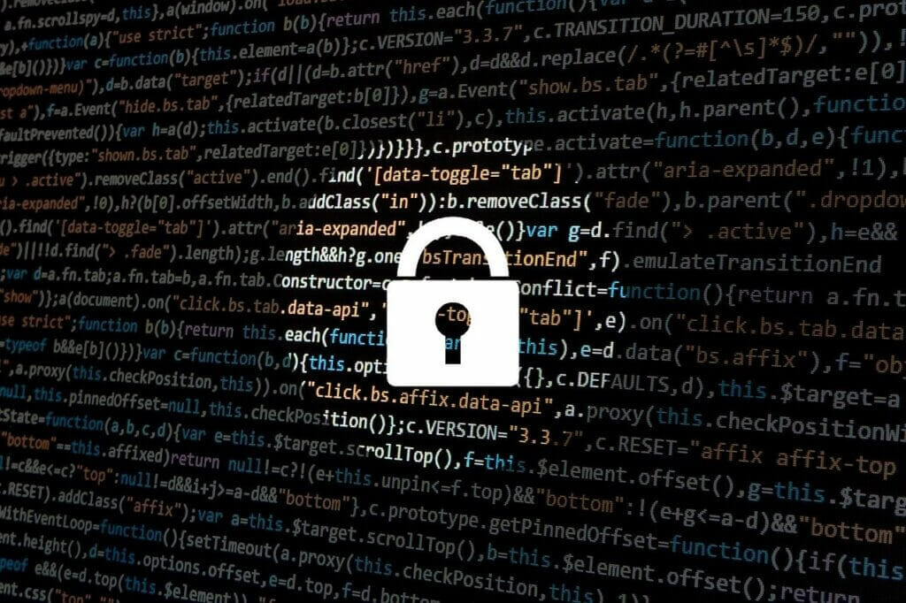
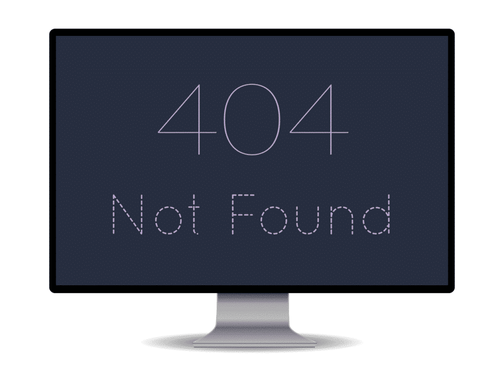
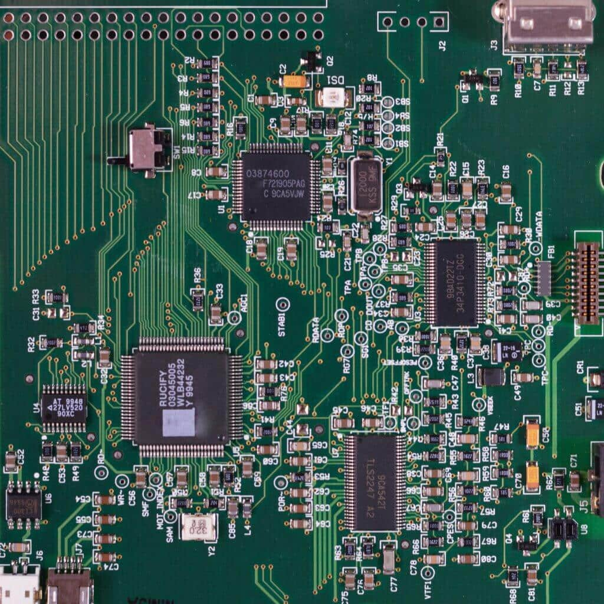
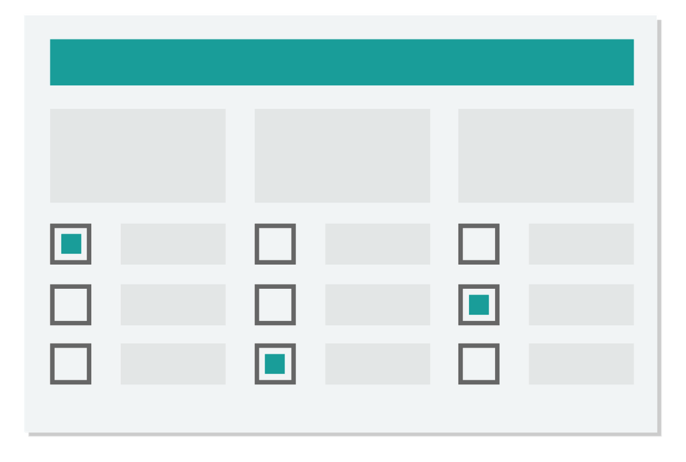
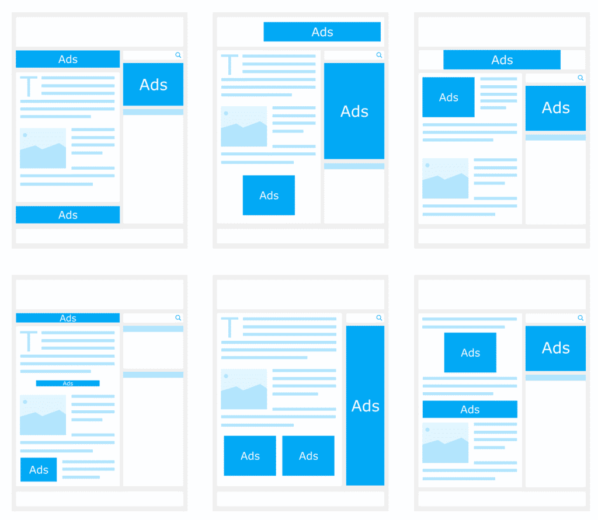
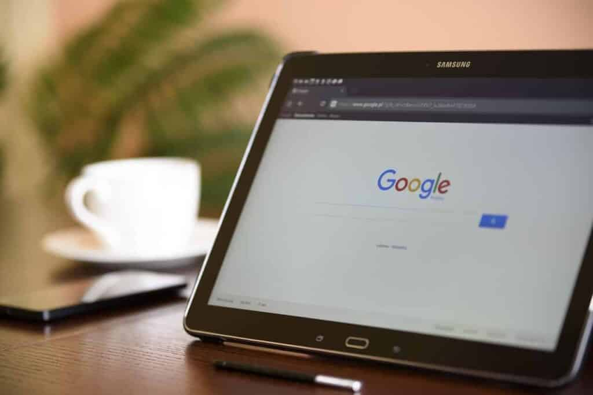
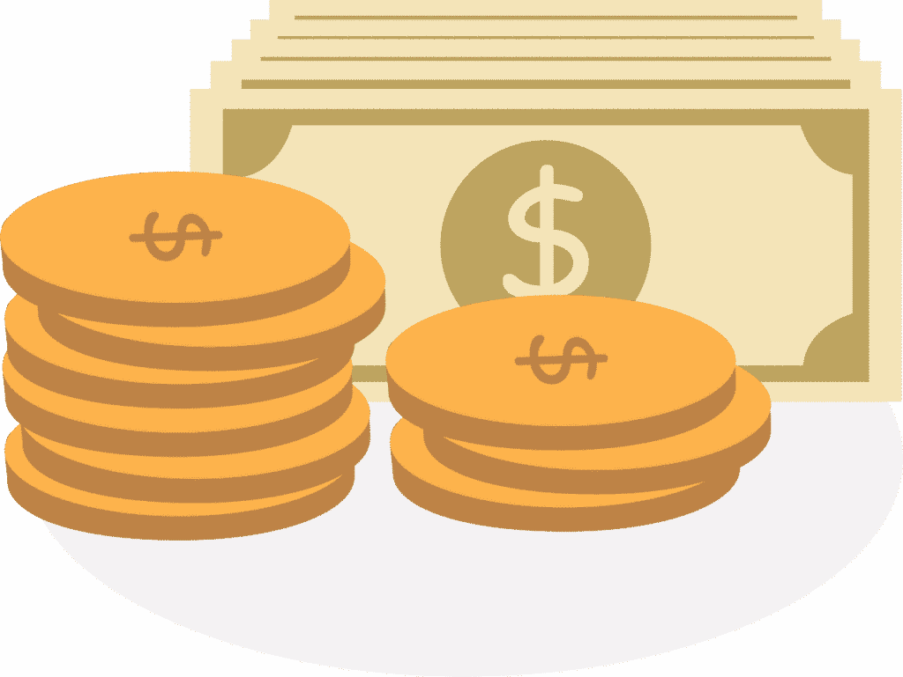
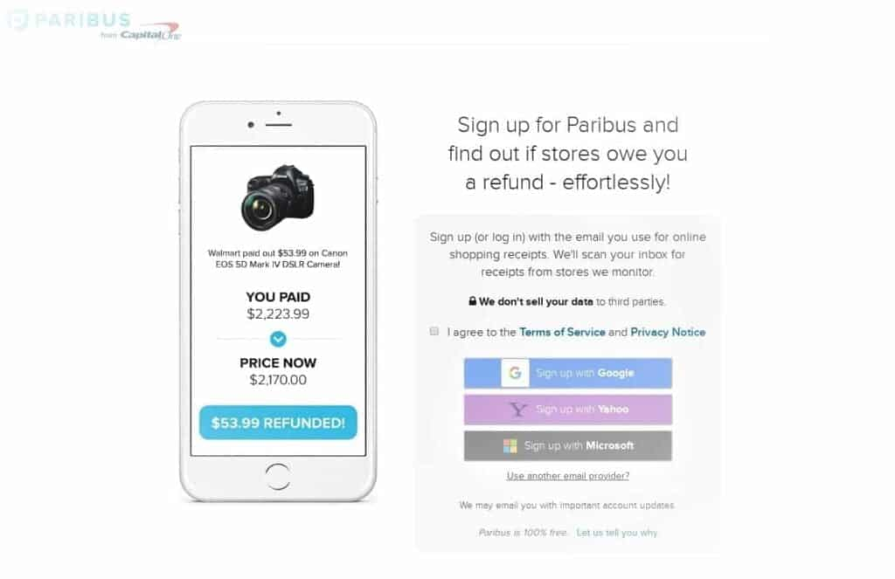
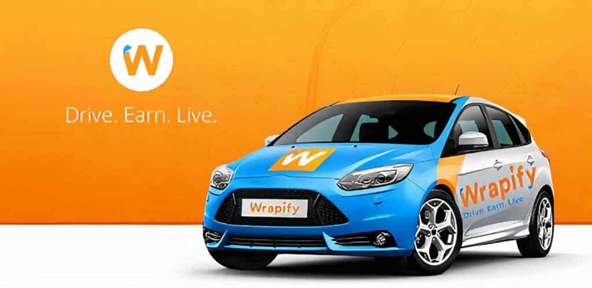
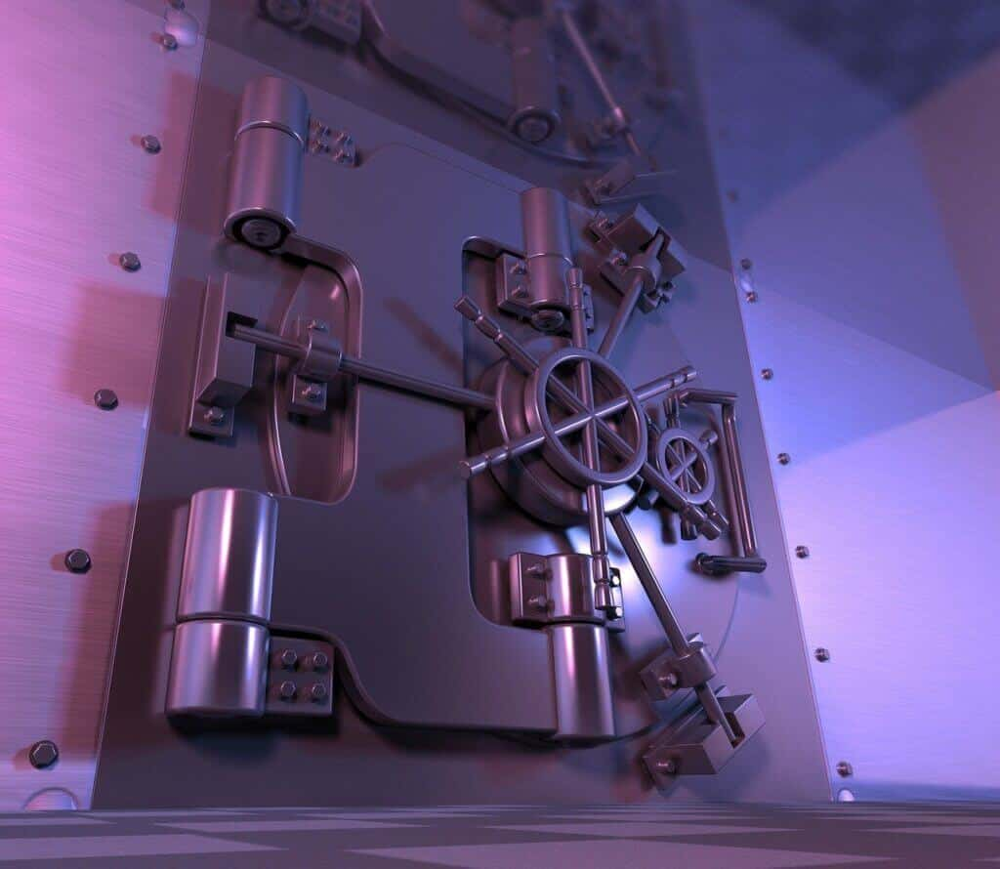

The world has completely changed after the invention of the internet. Now people are all-time online. We can't think of a single moment without it.

And people are not only addicted to browsing the internet. It is being used for many great purposes. Most people are increasingly looking for how to earn money online as the internet is growing big.

The first website was launched in 1991. And now, there are around 198 million active websites, according to the _[\_October 2020 Web Server Survey_ of _Netcraft_](https://news.netcraft.com/archives/2020/10/21/october-2020-web-server-survey.html). Plus, there are over a billion dead websites!\_

These immense amounts of websites have opened up numerous opportunities to earn money online. Even some websites let you make _free money_! You won't have to spend a single dime to earn those!

# 16 Ways How to Make Free Money Online

But don't get confused by the word _free._ Nothing in this world you can get for free. You'll have to work to earn money.

Due to the internet, earning money has become a lot easy in some cases. So, you may be able to make some money in your free time. Sometimes, you may get paid for what you do every day.

I have searched hard and come up with _**16 Ways to Make Free Money Online**_. I will talk about each one of the methods. Don't forget to notify me in the comments if I miss any excellent ideas.

Let's jump into the topic without talking further.

## 1\. Sell your Private Data

Data is the new property of this modern world. Big companies like Facebook & Google track every movement of our finger & cursor. And they analyze it to make billions of dollars.

A good example is *targeted ads* from Facebook. Facebook analyzes our browser cookies and past behavior to show us the most relevant ads. Many websites use our data for various purposes. But we don't get paid a single penny for it.

We are using their service after agreeing with their terms & conditions. So, we can't claim that they're illegally using our data. But it is unfair none the less.

But many market research companies are wishing to pay you for your data. You've to do nothing but install their apps and keep them. It'll collect your usage data and, you'll get paid yearly, monthly, or weekly for it.

[Nielsen Panel](https://computermobilepanel.nielsen.com/ui/US/en/sdp/landing) is one such app. You just have to install the app and keep it. You can get around $50 a year.

If you think $50/yr is less, then the [Screenwise Panel](https://screenwisepanel.com/member/Index.aspx?lang=0) powered by the giant Google and Ipsos is for you. You can earn up to $7/week and $350/yr. You'll also get a $50 bonus for connecting it to your router and TV and $5 for connecting to your smartphone, tablet, and browser. But one problem, households are randomly selected for joining the panel. So, you can't join it unless you get an invitation.

Some other great apps like these are [DataWallet](https://www.datawallet.com/datawallet-3/) ($1-$50 every 2 months), [Placed Panel](https://getpanelapp.com/) (around $50/yr.), [Smart Panel](https://smartapp.io/) ($110/yr.).

### **How Much Free Money Can You Make Online Selling Your Data**

Selling usage data is an excellent way to make free money. You'll not get rich by installing these apps. But you'll get something rather than getting nothing. And it's also not a bad deal. If I add all of the earnings from these 6 apps, then you can earn up to $1,000 a year! And whatever you get is free! Also, there are more apps like these!! Just do some searches on Google.

### Essential Apps & Websites: [Screenwise Panel](https://screenwisepanel.com/member/Index.aspx?lang=0), [Smart Panel](https://smartapp.io/), [Nielsen Panel](https://computermobilepanel.nielsen.com/ui/US/en/sdp/landing), [Placed Panel](https://getpanelapp.com/), [DataWallet](https://www.datawallet.com/datawallet-3/)

## 2\. Walk

Yes! You heard it right! You can make free money just by walking! Though you can't leave your day job, you'll get rewarded for something that you're already doing every day.

Many apps pay for walking, exercising, eating healthy food, etc. Though you can't make more than some cents doing these, you're doing nothing extra. Some apps let you take some high-paying health surveys. You can also get discounts on various products using these apps. Overall, it's a *healthy* way to earn money online!

[Charity Miles](https://charitymiles.org/) is such an app that pays for walking. It'll show you ads while you walk. It'll pay you 25 cents/mile you walk and 10 cents/mile you make bicycling.

Another program called [People Walker](https://www.facebook.com/thepeoplewalker/) lets you hire a partner to walk with. Or, you can be that partner to get paid! You can charge around $7 per mile.

[Achievement](https://www.myachievement.com/) is another app where you'll earn points for doing various tasks, such as taking health surveys, referring friends, walking, exercising, etc. You can redeem a $10 gift card once you accumulate 10,000 points. You can also get bonuses. If you only walk, you may need 4-months to earn 10,000 points! But, some people even earn around $100 every 4 months by taking health surveys and doing other things.

### \***\*How Much Free Money Can You Make** Online Walking\*\*

I have already discussed how much money you can make using each app. You'll not make much from these apps. But whatever you earn is for something that you do every day.

### **Essential Website & Apps:** [**Charity Miles**](https://charitymiles.org/)**,** [**Achievement**](https://www.myachievement.com/)**,** [**People Walker**](https://www.facebook.com/thepeoplewalker/)**,** [**SweatCoin**](https://sweatco.in/)

**_Note:_** _You can't make money using Charity Miles. They donate your money on your behalf to your selected charity. They've already donated over $2,500,000._

## 3\. Play Games

Playing games is the largest source of entertainment for most young people. We all love playing games. And what is better than making free money playing games?!

The best way to earn money, in this case, is by starting a [Twitch](https://www.twitch.tv/) or YouTube channel. You can stream your gameplay and upload the videos to your channel to generate revenue. Another excellent way is blogging about gaming.

You can also offer services on freelancing sites. Such as game-testing or game-training. [Fiverr](https://www.fiverr.com/) is an excellent platform for this.

There are also some apps and websites that let you make free money by playing games directly. [MistPlay](https://www.mistplay.com/), [Gamesville](https://www.gamesville.com/), [Swagbucks](https://www.swagbucks.com/) are three among those.

[SecondLife](https://secondlife.com/) is another game where you can start your second life and earn Linden Dollars. Then, you can convert your LDs into real $$$!

### \***\*How Much Free Money Can You Make\*\*** **Online Playing Games**

I have already discussed how much money you can make from a YouTube channel. And the highest-earning gamer in Twitch, Ninja (Richard Blevins) Gamer, makes more than $400K/mo! As his earnings aren't disclosed, some think that he earns $800K+ per month!!

The job of a game tester is also well-paid. In the US, the annual salary of a game tester starts at around $20K and can go beyond $120K!!

The apps and websites where you can make money by directly playing games are also great. Though you'll not make thousands of dollars like the above jobs, you'll get something while enjoying the exciting games. Some SecondLife gamers make more than $1,000 per month.

### Essential Websites & Apps: [Twitch](https://www.twitch.tv/), [YouTube](https://youtube.com/), [Fiverr](https://www.fiverr.com/), [SecondLife](https://secondlife.com/), [MistPlay](https://www.mistplay.com/), [Gamesville](https://www.gamesville.com/), [Swagbucks](https://www.swagbucks.com/), [InboxDollars](https://www.inboxdollars.com/)

## 4\. Test Websites & Apps

Every website & app needs to be working and user-friendly. So, it needs some testing from an expert to become assured that everything is working fine. An expert can tell what is missing and what can be done to further extend the functionalities of a website and app.

If you know the basics of a website or app, and have a keen eye for UI, then you can earn a decent amount of money testing websites and apps.

As a tester, you'll need to check a website for errors, poor-design, and missing elements. You also have to check what should be done to improve the functions of the site.

Most of the user-testing websites require a screen-recorded video of the testing. So, you've to install a screen-recording tool to record your screen and your voice. [_OBSProject_](https://obsproject.com/) is a great free tool for this.

### \***\*How Much Free Money Can You Make** Online Testing Websites and Apps\*\*

Website-testing is a well-paid job. The average payout is around $10 for 15-20-minute testing and $20-$25 for 60-minute. Occasionally you'll get even more. Sometimes, you'll make 2X-4X than that!!!

### Essential Websites & Apps: [UserTesting](https://www.usertesting.com/), [Enroll](https://enrollapp.com/), [TryMyUI](https://www.trymyui.com/), [Userlytics](https://www.userlytics.com/), [Userfeel](https://www.userfeel.com/)

## 5\. Do Microtasks

Micro tasking is getting much popular day by day. A microtask is a task that can be done in a few seconds or minutes. Generally, an employer splits a job into hundreds or thousands of microtasks. And, the tasker gets paid for each microtask he completes.

The pay can be anywhere between $0.02 to $2 for a microtask. Though it's less, you can complete many tasks in an hour. It usually takes around three minutes to complete a task.

**_Note:_** _Though micro-tasking is getting popular, it is also getting a lot cheaper. And as an employer pays only after getting his works done, he can fraud you easily. And if you file a complaint report, forget about getting a reply. Also, most of the employers ask for illegal and immoral things. Such as pageviews, filling up surveys, boosting search ranking, etc. So, there is a high risk involved in it also._

### \***\*How Much Free Money Can You Make** Online Doing Microtasks\*\*

Micro-tasking has become a lot cheaper. Gone are the days when you could make $60/hr doing it. You'll earn as high as $10/hr now. And you can get even around $1 an hour! It's just peanuts comparing to the time spent. So, it may only work if you live in an area where living-cost is extremely low.

### Essential Websites & Apps: [Amazon Mechanical Turk](https://www.mturk.com/), [ClickWorker](https://www.clickworker.com/), [Picoworkers](https://picoworkers.com/), [Microworkers](https://www.microworkers.com/), [Rapidworkers](https://rapidworkers.com/)

## 6\. Sell your Emails

Now and then, we receive junk emails in our inbox. But how would it be if you could make money from it? Yes, you heard it right! There's a company called [SBKC](https://www.sbkcenter.com/) (Small Business Knowledge Center) that pays for junk mails.

But why will they pay you for those junks? Because they conduct researches on junk mails. And as you're helping them, they're rewarding you with free money.

You just need to fill up a form and send them for approval. If you get approved, you'll get paid for your junk mails. One major con of SBKC is, they only work in the US & Canada. So, you may not get approved if you're outside of these two countries.

SBKC members are called _Panelist_. General panelists are called _Consumer Panelist_. But if you're a business owner or self-employed, you can join as a _Producer Panelist_.

You'll receive a prepaid envelope every month from SBKC. You need to put your junk mails in it and send it to them. But you can send your junk emails anytime. You just have to forward those to SBKC.

### \***\*How Much Free Money Can You Make** Online Selling your Junk Mails\*\*

You'll earn points for every junk mail. When you'll have accumulated 2000 points, you'll be able to withdraw a $20 gift card. It isn't much, but it can be a good source of passive income if you receive a lot of junk mails every month.

It can take 6-10 weeks to get a $20 gift card, but if you have a business, you may just need around a week or less.

### Essential Websites & Apps: [SBKC](https://www.sbkcenter.com/)

## 7\. Participate in Online Surveys

Many market research companies conduct surveys to fit their products according to the needs of consumers. And they reward their members for participating. You can also make some quick money just filling up some forms.

You can get around $1 per survey. Some survey sites like [Pinecone Research](https://www.pineconeresearch.com/) and [Vindale Research](https://www.vindale.com/) pay more like $3 or even more per survey. But there are some low-paying sites also.

Every survey site or panel has a limited number of surveys available for each member per month. So, you have to sign up to as many survey sites as possible to make a decent amount of money from paid surveys.

**How Much Money Can You Earn Online Participating in Surveys**

It just takes a few minutes to complete a form. So, you'll be able to participate in 5, 10, or even more surveys an hour. That's an easy $10-$20 an hour doing some fun works!

### Essential Websites & Apps: [SurveyJunkie](https://www.surveyjunkie.com/), [Swagbucks](https://www.swagbucks.com/) ($5 sign-up bonus), [InboxDollars](https://www.inboxdollars.com/) ($5 sign-up bonus), [LifePoints](https://www.lifepointspanel.com/), [Pinecone Research](https://www.pineconeresearch.com/), [Vindale Research](https://www.vindale.com/), [OnePoll](https://www.onepoll.com/panel/)

## 8\. Join a GPT Website

A GPT website is a website where you *Get Paid To* do various things. Though the primary way is filling up surveys, you've access to tens of other ways to make some quick bucks!

You can watch videos, ads, fill up surveys, do mini-jobs, complete offers, answer quizzes, play games, etc. to make money on GPT sites. There are also some other ways like coupons, special offers, cashback deals, joining other survey networks, etc.

A good GPT website also gives great discounts on booking flights & hotel rooms. You can also redeem cashbacks on your daily purchases. And not only can you get discounts and cashback, but you can also get points worth 10-12 times more than the amount of money you have saved!

There are numerous GPT sites on the internet. Many of them are scams. Again, many of them only work in the US and some other first-world countries. So, check out every website before spending time on them.

Some great and legit GPT websites are [ySense](https://ysense.com/) (formerly ClixSense), [Swagbucks](https://www.swagbucks.com/), [CashCrate](https://www.cashcrate.com/), [InboxDollars](https://www.inboxdollars.com/) ([InboxPounds](https://www.inboxpounds.co.uk/) in the UK), [Neobux](https://www.neobux.com/), etc. Among these, CashCrate is available in the highest number of regions. [OMD!](https://ohmydosh.co.uk/) (Oh My Dosh!) is another new GPT website.

### \***\*How Much Free Money Can You Make** Online from GPT Websites\*\*

A GPT website provides some fun ways to make money in the free time. Though it'll not help you to be a millionaire, you can make around $10 an hour easily. And, some people are making a decent amount of passive income from their referrals.

### Essential Websites & Apps: [ySense](https://ysense.com/), [Swagbucks](https://www.swagbucks.com/), [InboxDollars](https://www.inboxdollars.com/), [Neobux](https://www.neobux.com/), [CashCrate](https://www.cashcrate.com/), [Oh My Dosh!](https://ohmydosh.co.uk/)

## 9\. Watch Advertisements

No one likes _advertisements_. But what if you get paid for watching them? Yeah, You heard it right! You can make free money online by watching advertisements also.

Many websites pay for watching ads. [Swagbucks](https://www.swagbucks.com/), [InboxDollars](https://www.inboxdollars.com/) are two among them. They also let you play games, answer questions, watch videos, take surveys besides watching ads to make more money.

[SlideJoy](https://www.getslidejoy.com/use) is another app available for Android and iOS. It shows an ad on the screen whenever someone tries to unlock the phone. You can dismiss the ad or click on the ad. Fortunately, you'll get the same amount of money! And, considering how many times you unlock your phone-screen a day, it's a great app to earn money watching ads.

PTC (Paid to Click) sites like [Neobux](https://www.neobux.com/), [Scarlet-Clicks](https://www.scarlet-clicks.info/) also pay for watching ads. You'll only earn just some cents. But many people make hundreds of dollars daily from a PTC site just properly executing a strategy. They just buy a lot of referrals. And those referrals generate a decent amount of passive income every day.

### \***\*How Much Free Money Can You Make** Online Watching Advertisements\*\*

You can expect to get around $0.001-$0.02 per ad on a PTC or GPT website. And, if you can watch six ads in a minute, then you'll earn as low as $0.36 to as high as $7.2 per hour.

But a website doesn't have thousands of ads available to watch. So, you'll only earn a few cents a day even if you get the highest rate for an ad possible. But you can make a lot from referrals.

You can earn $10-$15 monthly by just unlocking the phone screen using Slidejoy. That's great for doing absolutely nothing. You may think that you'll be able to make 20X-100X more money if you spend all the time behind Slidejoy. But that will be nothing but a waste of time.

### Essential Websites & Apps: [SlideJoy](https://www.getslidejoy.com/use), [Neobux](https://www.neobux.com/), [Ojooo Wad](https://wad.ojooo.com/), [Scarlet-Clicks](https://www.scarlet-clicks.info/), [Ayuwage](https://www.ayuwage.com/), [Innocurrent](https://www.innocurrent.com/), [Swagbucks](https://www.swagbucks.com/), [InboxDollars](https://www.inboxdollars.com/)

## 10\. Watch Videos

Watching videos is another easy way to make free money online. It's very much like making money watching advertisements. We spend much of our spare time watching videos on YouTube, social media, and ads. So, you're getting paid for something you're already doing.

There are many ways to make money by watching videos. Such as [iRazoo](https://www.irazoo.com/), [Swagbucks](https://www.swagbucks.com/), [InboxDollars](https://www.inboxdollars.com/), [SuccessBux](https://www.successbux.com/), etc. websites pay for viewing a variety of short videos. You'll not get much by watching videos on these websites. But they provide a lot of options to earn money alongside just videos.

[SlideJoy](https://www.getslidejoy.com/use) is another app that pays for watching videos. I've already said that it's an excellent app for making money online by watching ads. But it's also great if you want to make money watching videos.

[Viggle](https://viggleinc.com/) is another app to earn money by watching videos. You just have to tap the app when you're streaming Amazon, Netflix, or Hulu. You'll get 1 point per minute. In some shows, you can get even 10 points per minute. You can also get bonuses on some new shows. It also offers in-show games to earn a bit more points.

Nielsen also has a program called [Nielsen Digital Voice](http://digitalvoice.nielsen.com/) that pays for watching videos. You can earn up to $1,000 a month! Though you can't get $1,000 by just watching videos.

Another way to earn money online watching videos is by writing subtitles for videos. You can offer your service on freelancing sites.

**_Note:_** _Keep in mind that many people will try to pay you to watch their YouTube videos. But keep in mind that it is illegal, and you must avoid them._

### \***\*How Much Free Money Can You Make** Online Watching Videos\*\*

You can expect to earn a few cents to a few bucks per hour for watching videos. Though it's less, it is free.

In the US, a subtitle writer earns $23/hr on average. It translates into an annual salary of $46K (ranges between $35K-$60K)!

### Essential Websites & Apps: [iRazoo](https://www.irazoo.com/), [Swagbucks](https://www.swagbucks.com/), [InboxDollars](https://www.inboxdollars.com/), [SuccessBux](https://www.successbux.com/), [SlideJoy](https://www.getslidejoy.com/use), [Viggle](https://viggleinc.com/), [Nielsen Digital Voice](http://digitalvoice.nielsen.com/), [Fiverr](https://www.fiverr.com/), [Freelancer.com](https://www.freelancer.com/), [Upwork](https://www.upwork.com/)

## 11\. Search the Web

More than 40 billion searches are made a month on Google. And there are other search engines also. Every day, we search for this and that online. Probably you've also come to my blog from a Google search.

What if you could make money by just searching the web? Yes, you can make money simply searching!

[Qmee](https://www.qmee.com/), a chrome extension, pays money for searching. It shows ads on the sidebar of a search result. You can get some cents if you click on an ad. One major pro of Qmee is that there's no minimum payout threshold. So, you can cash out any amount of money you've made with Qmee. You can donate the money also.

Microsoft also has a reward program named [Microsoft Rewards](https://www.microsoft.com/en-us/rewards). You'll earn points for every Bing searches and for shopping online. Every 1,000 points are equal to $1.

The problem is there are some quotas. And no point is counted after meeting the limits.

There are also two levels. If you level up, you'll be able to earn more points.

[Swagbucks](https://www.swagbucks.com/default-your-search) also pays for using its own search engine instead of the favorite Google and Bing.

**_Note:_** _Swagbucks doesn't have a search engine of its own. It collects the data from Yahoo._

### \***\*How Much Free Money Can You Make** Online Searching\*\*

You can earn anywhere between $0.05 to $1 per search in Qmee and up to $0.39 per search in SwagBucks. Microsoft Rewards allows you to get a maximum of 9600 points per month if you're at level 2. That is equal to $9.6. Though it is not much, it can be a passive income if you are a savvy Bing user.

### Essential Websites & Apps: [Qmee](https://www.qmee.com/), [Microsoft Rewards](https://www.microsoft.com/en-us/rewards), [Swagbucks](https://www.swagbucks.com/default-your-search)

## 12\. Answer Questions

Are you an expert on a subject? Do you think that you can answer any questions on that topic? If your answer is yes, then you can make a decent amount of money answering questions online.

People ask millions of questions every day online on forums, social media, and other websites. But many questions remain unanswered.

Again many questions are not answered satisfactorily. So, many people are willing to pay from their pockets to get their problems cleared.

[JustAnswer](https://www.justanswer.com/) is a website that is entirely dedicated to answering questions for a fee. At JustAnswer, anyone can ask their questions. And the experts can answer them to get paid.

[PrestoExperts](https://www.prestoexperts.com/) is another excellent website. You'll have to answer questions via phone calls here. You can set your fee from $2/min and up. Another two great alternatives are [Experts123](https://www.experts123.com/) and [FixYa](https://www.fixya.com/).

### \***\*How Much Free Money Can You Make** Online Answering Questions\*\*

For every question you answer at JustAnswer, you earn 20-50% of what the questioner has paid. You'll get more as you level up.

The minimum price of a question at JustAnswer is $15. And the average is around $30. But it can be as high as $100. So, you'll earn at least $3-$7.5 according to your level and as high as $50 per question!!

You'll earn at least $1.17/min or $70.2/hr as a PrestoExpert, after deducting all the fees! If you are answering questions via text messages on one of the websites below, you can get around $0.10 per answer.

### Essential Websites & Apps: [JustAnswer](https://www.justanswer.com/), [PrestoExperts](https://www.prestoexperts.com/), [Experts123](https://www.experts123.com/), [FixYa](https://www.fixya.com/), [HelpOwl](https://www.helpowl.com/answer_question.php), [Earn](https://www.coinbase.com/earn), [StudyPool](https://www.studypool.com/), [1Q](https://1q.com/members/register), [AskWonder](https://askwonder.com/)

## 13\. Get Cashback on Purchases

Getting _Cashback_ is great for saving money. It isn't really a money-making method, but indeed a money-saving method. And the money saved is the money earned. And thus, it's an excellent way to make free money. You've to do nothing to get cashbacks but buy the products you buy usually.

Cashback apps don't offer a discount before making a purchase. They give free money after making a purchase. But why do those apps give free money?

Because they've partnered with many brands and retailers. When you make a purchase using their app, those brands give them a portion of their earning. And as you purchased using their app, they reward you with free money.

There are many cashback apps and websites. Not all of them are great, nor all of them are legit. But many excellent cashback apps can reduce your expenses by up to 40% or more. [Rakuten](https://www.rakuten.com/), [Ibotta](https://home.ibotta.com/), [ShopKick](https://www.shopkick.com/), [Paribus](https://paribus.co/), [TopCashback](https://www.topcashback.com/) are some of the best cashback apps.

Rakuten (Formerly Ebates) is one of the best cashback apps. It works with more than 2500 retailers. So, you can get cashbacks on many more products than other apps.

Ibotta is another excellent cashback app. It works best for grocery shopping.

ShopKick is another cash back app. It's a little bit different. It lets you earn money without actually buying the products. You just have to walk into stores and scan the barcodes of the select products to earn points. But to get a meaningful amount of points, you've to buy something.

### \***\*How Much Free Money Can You Make** Online from Cashback Apps\*\*

It depends on the amount of cashback. If you get 10% cashback on every purchase and spend $1,000 every month, then you'll make $100 per month. If it is 20%, then you'll save $200. If you get 20%-30% cashback on average, then it translates into a whopping $2400-$3600 free money annually!!

**_Tips:_** _Apply a coupon code combined with a cashback_

_There are many coupon websites and apps online. You can use them to get a discount on a product. After that, you can still use the above apps to get a cashback (if available). You may make $600 instead of $300 when a coupon is combined with a cashback. So, you'll have to spend only $400 to buy a $1,000 product!!!_

### **Essential Websites & Apps:** [**Rakuten**](https://www.rakuten.com/)**,** [**Ibotta**](https://home.ibotta.com/)**,** [**ShopKick**](https://www.shopkick.com/)**,** [**TopCashback**](https://www.topcashback.com/)

## 14\. Claim Cashback on Price Drop on Purchased Products

How will you feel if you buy a product and the price goes down after a while? I know it'll really frustrating. So, I have come with an app named Paribus to help you.

[Paribus](https://paribus.co/) is a cashback app, but it works differently. It negotiates with brands and refunds your money if the price drops a few days after you buy a product online. It generally takes around 7-days to get the money back.

You'll have to grant access to your email account to Paribus. Because Paribus has to check your emails to know what purchases you've made. If a price-drop occurs, it'll automatically ask the retailer for a refund. But for a few retailers, it'll only notify you, and you'll have to ask for a refund.

Paribus can also monitor the delivery of a product. If any late delivery happens, Paribus will hold the business accountable for that and will ask for compensation.

Paribus is a great app. It can monitor purchases from 25+ primary retailers. Many people complain that it doesn't work, but it works and works great. It works only if the price drops after a few days. So, you can't expect to get a refund after weeks or months have passed.

### \***\*How Much Free Money Can You Make** Using Paribus\*\*

You'll get the full amount of refunded money to keep. Paribus won't cut a single penny from your earnings.

### **An Alternative to Paribus**

There is also another app like Paribus. Its name is [Earny](https://www.earny.co/). It can also refund your money on the occurrence of a price-drop. But there are some differences between Earny and Paribus. Of them, the key differences are:

- Paribus is a free service, while Earny is a paid service. You have to pay $47.99 annually or $7.99 monthly to use their service.
- Paribus works with 25+ retailers when Earny can monitor price-drops from only 15 retailers.
- Earny shares your contact information with its partners. Paribus doesn't. Earny does it to provide you with promotional deals from its partners.
- Earny can also offer price-protection on credit cards. Paribus doesn't have a feature like this.

### Essential Websites & Apps: [Paribus](https://paribus.co/), [Earny](https://www.earny.co/)

## 15\. Wrap Your Car with Ads

It is another excellent way to make free money. If you live in a busy city and drive a lot, it can be an excellent source of passive income.

Anyone can't earn money wrapping their cars with ads. There are several requirements to be eligible. Such as, you must have a driving license. You need to be at least 18 years old. You must drive your car regularly. You also need to have a clean record. You can't apply if you have committed a crime in the past.

[Wrapify](https://wrapify.com/) and [Carvertise](https://carvertise.com/) are two excellent websites to find advertisers for your car. You can also contact a local advertising agency for ads.

### \***\*How Much Free Money Can You Make** Online Wrapping Your Car with Ads\*\*

How much money you'll get varies on different factors. Such as how much time you spend driving, where you live, which roads you drive in, etc. But still, you can earn at least $100 to as high as $500 a month. So, it can be a good source of passive income.

### Essential Websites & Apps: [Wrapify](https://wrapify.com/), [Carvertise](https://carvertise.com/), [Nickelytics](https://www.nickelytics.com/), [StickerRide](https://stickerride.com/), [Adverttu](https://www.adverttu.com/), [Car Quids](https://www.carquids.com/)

## 16\. Claim Unclaimed Property from Government

Escheatment is a process in which assets are transferred to the state-run unclaimed property offices when a business or institution fails to deliver them to the owner of them. And then the real owner can claim them from the appropriate office.

Unclaimed property can come in various ways. Probably an employer couldn't find you to pay you your wages. Perhaps you got tax refunds. But the money wasn't delivered to you because you have moved to another place. Or, a financial institution has been failed where you invested your money.

You've to go to the official website of your state to check if you have any unclaimed property. If you see that they have funds that belong to you, then you can claim that to get back.

Some states provide online forms to claim property, again some don't. If you see that an online claim form isn't present, then you've to send an email to them claiming your property.

Get your documents ready before doing it. You've to send them a copy of a photo of one of your state-issued IDs, such as a driving license, to prove your identity.

It'll take time to get back your money or property back. You may need to wait for a few days to a few months. So, keep patience.

### \***\*How Much Free Money Can You Make** Online Claiming Unclaimed Property\*\*

There is no fee to search and claim your property. But if you hire a finder or locator, you may need to pay him a percentage of your property. It can be as high as 10%.

## **Wait for More Ways to Earn Money Online**

Here ends the ultimate list of _**16 Ways to Make Free Money Online**_. I've tried my best to talk about every possible excellent way to make free money online.

I have also included detailed instructions on how to execute each method. I've also added the essential links you may need.

But this isn't the end. I'll update this post regularly to add more and more ways of making free money online.

Don't forget to tell me which idea you liked most in the comment section. Share your thoughts and notify me if you think I've missed any excellent way to make free money online.
