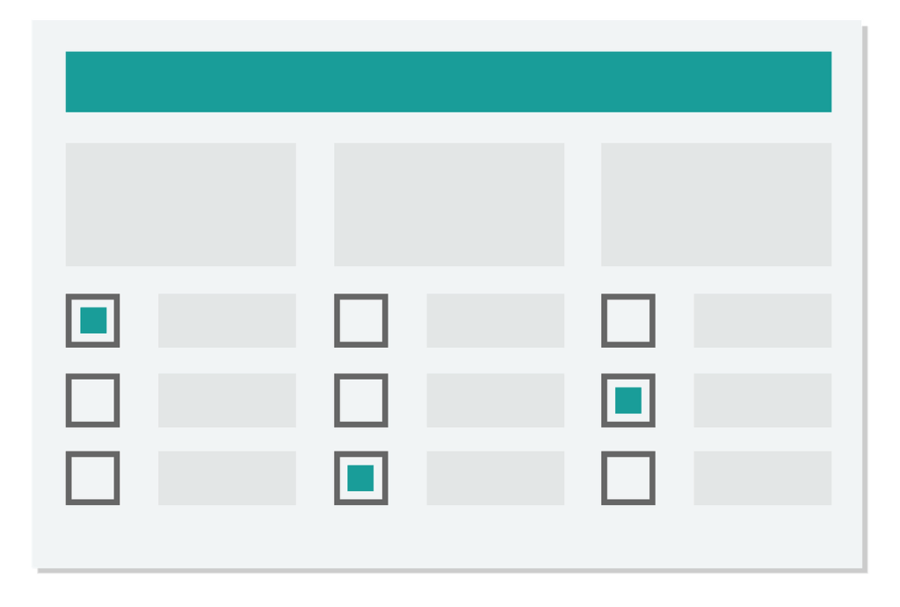
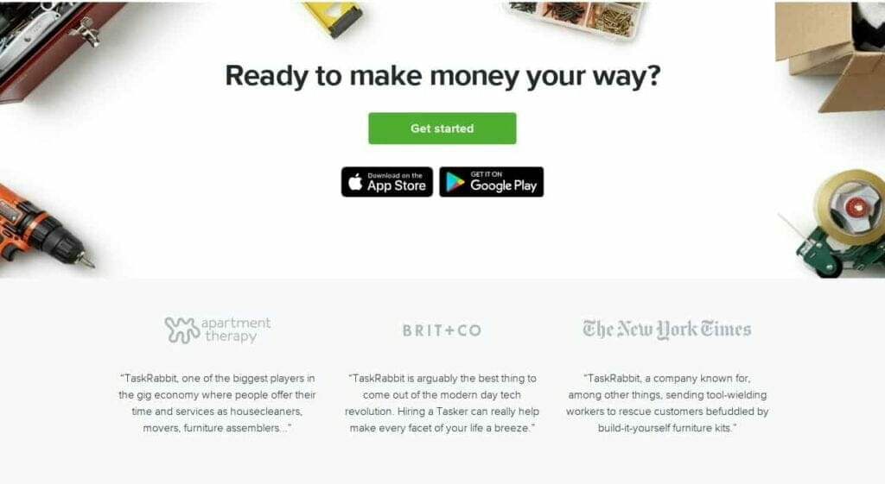
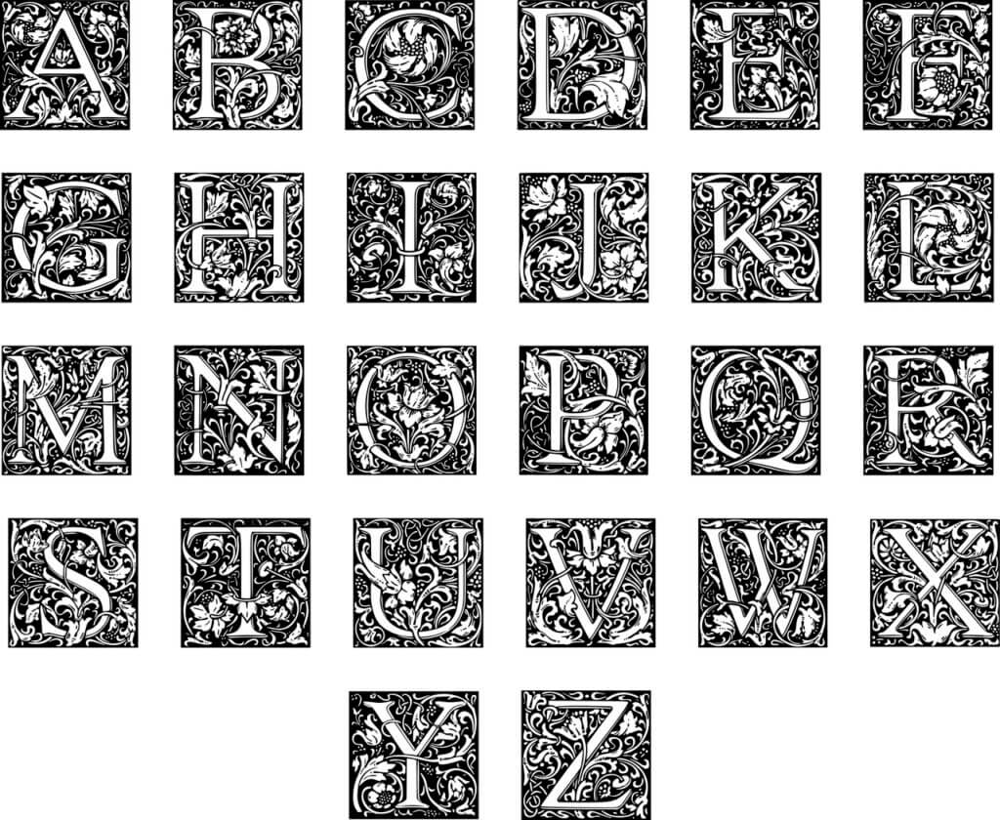

These days, when the world is online-centric, people are increasingly looking for new ways to make money online. According to Statista, [_in 2019, retail e-commerce sales worldwide amounted to $3.53 trillion, and e-retail revenues are projected to grow to $6.54 trillion in 2023_](https://www.statista.com/statistics/379046/worldwide-retail-e-commerce-sales/)!!!

To help you to earn a small portion of these trillions, I have come up with **_20 Best Ways How to Make Money Online Selling Things_**.

# 20 Best Ways How to Make Money Online Selling Things

Here, in this post, I'll talk about selling things you already own. So, there is no chance to lose money at all, only profit!

I have searched the internet and come up with _**20 Best Ways How to Make Money Online Selling Things**_. I have talked about every method in detail.

I have also added links to essential websites you may need. Don't forget to share your thoughts in the comments section.

Let's jump into the topic without talking further.

### 1\. Sell Old Books Online

Probably, you have got a lot of textbooks and many other books at your home that you don’t read now. But do you still need them? So, why are you keeping them when you can turn them into cash?! Yeah! It is one of the best ways to make money online selling things.

If you had ever thought about selling your old books, you might want to sell your books at a garage sale or a second-hand book store. But you’ll end up selling your books cheaply in this way. So, consider selling your books online to get fairer prices.

Many companies buy back used books. [BookScouter](https://bookscouter.com/) is a useful website to check these deals. It compares the buy-back prices of a book from 50 different vendors and shows you the best price you can sell your book for.

What you have to do is just enter the book name, or its author name, or the ISBN. Then, BookScouter will show you which vendor is offering the highest buy-back price for your book.

You won't get a buy-back deal always. Companies offer buy-back deals most often for textbooks or other study-books. If you don’t find one for your copies after checking BookScouter, don’t worry. There are many other places online where you can get a fair price for them.

You can sell your books locally. [Craigslist](https://www.craigslist.org/) or [Facebook Marketplace](https://www.facebook.com/marketplace/) will help you in this case. [eBay](https://www.ebay.com/) is also a great platform where you can get the best possible price for your books.

[Amazon](https://www.amazon.com/) also has a Trade-in program for old books. It doesn’t buy every book. But if you’re lucky, you can expect to get up to 80% of the price you purchased your book for!

#### How Much Money Can You Make Online Selling Your Old Books

You'll not get the price you bought the book for. People buy used books only for the reason that they are cheap. Still, you can get a maximum of 80% of the retail price or something like that.

#### Essential Websites & Apps: [BookScouter](https://bookscouter.com/), [eBay](https://www.ebay.com/), [Facebook Marketplace](https://www.facebook.com/marketplace/), [Craigslist](https://www.craigslist.org/), [Amazon](https://www.amazon.com/)

### 2\. Sell Old Clothes Online

Not only books, but you can sell your old clothes also online. We don’t wear a dress for years. And maybe, your closet has become full of old clothes. So, why are you keeping them when you can turn them into cash?!  
The following words are not only applicable to selling old clothes. But you can also sell new clothes to make money online using the tactics I'll tell you now.  
People depend on just the photos of a product when they buy online. If you want to start a mini cloth-selling business online, you must upload high-quality pictures. You should-

- Consider purchasing a good camera once you have made some sales.
- Capture pictures of your clothes from every angle possible.
- Capture any flaw or flaws your clothes have.
- Use something like a wooden hanger to give your clothes a better look.

There are many places online to sell clothes. [Depop](https://www.depop.com/) is one app among them. Though it's a newer app, it has gained much popularity in a short time. And now, it's available in 150+ countries. And, many teenagers are making over $300,000 a year selling clothes at Depop. [Poshmark](https://poshmark.com/) and [ThredUp](https://www.thredup.com/) are another two great alternatives.

But if you have high-end clothes, then [eBay](https://www.ebay.com/) is best for you. You’ll get the best possible price for your clothes there.

You can also sell your clothes locally on [Facebook Marketplace](https://www.facebook.com/marketplace/) or [Craigslist](https://www.craigslist.org/). You’ll get to keep the full profit you make. Because it doesn't charge a commission over your products.

#### How Much Money Can You Make Online Selling Old Clothes

How much money you’ll earn depends mainly on the condition of your clothes. It also depends on what type of, where, and how many clothes you’re selling, etc.

You can get from a few dollars to a few hundred dollars for your clothes. Some successful cloth reselling businesses earn more than $300,000 per year!

#### Essential Websites & Apps: [Depop](https://www.depop.com/), [Poshmark](https://poshmark.com/), [ThredUp](https://www.thredup.com/), [eBay](https://www.ebay.com/), [Facebook Marketplace](https://www.facebook.com/marketplace/), [Craigslist](https://www.craigslist.org/), [Instagram](https://www.instagram.com/), [Vintage](https://evintage.io/)

### 3\. Sell Used Phones Online

Electronic devices are now cheaper than ever before. Now, you can grab a brand new phone at as little as $50.

But still used phones have a large market. And the market is still growing big. If you’ve old phones in your house that you aren’t using, you can sell them to make some money.

Selling a used phone isn't very hard. There are many buy-back companies like [Gazelle](https://www.gazelle.com/), who buy-back used phones. You just have to go to their website, and they’ll offer you a fair price after you give them some info about your phone.

Or, if you want to get some more cash, you can list your phone on [eBay](https://www.ebay.com/) or [Craigslist](https://www.craigslist.org/). There are a lot of people to buy your phone. You can also sell your phone to [Amazon](https://www.amazon.com/) if you want something quicker. But you’ll get a little bit less than eBay or Craigslist.

**Note:** Don't try to hide any defect your phone has. You can get engaged in a dilemma or lose money instead of making money.

#### How Much Money Can You Make Online Selling Used Phones

It varies from phone to phone. There are no exact numbers. If you have a damn old phone or a phone from a less-known brand, you can’t expect to get a high price. For most used phones, if they have no defects, you can generally get 60-70% of the retail price.

#### Essential Websites & Apps: [Gazelle](https://www.gazelle.com/), [eBay](https://www.ebay.com/), [Craigslist](https://www.craigslist.org/) [Amazon](https://www.amazon.com/), [NextWorth](https://www.nextworth.com/), [BuyBackBoss](https://buybackboss.com/), [Decluttr](https://www.decluttr.com/)

### 4\. Sell Old Electronic Devices Online

I have talked about selling used phones. Used phones are the highest-selling electronic device in the used market. So what about the others? Don’t worry. Other devices’ electrons also can be converted into hard cash!

You can sell any electronic device you have, such as a laptop, DVD, PlayStation, TV, iPhone, iPad, etc. You’ll not get the price you paid for them. But you’ll get paid for something that is of no use to you.

[Gazelle](https://www.gazelle.com/), [NextWorth](https://www.nextworth.com/), [BuyBackBoss](https://buybackboss.com/), [Decluttr](https://www.decluttr.com/) are some of the best websites to sell electronic devices. They offer a buy-back deal instantly after collecting some details about a device. If you like the price, you can accept it. You can reject it also. It’s a great way to sell your devices quickly.

But those companies don’t offer you the highest price. And also, they don’t accept any device. So, if you want to get a better value for your products, you should sell them locally. [Craigslist](https://www.craigslist.org/) and [Facebook Marketplace](https://www.facebook.com/marketplace/) are two great places for this. You’ll get a much better price there.

Or, you can also sell your devices on [eBay](https://www.ebay.com/). Often, you’ll get the best price on eBay. And if something like a reselling business is in your mind, then eBay might be the best fit for you.

#### How Much Money Can You Make Online Selling Old Electronic Devices

If your devices are in good condition and not too old, you can expect to get around 60-70% of the retail price for your device.

#### Essential Websites & Apps: [Gazelle](https://www.gazelle.com/), [NextWorth](https://www.nextworth.com/), [BuyBackBoss](https://buybackboss.com/), [Decluttr](https://www.decluttr.com/), [eBay](https://www.ebay.com/), [Facebook Marketplace](https://www.facebook.com/marketplace/), [Craigslist](https://www.craigslist.org/)

### 5\. Sell Ad Space on Your Car

It is another excellent way to [make free money online](https://muhymin.com/make-free-money-online/). If you live in a busy city and drive a lot, it can be a good source of passive income.

Anyone can't sell ad space on their cars. There are several requirements to be eligible. Such as, you must have a driving license. You need to be at least 18 years old. You must drive your car regularly. You also need to have a clean record. You can't apply if you have committed a crime in the past.

[Wrapify](https://wrapify.com/) and [Carvertise](https://carvertise.com/) are two excellent websites to find advertisers for your car. You can also contact a local advertising agency for ads.

#### How Much Money Can You Make Online Selling Ad Space on Your Car

How much money you'll get varies on different factors. Such as how much time you spend driving, where you live, which roads you drive in, etc. But still, you can earn at least $100 to as high as $500 a month. So, it can be a good source of passive income.

#### Essential Websites & Apps: [Wrapify](https://wrapify.com/), [Carvertise](https://carvertise.com/), [Nickelytics](https://www.nickelytics.com/), [StickerRide](https://stickerride.com/), [Adverttu](https://www.adverttu.com/), [Car Quids](https://www.carquids.com/)

### 6\. Sell Websites

It is another excellent way to make money online selling things. Thanks to the developers, building a website has become easier than ever. Anyone now can create a website and launch it in minutes! It just needs buying a domain name and web hosting. And then install WordPress. Done!

To create a website for sale, you must build a niche-site. Because only niche-sites are perfect for sale. You must buy a great domain name also, which represents the niche.

Then just buy web hosting and install WordPress and the necessary plugins. If you are unsure about which plugins you’ll have to install, check out my ultimate guide on the [_best WordPress plugins_](https://muhymin.com/best-wordpress-plugins/).

Bluehost is one of the best places to purchase web hosting and domain names. It is also one of the cheapest web hosts. Get web hosting from as low as $2.75/mo and .com domain names at just $12.99/yr!

Mainly two types of websites are sold. The first one is starter websites. A starter website won’t make you rich. But a site that took you just a few hours to build can be sold at $1,000 or even more!

Or, you can post some content on your site. Do proper keyword research and build links. Once it starts making some money, list it for sale. This type of website is called established websites. You can ask 15-36 times more money than the monthly revenue for an established website!!!

[Flippa](https://flippa.com/) is the best and also the most popular platform for selling websites. [EmpireFlippers](https://empireflippers.com/) is another excellent alternative. As always, they will cut a commission out of earnings.

You’ll have to wait for a few days to up to a month to sell a website. You may need to hire a broker also to sell a website. He may take 20% of the sold price as his fee.

#### How Much Money Can You Make Online Selling Websites

Starter websites are great for making a decent amount of money quickly. It just takes a few hours to build a good-looking website. Probably, you'll be able to create 30, 50, or more sites in a month. And, if you can sell only 5 websites a month, you’ll still earn $5,000!!

But established sites are much more profitable if you can work hard. If a website Is making $3,000/mo, then you can get anywhere between $45K-$108K selling the website!!! That’s still a hefty $30K-$80K after all the expenses!!!

#### Essential Websites & Apps: [Flippa](https://flippa.com/), [EmpireFlippers](https://empireflippers.com/)

### 7\. Sell Stock Photographs

Do you’ve got a hand in photography? Or are you a professional photographer? If your answers are yes, then you can make good passive income selling stock photographs and videos.

Because every people who have a business online, from a blogger to a billion-dollar businessman, need stock photographs.

Though stock photographs are inexpensive, it can be a good source of passive income. Because a photographer shoots hundreds or thousands of photos every month. And you’re not limited to just one website. You can upload your photographs and videos on many websites.

But you can’t just upload a lot of photos and hope they sell. You’ll have to optimize the photographs for sale.

You need to use the right keywords for your photos. Use keywords that aren’t too broad. Probably many photographers are already competing for those keywords.

You shouldn’t capture anything. Try to pick a niche to shoot for. And use [Google Trends](https://trends.google.com/trends/) to check what is trending now.

There are many websites to publish your photos and videos. But the problem is, you don’t give them a commission. Instead, they give you a commission for each download! Still, of them, the best websites are:

- [**Shutterstock**](https://www.shutterstock.com/): Though Shutterstock is the biggest stock website, it is the lowest-paying (or the greediest). They only pay a 15% commission at Level 1. And you need more than 25,000 photos and video downloads to get to Level 6. At level 6, you’ll get a 40% commission for every download. To make the thing worse, levels on photo-licensing and video-licensing are different. And, to make things even worse, all the progress reset on the first day of a new year.
- [**Pond5**](https://www.pond5.com/): Pond5 commission rates are much better than Shutterstock. They share 40% of revenue for non-exclusive video licenses and 60% revenue share for exclusive video licenses. And 35% revenue share for music and sound effects, and 50% for photographs.
- [**iStock**](https://www.istockphoto.com/): iStock also has the lowest commission, like Shutterstock. Only 15% for photos, and 20% for videos and illustrations. And for an exclusive license, commission rates start at 25% and goes up to 45% commission on each sale.
- [**Adobe Stock**](https://stock.adobe.com/): Adobe Stock has a commission rate of 33% for photos and vector arts and 35% for videos.
- [**500px**](https://500px.com/): 500px has a better commission structure than most other websites. It gives 60% to their contributors for exclusive-licenses and 30% for non-exclusive licenses.

You can also start your own website to show your works, and if someone finds that your photos are great, they can license those paying a fee. You’ll also get the full amount to keep.

#### How Much Money Can You Make Online Selling Stock Photographs

How much money you'll earn depends mainly on three factors. Such as how much you're getting per photo, how many downloads you get, and the commission rates.

If you are getting $4 per photo on average, and your photos get 1,000 downloads per month, then you can earn anywhere between $600-$2,400 per month.

It means that you’ll earn more if you get a higher commission and more downloads. So, try to shoot as many stock-quality photos as possible and upload them on as many websites as possible.

If your photos get more than a million downloads per month, you can expect to earn even $600,000 up to $2.4M a month!!! And, if you’re selling your photos on your website, then that’s even more, $4M!!!!

#### Essential Websites & Apps: [Google Trends](https://trends.google.com/trends/), [Pond5](https://www.pond5.com/), [500px](https://500px.com/), [Adobe Stock](https://stock.adobe.com/), [ShutterStock](https://www.shutterstock.com/), [iStock](https://www.istockphoto.com/)

### 8\. Sell Junk Mails

Now and then, we receive junk emails in our inbox. But how would it be if you could make money from it? Yes, you heard it right! There's a company called [SBKC](https://www.sbkcenter.com/) (Small Business Knowledge Center) that pays for junk mails.

But why will they pay you for those junks? Because they conduct researches on junk mails. And as you're helping them, they're rewarding you with free money.

You just need to fill up a form and send it for approval. If you get approved, you'll get paid for your junk mails. One major con of SBKC is, they only work in the US & Canada. So, you may not get approved if you're outside of these two countries.

SBKC members are called Panelist. General panelists are called Consumer Panelist. But if you're a business owner or self-employed, you can join as a Producer Panelist.

You'll receive a prepaid envelope every month from SBKC. You need to put your junk mails in it and send it to them. But you can send your junk emails anytime. You just have to forward them to SBKC.

#### How Much Money Can You Make Online Selling Junk Mails

You'll earn points for every junk mail. When you'll have accumulated 2000 points, you'll be able to withdraw a $20 gift card. It isn't much, but it can be a good source of passive income if you receive a lot of junk mails every month.

It can take 6-10 weeks to get a $20 gift card, but if you have a business, you may just need around a week or less.

#### Essential Websites & Apps: [SBKC](https://www.sbkcenter.com/)

### 9\. Sell Your Knowledge

Do you have deep knowledge of a subject? Are you an expert on that topic? If your answers are yes, then you can sell your knowledge and earn a decent amount of money online! Yeah, you heard it right. Thousands of businesses hire knowledge-sellers (you may know them as a consultant) like you to receive actionable advice. A consultant can play a vital role in growing a business. As a result, the consultation service is a highly-profitable business.

Consultants exist in every niche and sector possible. A consultant is basically an expert who earns money selling actionable advice (or knowledge!). If you’re an expert on just anything, you can start making money online right now.

Consultation service is a highly-flexible work. You’ll not need to leave your day-job or your online business. You just have to answer your client’s questions with details. And that doesn’t take hours!

If you’re a blogger, a consultation service can be an additional source of revenue for you. Many successful bloggers are offering consultation services and earning a decent amount of money as a side-hustle.

Freelancing platforms aren’t the best option for finding clients when you are a knowledge-seller (consultant). If you are a successful blogger, you shouldn’t miss the chance to get clients directly from your audience.

Outreaching to companies is the best way to get clients for your consulting business. For example, if you’re a marketing consultant, search for companies and blogs that aren’t maximizing their marketing efforts and offer them your consultation service. Or, if you’re an SEO expert, offer them SEO consultation services.

Though freelancing platforms, in this case, aren’t the best choices, they’re not the worst. You should use freelancing and social sites to get more consultation jobs. They can be highly effective if you’re just starting out.

**Note:** As a consultant, provide only the actionable advice you know will work. You’ll also need to outsource any work you aren’t an expert at. Because if you fail in any one of the two cases, it can be a big turndown for your business.

#### How Much Money Can You Make Online Selling Your Knowledge

How much you’ll earn as a consultant depends on your depth of knowledge, niche, specialty, etc. If you charge your clients $500 per month and work with five clients every month, then you’ll earn $30K/yr.

So, if you charge more, you’ll earn more. Many consultants charge $2,500 or more per month per client. Again, some consultants demand even more than $1K/hr per client!!!

#### Essential Websites & Apps: Your Own Blog, [Freelancer.com](https://www.freelancer.com/), [Upwork](https://www.upwork.com/)

### 10\. Sell Your Private Data

Data is the new property of this modern world. Big companies like Facebook & Google track every movement of our finger & cursor. And they analyze it to make billions of dollars.

A good example is targeted ads from Facebook. Facebook analyzes our browser cookies and past behavior to show us the most relevant ads. Many websites use our data for various purposes. But we don't get paid a single penny for it.

We are using their service after agreeing with their terms & conditions. So, we can't claim that they're illegally using our data. But it is unfair none the less.

But many market research companies are wishing to pay you for your data. You've to do nothing but install their apps and keep them. It'll collect your usage data and, you'll get paid yearly, monthly, or weekly for it.

[Nielsen Panel](https://computermobilepanel.nielsen.com/ui/US/en/sdp/landing) is one such app. You just have to install the app and keep it. You can get around $50 a year.

If you think $50/yr is less, then the [Screenwise Panel](https://screenwisepanel.com/member/Index.aspx?lang=0) powered by the giant Google and Ipsos is for you. You can earn up to $7/week and $350/yr. You'll also get a $50 bonus for connecting it to your router and TV and $5 for connecting to your smartphone, tablet, and browser. But one problem, households are randomly selected for joining the panel. So, you can't join it unless you get an invitation.

Some other great apps like these are [DataWallet](https://www.datawallet.com/datawallet-3/) ($1-$50 every 2 months), [Placed Panel](https://getpanelapp.com/) (around $50/yr.), [Smart Panel](https://smartapp.io/) ($110/yr.).

#### How Much Money Can You Make Online Selling Your Private Data

Selling usage data is an excellent way to make money online selling things. You'll not get rich by installing these apps. But you'll get something rather than getting nothing. And it's also not a bad deal. If I add all of the earnings from these 6 apps, then you can earn up to $1,000 a year! And whatever you get is free! Also, there are more apps like these!! Just do some searches on Google.

#### Essential Apps & Websites: [Screenwise Panel](https://screenwisepanel.com/member/Index.aspx?lang=0), [Smart Panel](https://smartapp.io/), [Nielsen Panel](https://computermobilepanel.nielsen.com/ui/US/en/sdp/landing), [Placed Panel](https://getpanelapp.com/), [DataWallet](https://www.datawallet.com/datawallet-3/)

### 11\. Sell Your Opinion

Many market research companies conduct surveys to fit their products according to the needs of consumers. And they reward their members for participating. You can make some quick money by selling your opinions to them.

You can get around $1 per survey. Some survey sites like [Pinecone Research](https://www.pineconeresearch.com/) and [Vindale Research](https://www.vindale.com/) pay more like $3 or even more per survey. But there are some low-paying sites also.

Every survey site or panel has a limited number of surveys available for each member per month. So, you have to sign up to as many survey sites as possible to make a decent amount of money from paid surveys.

#### How Much Money Can You Make Online Selling Your Opinion

It just takes a few minutes to complete a form. So, you'll be able to participate in 5, 10, or even more surveys an hour. That's an easy $10-$20 an hour doing some fun works!

#### Essential Websites & Apps: [SurveyJunkie](https://www.surveyjunkie.com/), [Swagbucks](https://www.swagbucks.com/) ($5 sign-up bonus), [InboxDollars](https://www.inboxdollars.com/) ($5 sign-up bonus), [LifePoints](https://www.lifepointspanel.com/), [Pinecone Research](https://www.pineconeresearch.com/), [Vindale Research](https://www.vindale.com/), [OnePoll](https://www.onepoll.com/panel/)

### 12\. Sell Handmade Crafts

Do you have a knack for crafting handmade things? Or, are you a housewife or stay at home mom who loves knitting and sewing? Many people are making extra bucks or even their living online selling handmade crafts. And you can make it too!

You need an online presence first to sell your crafts. The best way is to start an Etsy store. [Etsy](https://www.etsy.com/) is the most popular place for selling handmade crafts. It's like the Amazon of handmade crafts. It is also a budget-friendly option, and also you can easily set up a store. You can also link your website or blog to your Etsy shop.

You can also set up your store via [Shopify](https://www.shopify.com/). It is a premium service, but it’s an all-in-one package. You won’t need to build the website from scratch also. Just pick a pre-made template and start working. You can also set up a WordPress store using the [WooCommerce](https://woocommerce.com/) plugin.

After you’re have done the technical things, now is the time to build crafts. If you want some ideas about what you should craft and sell, you can check out this post on [_87 Crafts You Can Make and Sell_](https://twinsmommy.com/crafts-that-make-money/) from Elna Cain.

#### How Much Money Can You Make Online Selling Handmade Crafts

Building a successful craft business takes time. You’ll not become a millionaire overnight by selling crafts. You need to be a passionate crafter, and your passion will drive you to success. And once you’ve earned success, you can earn even more than $50K per month!

#### Essential Websites & Apps: [Etsy](https://www.etsy.com/), [Shopify](https://www.shopify.com/), [WooCommerce](https://woocommerce.com/)

### 13\. Repackage Your Blog Posts and Sell Them

Do you have a blog? If you have one, you may have a lot of blog posts there. You can then repackage your blog posts and create ebooks. You can earn a decent amount of money online by selling them.

Ebooks have gained so much popularity that it has occupied 20% of the entire book industry. And many writers are earning millions just by writing and selling ebooks.

Writing and publishing an ebook has become easier than ever before. Because of the self-publishing platforms, anyone can now self-publish their own books online. So, the royalties are much higher than paperbacks.

#### How to Make Money Online Writing an Ebook

If you want to write an ebook, a niche is crucial. Because if you’re writing your first ebook, perhaps no one will buy it. As there are books from many established writers.

After you’ve selected a niche, write the ebook. If you have a blog, then creating an ebook might be easier for you. As you may already have content for your ebook in your blog. You just have to repackage those.

After you’ve written an ebook, get it proofread by an expert. And you need to design a great cover also. You should hire someone to do this for you because you might not be good at this. And the first impression is the last impression!

If you’re done with designing a great ebook cover, quickly publish it. [Amazon Kindle](https://kdp.amazon.com/), [Nook](https://press.barnesandnoble.com/), [Apple Books](https://authors.apple.com/), [Kobo](https://www.kobo.com/us/en/p/writinglife) are some great places for publishing your ebook.

Amazon Kindle is the biggest self-publishing platform. It has more than 300 million monthly readers. You’ll also get 70% royalty if your ebook is priced between $2.99-$9.99. You must publish your book on Kindle if you want to get many sales.

But you should try to make as many sales as possible on your own. Because you can keep all the profits of the sales.

You should spend enough time marketing your ebook. You can use your blog, social media followers, and contact famous authors, your friends, and your family.

#### How Much Money Can You Make Online Selling Your Blog Posts

The highest-earning author in 2019, J.K. Rowling, the author of the famous title Harry Potters, earned an astounding $92 million in 2019!!

Not everyone makes millions of dollars writing ebooks. But you can easily earn a decent amount if you can write a great book.

You can know how much you can earn writing ebooks by doing simple math. If the price of your book is $5, and it sells 1000 copies every month, you’ll make $2,500 from just one ebook, even after cutting 50% as a commission. And considering you’ll write multiple books, it can be a great source of passive income.

#### Essential Websites & Apps: [Amazon Kindle](https://kdp.amazon.com/), [Nook](https://press.barnesandnoble.com/), [Apple Books](https://authors.apple.com/), [Kobo](https://www.kobo.com/us/en/p/writinglife)

### 14\. Sell Your Notes Online

Every student has to take notes regularly. If you’re a student, then it might be a part of your daily routine. It is a tedious job and needs a lot of time. Not everyone can do this, nor everyone has this much time.

They need some assistance. And you can help.

_But how?_

You can give them the notes you don’t need now.

_For free?_

No, not at all. You’ll sell your notes at a fair price.

If you’ve excellent note-taking skills, then you can make a decent amount of money selling notes. You can sell study guides, suggestion papers, and other useful study papers also.

There are many marketplaces for selling notes. But not all of them have a high commission rate. All of them aren’t open to everyone also. Some websites are even restricted to students of a particular university or a country.

[Stuvia](https://www.stuvia.com/), [GradeBuddy](https://gradebuddy.com/), [Nexus Notes](https://nexusnotes.com/), [CourseHero](https://www.coursehero.com/) are also some great websites to sell your notes. Check out each website to find which best fits you.

#### How Much Money Can You Make Online Selling Notes

On average, you can expect to get around $20-$30 per note. But you can get more than that. You can even earn $50-$75 or more for a comprehensive study guide. So, if you have 100 notes, and only one copy of each of them sells every month, then you'll earn a decent passive income of $2,000-$7,500 per month!!! And, if the website cuts 50% of your earnings as a fee, you'll still earn $1K-$3.75K/mo.!!!

#### Essential Websites & Apps: [Stuvia](https://www.stuvia.com/), [GradeBuddy](https://gradebuddy.com/), [Nexus Notes](https://nexusnotes.com/), [CourseHero](https://www.coursehero.com/), [Notesgen](https://www.notesgen.com/), [NotesMate](https://www.notesmate.in/), [StudySoup](https://studysoup.com/), [Omega Notes](https://www.omeganotes.com/), [Oxbridge Notes](https://www.oxbridgenotes.co.uk/), [OneClass](https://oneclass.com/)

### 15\. Sell Your Articles

Writing is an excellent way to earn money online. Many writers are earning millions of dollars online. And if you’re a great writer, you’ll be able to make a decent amount of money selling articles online.

But you need to keep in mind that you can’t be rich just by writing. But it is very possible to meet your need. You can offer different types of writings, such as technical writing, copywriting, or creative writing.

If you want to sell articles to clients, then you mightn't get the best value for your work. Because a writer is generally poorly-paid. You’ll earn as high as $50 per 1000 words, while the median is around just $10-$20. And you’ll also have to do research before writing. So, it’s not a great way to earn money writing online selling articles.

Many online magazines and websites accept articles from writers. They also pay well. Some magazines even pay more than $1K for a single article. If you are interested, just do some research on your own. You’ll find a lot of websites that accept paid guest-writing.

You can also find article writing jobs in [ProBlogger](https://problogger.com/jobs/) and [Blogging Pro](https://www.bloggingpro.com/jobs/). They are also well paid.

There are many other ways to earn money online writing. The best way is to start a blog. You’ll be able to make a decent amount of money from a successful blog.

Or, you can write an ebook and sell it on [Amazon Kindle](https://kdp.amazon.com/), [Nook](https://press.barnesandnoble.com/), [Apple Books](https://authors.apple.com/), etc. Some authors are earning even eight-figures writing ebooks!!!

#### How Much Money Can You Make Online Selling Articles

If you’re a freelance writer, you can earn anywhere between $2K-$6K per month. If you have a blog and sell ebooks, you may make a few more thousands of dollars per month.

#### Essential Websites & Apps: [Contena](https://www.contena.co/), [ProBlogger](https://problogger.com/jobs/), [Blogging Pro](https://www.bloggingpro.com/jobs/), [Freelancer.com](https://www.freelancer.com/), [Amazon Kindle](https://kdp.amazon.com/), [Nook](https://press.barnesandnoble.com/), [Apple Books](https://authors.apple.com/), [Kobo](https://www.kobo.com/us/en/p/writinglife)

### 16\. Sell Your Recipes

It is another excellent way to make money online selling things. Everyone loves delicious foods. Because we don’t eat to live, we live to eat. And we are always eager to taste new recipes. If you have some exciting recipes, you can make some good money selling them online.

You can sell your recipes in a lot of ways. I think the best way is to sell them to food magazines. Because they pay well for a single recipe. Some magazines and websites are willing to pay you over $1,000 if you can pitch them with a great recipe! Some of them are [Taste of Home](https://www.tasteofhome.com/help/submit-a-recipe/), [Cuisine at Home](https://www.cuisineathome.com/tips/submit/), [Cooking Light](https://cookinglight.com/food/top-rated-recipes/send-us-your-recipes), [EatingWell](https://www.eatingwell.com/article/290691/writers-guidelines/), etc.

Fiverr is another great place to sell your recipes. You are free to set your own rate at Fiverr. [Facebook Marketplace](https://www.facebook.com/marketplace/) and [Craigslist](https://www.craigslist.org/) are two great alternatives.

You can also sell your recipes on freelancing platforms. You’ll be able to offer your recipe writing services there. Two excellent freelancing platforms for this are [Freelancer.com](https://www.freelancer.com/) and [Upwork](https://www.upwork.com/).

You can also create a food blog. You’ll be able to post your recipes and write about delicious dishes there. [Bluehost](https://www.bluehost.com/) is one of the best web hosts for a starting blog. You'll be able to grab a .com domain name at only $12.99, and its hosting plans start from as low as $2.75/mo.

Starting a [YouTube](https://www.youtube.com/) channel is another excellent choice. It is the best platform in the present to earn money as a chef. Nowadays, people are searching for video tutorials on YouTube for every recipe. They want to try new things and improve their cooking skills.

You can also build and sell a cooking course. If you already have a lot of YT videos and blog posts, it’ll be easy for you. [Kajabi](https://kajabi.com/) and [Udemy](https://www.udemy.com/) are two of the best places to sell a course.

#### How Much Money Can You Make Online Selling Recipes

You can get $5 to $500 or even more for a single recipe! Magazines pay well for a recipe. At Fiverr, you may be able to get around $25 per recipe.

If you can succeed as a blogger or vlogger, you’ll be able to make thousands of dollars every month! And if you can create an excellent course on cooking, you can earn even a six-figure income!!!

#### Essential Websites & Apps: [Taste of Home](https://www.tasteofhome.com/help/submit-a-recipe/), [Cuisine at Home](https://www.cuisineathome.com/tips/submit/), [Cooking Light](https://cookinglight.com/food/top-rated-recipes/send-us-your-recipes), [EatingWell](https://www.eatingwell.com/article/290691/writers-guidelines/), [Fiverr](https://www.fiverr.com/), [Freelancer.com](https://www.freelancer.com/), [Upwork](https://www.upwork.com/), [Facebook Marketplace](https://www.facebook.com/marketplace/), [Craigslist](https://www.craigslist.org/), [Bluehost](https://www.bluehost.com/), [YouTube](https://www.youtube.com/), [Kajabi](https://kajabi.com/), [Udemy](https://www.udemy.com/)

### 17\. Sell Your Working Skills

People need some help with this and that often. But it was hard to find someone for assistance with these works. [TaskRabbit](https://www.taskrabbit.com/become-a-tasker) is solving this problem since it was launched in 2008. If you can do these odd jobs, then you can sell your working skills at TaskRabbit.

TaskRabbit is now available across 54 cities in the U.S. It has also expanded its service in the UK, Canada, and Germany, and it is also available in Paris and Barcelona.

You’ll work as a tasker at TaskRabbit. And people will hire you to get their works done. These odd jobs include cleaning, delivery, furniture moving and assembling, running errands, decoration, etc.

You’ll have to list what services you can offer and how much your hourly rate is for each task. You’ll get paid by clients using the TaskRabbit app. TaskRabbit will cut 15% of your earnings as a fee.

#### How Much Money Can You Make Online at TaskRabbit Selling Your Working Skills

It’s up to what you charge per hour. If you charge $30/hr, you can take home $25.5 after cutting the 15% fee. And, many people are charging $60 or even more per hour for complicated tasks. But you’ve to gain experience and get good reviews before charging a high hourly rate.

Customers may also reimburse or tip a tasker. TaskRabbit won’t charge a fee on any tip or reimbursements made. A tasker can keep 100% of these.

#### Essential Websites & Apps: [TaskRabbit](https://www.taskrabbit.com/become-a-tasker)

### 18\. Sell Your Freelancing Services

Freelancing means working freely with many companies at the same time. You aren’t limited to just a single organization. Freelance projects aren’t long-term like your day job. Most of them are short-term. And you can work on different projects at the same time. This makes selling your freelancing services a great way to earn money online.

To become a successful freelancer, you should do some basic things first. You should build a portfolio website to highlight your works. And try to be a specialist in a particular niche, not a generalist. It’ll help you to be an expert in your working sector and let you charge premium rates for your works.

If you’re just starting as a freelancer, you’ll face many difficulties. At first, perhaps you can’t charge a decent rate for your work. Because everyone wants to hire an expert and not an inexperienced beginner.

To gain some experience and knowledge as a newbie, you can start blogging. You’ll be able to represent your content before your clients. It can help you greatly to collect potential clients.

You should create accounts on as many freelancing websites as possible. Doing this will increase your chances of getting work. Some popular freelancing sites are [Fiverr](https://www.fiverr.com/), [Freelancer.com](https://www.freelancer.com/), [Upwork](https://www.upwork.com/), [PeoplePerHour](https://www.peopleperhour.com/), [Guru](https://www.guru.com/), etc.

[SolidGigs](https://solidgigs.com/) and [FlexJobs](https://www.flexjobs.com/) are also two great curated-job platforms to get freelancing jobs. There are also particular freelancing platforms for each category. Such as [Contena](https://www.contena.co/) for writers, [Gun.io](https://www.gun.io/) for developers, [99designs](https://99designs.com/) for designers, etc. Check below for more.

Most of the freelancing websites will cut a percentage of your earnings as a fee. So, you’ll not be able to get the full amount to keep. And also, you might not get paid well because you’ll have to bid to win a job. And many times, the lowest bidder wins the job.

And even if a freelancing platform doesn’t have fees for a freelancer, it’ll charge a fee to the employer. If he doesn’t want to spend extra, he can end up paying you less.

So, once you’ve gained some experience, you should start receiving clients directly through your blog or cold-emailing. Or, you should focus on the category-based platforms. Social Media is also a great place to collect potential clients.

#### How Much Money Can You Make Online Selling Your Freelancing Services

You’ll not earn much as a new freelancer. Perhaps, you’ll get paid only $10 an hour. But you’ll become skilled and gain a reputation progressively. Then you can certainly charge much more than $10.

Some successful freelancers charge up to $250/hr or even more. It translates into an annual salary of a whopping $500,000!!!

#### Essential Websites & Apps: [Fiverr](https://www.fiverr.com/), [Freelancer.com](https://www.freelancer.com/), [Upwork](https://www.upwork.com/), [PeoplePerHour](https://www.peopleperhour.com/), [Guru](https://www.guru.com/), [Toptal](https://www.toptal.com/), [FlexJobs](https://www.flexjobs.com/), [SolidGigs](https://solidgigs.com/), [Contena](https://www.contena.co/), [Gun.io](https://www.gun.io/), [Gigster](https://gigster.com/), [99designs](https://99designs.com/), [ZipRecruiter](https://www.ziprecruiter.com/), [Behance](https://www.behance.net/), [The Creative Loft](https://photography.thecreativeloft.com/), [**Creative** Jobs Central](https://www.creativejobscentral.com/photography-jobs), [BELAY](https://belaysolutions.com/)

### 19\. Sell Your English Skills

We need English in our everyday life even if we aren't native. But probably you’re a native English speaker. If you are, then you can earn a decent amount of money by selling your English skills.

When you’re thinking of making money online by selling your English skills, a TEFL course will help you a lot. Because many websites have some requirements, and most of them require a TEFL. Some even require a degree. But don’t worry if you’ve neither. You can still earn good money teaching English online.

There are many websites to teach English online. Some are exclusive to English, while most of them allow teaching other languages. Among them, the bests are [VIPKid](https://www.vipkid.com/), [English First](https://www.englishfirst.com/), [italki](https://www.italki.com/?hl=en), [Verbling](https://www.verbling.com/), [PalFish](https://www.onlineenglishteaching.com/palfish), [Tandem](https://www.tandem.net/).

You can set your own hourly rates when you’re teaching English online. The websites will only charge you a commission. And they make sure that you get paid. Students will pre-pay you, and you’ll receive the money before or right after the lesson.

#### How Much Money Can You Make Online Selling Your English Skills

An English tutor may get around $15-$25 per hour, plus bonuses (if available). But an experienced tutor with a degree can earn 2X or even more than that. But without TEFL, you can expect to get around $10-$12 per hour.

#### Essential Websites & Apps: [VIPKid](https://www.vipkid.com/), [English First](https://www.englishfirst.com/), [italki](https://www.italki.com/?hl=en), [Verbling](https://www.verbling.com/), [PalFish](https://www.onlineenglishteaching.com/palfish), [Tandem](https://www.tandem.net/)

### 20\. Sell Your Language Skills

I’ve already talked about earning money selling English skills. But maybe, it didn’t work for you. Because English wasn’t your language.

But still, you can earn money online if you’re an expert in your own language! You’ll be able to make a decent amount of money selling your language skills.

Like teaching English, a degree can help you in the case of other languages. But just like teaching English online, don’t worry if you don’t have one.

There are many websites where you can teach people your language online. But all of them mightn't work for you. Because every language isn't available on all the websites. So, you must check each website whether your language is available or not.

If you find that you can’t teach your language on any one of those websites, you can still sell your language skills online. You’ll have to offer your service on freelancing sites, such as [Fiverr](https://www.fiverr.com/), [Freelancer.com](https://www.freelancer.com/), [Upwork](https://www.upwork.com/), etc.

[Italki](https://www.italki.com/?hl=en) is the largest online language teaching platform with 10,000+ teachers from more than 130 countries and more than 5 million users. It has a fair commission rate also. Italki charges only a 15% commission on lesson fees. Two other excellent alternatives to Italki are Verbling and Tandem.

#### How Much Money Can You Make Online Selling Your Language Skills

It depends on what language you are teaching and your students' country. But still, you’ll be able to earn around $20/hr to up to $80/hr.

#### Essential Websites & Apps: [italki](https://www.italki.com/?hl=en), [Verbling](https://www.verbling.com/), [Tandem](https://www.tandem.net/), [Fiverr](https://www.fiverr.com/), [Freelancer.com](https://www.freelancer.com/), [Upwork](https://www.upwork.com/)

## Wait for More Ways to Make Money Online Selling Things

Here ends the ultimate list of _\*\*\*\*\_20 Best Ways How to Make Money Online Selling Things_**.**\_ I’ve tried my best to talk about every possible excellent way to make money online selling things.

I have also included detailed instructions on how to execute each method. I’ve also added the essential links you may need.

But this isn’t the end. I’ll update this post regularly to add more and more ways of making money online selling things.

Don’t forget to tell me which idea you liked most in the comment section. Share your thoughts and notify me if you think I’ve missed any excellent way to make money online selling things.
