The internet is growing big rapidly since its creation. Terabytes of data are being processed every second on the internet! Now, the estimated total size of the internet has exceeded one yottabyte (1,000 trillion gigabytes)!!!

In the early days of computer technologies, people thought that hundreds of millions of people would lose their day-jobs because of automated software. But it didn’t happen. Yeah, many people indeed lost their traditional jobs. But the gigantic internet has opened up many opportunities to earn money online.

Nowadays, people are more and more looking for *online jobs*. And I’m here to teach you how to get one. I have browsed the internet to collect _85 excellent ways to earn money online_. I have also included detailed instructions on how to execute each method and added links to essential websites and apps.

Anyone can earn money online; no educational qualification is necessary. Though you’ll not need to get a degree, you’ll need to be much more skilled than a simple graduate. And also, you’ll need to have a good command over English to better communicate with people around the globe.

As you’re working from home, it doesn’t mean that you’ll get less money than your 9 to 5 job. Many people have left their day-job and are earning millions of dollars online. And they’ve achieved the freedom to work freely.

With the rise of the internet, many easy ways to earn money online have emerged. Though they’re certainly not a great source of income, you can make some quick cash. Just keep in mind that they can’t help you to leave your day job.

But, don’t fall for a trap. Many fake websites claim they’ll make you thousands of dollars in a day. But they’ll do nothing but take your cash at the end of the day. You’ll find many such scams in spammy FB groups.

# 85 Excellent Ways How to Earn Money Online

Today, I’ll talk about *85 Excellent Ways How to Earn Money Online*. I have tried to cover as many LEGIT and LEGAL ways of making money online as possible. If I have missed any idea, don’t forget to notify me in the comments.

In the beginning, I’ll talk about the ideas you can use to launch your career online. These methods have the highest potential of earning money and can help you to leave your day-job and work flexibly. You can also take the ways as a side-hustle.

In the second part, I’ll talk about the ideas you can work in your free time. These jobs won’t help you to leave your day-job, but you can easily earn some extra cash in your spare time. I’ll also talk about the online works that don’t have much potential in this part.

In the next part, I’ll talk about the methods you can make free money! Yes, you’ll have to do nothing to earn that money. Just keep doing what you’re doing now.

In the fourth part, I’ll tell you how you can make money by selling or renting your household things. I’ll also talk about how you can start a reselling business.

I’ll talk about fun ways to earn money online in the last and the fifth part. You can’t rely only on these methods to make a living. But you’ll get something while spending free time doing fun things.

So, let’s begin the adventure without talking further.

**_Disclaimer:_** _Some of the links below are affiliate links. If you click on any one of those links and buy something, I’ll get a commission without any extra cost to you. You can even get discounts on some products because of clicking on my affiliate links._

_I’ve not included any method of earning money online that is illegal or immoral. I’ve also excluded the ways that conduct betting. I also haven’t included ways that can harm anyone’s religious beliefs._

## **Excellent Ways How to Earn Money Online Doing Full-time Works**

### 1\. Start a Blog

Blog means a website where contents written in informal style are published regularly. In a blog, you can’t only publish written content. You can post videos, photographs, podcast episodes, or whatever you want.

Nowadays, more and more people are starting to blog. Many successful bloggers are earning more than a million a year. The world’s most successful blogger, _Arianna Huffington_, earns around 1.4 million from her blog every month!

But to achieve that kind of potential, you’ll need to work very hard. In the beginning, you’ll earn very little to nothing. You have to publish and promote content regularly and reach out to other bloggers.

It takes time to grow a blog. It'll depend on your effort that whether you’ll need six months or several years. But once you’ve made it, a blog can be a potential source of passive income.

#### How to Start A Blog

You’ll need to choose a niche first to start a blog. Niche is a subject you’ll write your content about on your blog. It can't be too broad, nor too small. For example, health is a broad niche, but dental health is an ideal niche.

The next step is registering a domain name. You’ll need to choose a great domain name for your blog that is available. It can be something that represents your niche. Or, you can also use your own name or nickname.

Then you’ve to buy a website hosting package for your website. A web host will host your website files from its server. You’ll need to keep several things in mind when choosing a web host, such as SSD storage, bandwidth, uptime, server speed, etc.

BlueHost is the most popular web host for beginners. It has already hosted more than 2 million websites. BlueHost’s web hosting plans start from as low as $3.95/mo, and you can get a .com domain at only $11.99/yr.

My website is hosted at Veeble. It’s a reliable web host. Veeble's plans are available from just $2.09/month. And you can get a .com domain at only $15/yr.

After you’ve bought web hosting and a domain name, you need to install WordPress now. WordPress powers more than 35% of the total websites. It has 3000+ themes and 55000+ plugins in its repository! If these don’t fit you, then you can write codes to build your website.

After installing WordPress, you’ll have to configure it according to your needs. The core functionalities of WordPress aren’t enough to create a great blog. You need to install a great theme and necessary plugins to your website. Check out my ultimate guide of [best WordPress plugins](https://muhymin.com/best-wordpress-plugins) for SEO, Performance, Security, and more.

Now, you can start publishing content on your website. You write or hire a professional writer. But always post high-quality content. Don’t forget to add rich media, like images, videos, screenshots, etc.

#### How to Make Money from A Blog

You need visitors to earn an income from your blog. If you’ve got enough visitors on your blog, you can start monetizing your blog. The best ways to monetize a blog are:

- Put affiliate links on your blog and earn commission on each sale
- Place ads on your website
- Charge brands for sponsored contents
- Sell your products and services
- Take donation from your visitors
- Offer consulting or writing gigs
- Generate leads for other companies

#### How Much Money Can You Earn Online Blogging

How much money a blogger earns depends on various things. The three most important factors are the size of your blog audience, CTRs (Click-Through-Rate), and how many monetization options you’re utilizing.

On average, if you’re getting around 100,000 visitors to your blog every month, you can expect to earn $5,000-$6,000 every month. But, don’t take this as an exact figure. Your earnings can be even higher than $10K!

#### Essential Websites & Apps: BlueHost, Veeble, GoDaddy

### 2\. Start a YouTube Channel

YouTube was launched in February 2005 by three former PayPal staff. From its debut, it is just booming. Almost 90 years of videos are uploaded to YouTube every day!

Google bought YouTube for $1.65 billion in 2006, just one year after its debut. And now, the estimated current worth of YouTube is over $160 billion.

With the rise of YouTube, many YouTubers have emerged. They are earning money successfully on YouTube. Many YouTubers have become a millionaire just from their videos!

You’ll be shocked to hear that the highest-paid YouTuber in both 2018 & 2019 was an eight-year-old boy, _Ryan Kaji_. In 2018, his earnings were $22 million and $26 million in 2019!!! And he made that from toy-review videos!

It took Ryan only three years to reach this level, 2015 to 2018. It says how powerful YouTube is for making money. Not only, Ryan, many YouTubers have also earned more than a million from YouTube.

If you’ve become inspired to start a YouTube channel after reading the above statistics, then go to Youtube.com and quickly create an account. Then you’ll be able to start your first YouTube channel.

First, choose a niche and create engaging videos people will love. Optimize your videos for YouTube SEO and use social media to boost your views. Keep doing this until you’ve gained at least 1,000 subscribers and 4,000 hours of view-time.

#### How to Make Money from A YouTube Channel

YouTube monetization isn’t turned on by default. You’ll have to join YPP (YouTube Partners Program) to enable it on your YouTube channel. But you’ll need at least 1,000 subscribers and 4,000 hours of view-time in the last 12 months to enable monetization.

If your channel meets the requirements, you’ll be able to earn money in the following ways after enabling monetization:

- Advertising revenue
- Channel Memberships
- Merchandise Shelf
- Super Chat & Super Stickers
- YouTube Premium Revenue

But if you don’t meet the requirements currently, or monetization isn’t available in your country, there are also some other ways to make money from YouTube. Of them, the most popular methods are-

- Affiliate Marketing
- Sponsorship
- Crowdfunding/Donation
- Copyrighted Videos

#### How Much Money Can You Earn Online from YouTube

I’ve already said how much an eight-year-old boy is making from YouTube. It isn’t possible to calculate the exact amount you’ll earn. It depends on various factors. Such as your niche, your subscriber and view count, how many ways you’re monetizing your channel, etc.

There are many ways to earn money online on YouTube. If you can monetize your channel right, you can definitely get $1 to up to $5 or even more per 1000 views. So, if your videos get 1 million views monthly, you’ll earn a cool $1K-$5K/mo!

#### Essential Websites & Apps: YouTube

### 3\. Start a Podcast

People are consuming more audio content than ever before. That’s why podcasting is getting so popular. Many popular podcasts are making millions in revenue. And if you want to start a podcast, then now is the best time to do it.

A niche is crucial and also highly beneficial to start any online presence. It also applies to a podcast, as it applies to a blog and YouTube channel. Another important thing is creating the best content. It’ll make you stand out from the crowd and increase your followers.

You have to submit your episodes to the right channels to get enough podcast downloads. You should at least list your podcasts in iTunes, Stitcher, Spotify, and Google Podcasts. There are also many other directories to upload your podcast.

Once your podcast starts getting a good number of downloads, you can start making money from your podcast. You can monetize your podcast in many ways. Of them, the most popular way is advertising. Usually, a 30s ad has a CPM rate of $18, and a 60s ad has a CPM rate of $25.

Another popular method is affiliate marketing. You can make good money by promoting various products. You can also sell your own products like courses, ebooks, audiobooks, physical products, etc. You can start coaching in your podcast also.

Many podcasts make good money just from Patreon donations and crowdfunding. But it doesn't work well for all niche.

Some other great ways to monetize a podcast are:

- Selling branded merchandise
- Paid Podcasts
- Sponsorship
- Hosting live shows and selling tickets

#### How Much Money Can You Earn Online Podcasting

The podcaster from the famous podcast, *The Joe Rogan Experience*, _Joe Rogan_, earned $30M in 2019!!! He was the highest-earning podcaster in 2019. His podcast gets an incredible 190 millions of downloads every month!!!

You don’t need that number of downloads to start making money from a podcast. You can even monetize your podcast from zero downloads. But you’ll need at least 100,000 monthly downloads to earn a decent amount of money.

If you’re getting around 100,000 monthly downloads, you can easily earn $1800-$5000 from just ad revenue. And considering you’ll monetize your podcast in other ways also, you’ll make much more than this.

#### Essential Websites & Apps: Google Podcast, Apple iTunes, Spotify, Stitcher, Patreon

### 4\. Launch a Startup Business

Do you’ve got a great business idea in your mind? Do you want to launch a startup of your own? Everyone has a dream like this. But only some people can do it. Launching a startup business is a whole different thing than having an idea. It’s an intimidating task. But once you’ve successfully done it, you can earn millions of dollars.

You need to have a well-prepared business plan first. You need everything strategized to launch and successfully run a business.

You need to have adequate capital prior to starting a business. You can’t just have a good idea without enough money. Running a business requires some employees, an office, and of course, a website is a must. You can’t make money online without having a website. And all these cost money.

You need to collect enough money before launching a business. But a bank may not want to give a loan to a small business that has just started its journey. Your family and friends can help you in this case.

Moreover, if you have an excellent idea, then you can pitch it to an investor. Venture Capitalists alone invested 61 billion in small businesses in 2019! But the problem is, they don’t invest in every sector. 50% of their investments were in the Software & Technology sector.

When you’ve launched the startup, you need to do effective marketing to attract customers. Content Marketing is the best way to promote your products. Social Media and Search Engine Marketing come after this. And there is nothing better than starting a blog for doing these.

You can also go for traditional advertisement models like PPC, or TV and Radio channel ads. If you’re unsure about what to do, you should better hire a marketer who is an expert on these.

To grow your startup into a successful business, you need to do nothing else but keep repeating the process. You need to tackle the roadblocks that come in your way. Mistake and loss can happen, but it doesn’t mean you’ve failed. Just learn from the past and keep your business growing. Nothing can stop you from achieving success.

#### How Much Money Can You Earn Online Launching A Startup

Perhaps a few bucks, or a few thousand, or even a few millions! Or a tremendous $193 billion of dollars!!!!! It’s the total worth of Jeff Bezos, the founder and CEO of Amazon, and the world’s richest man! He is worth even more than the video-sharing platform YouTube!

#### Essential Websites & Apps: Shopify

### 5\. Start an Electronic Store

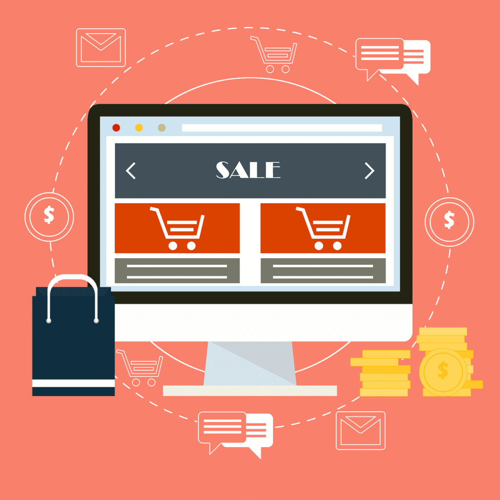

E-commerce is getting increasingly popular. As everyone now wants to work from home. And starting an online store is a convenient way to do that.

If you want to start an electronic store, first, you’ve to figure out what type of products you’ll sell. If you want to sell electronic products, you’ll don’t need to invest a large amount of money. Perhaps, you’ll not need capital at all.

But if you sell physical products, you need to have adequate capital first. Otherwise, you may end up closing your business eventually.

If you have the required money, go, and create a website first. And create an account on Amazon and eBay. Don’t leave these great opportunities!

Shopify has a full-suite for starting an E-commerce website. From hosting to selling products and building a customer base. It has excellent tools and features that will help you to run an e-store successfully. Click here to get a 14-day free Shopify trial.

Another alternative is WooCommerce for WordPress. It’s great for WordPress websites. But if you don’t have a developer, then Shopify is best for you.

If you want a free alternative, then you can use the free WooCommerce plugin. Once you’ve made some money, you can upgrade to Shopify or WooCommerce premium.

Just starting a website won’t help you to sell your products. You’ve to promote your products effectively. And again, blogging is the best choice. Use Content Marketing, Search Engine, Social Media, and other marketing tactics to drive traffic to your business blog. You should also build an email list and send updates and promotional deals to your existing customers.

#### How Much Money Can You Earn Online from an E-Store

There is no exact figure of how much money you’ll earn from an e-commerce store. On average, an e-commerce website generates around $1 million monthly revenue after three years! It's a high enough number to satisfy most people.

#### Essential Websites & Apps: Shopify, WooCommerce

### 6\. Build and Sell an Application Software

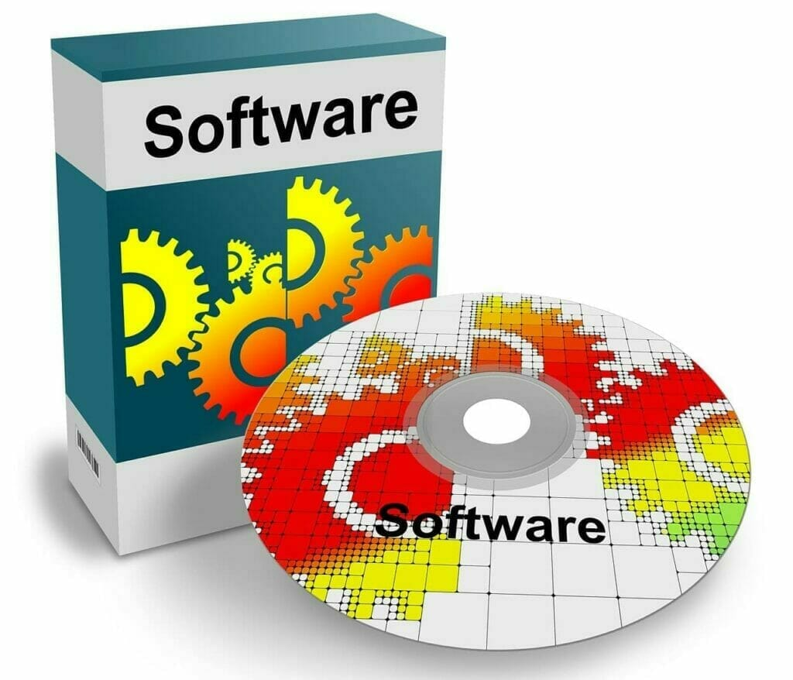

Software packages probably are the best product in the online market. We are always in need of useful apps. And people don’t hesitate to pay for a nifty tool.

And many people even earn 7-figure income for this helping. If you can build an excellent app and execute your plan correctly, perhaps you’re going to be a millionaire very soon!

To build a useful app, you need a great idea first. You’ve to find a problem or many problems that your software can solve or prevent from occurring.

After you’ve got an idea, you need to convert that idea into an app. Either hire a group of developers or build it yourself.

The second way may be cheap, but it’ll take years to build a single app. But, if you succeed, the full profit is yours. Again, if it fails, there is no risk. As you didn’t spend much.

But definitely, it’s better to hire a team of developers. Though it can cost you thousands of dollars, it doesn’t matter. Because the profits can go over millions of dollars! And the other developers will help you to achieve it.

You mustn’t hire cheap developers. Quality is much more important than money. You can easily list your job in the freelancing sites like Freelancer.com, Upwork, etc. Or, you can search for a skilled developer in platforms like Gun.io, TopTal, Hired, GitHub Jobs, etc. Coding forums are also great for finding a developer.

After you’ve hired a developer or a team, you need to discuss with them actively. You need to let them know what you want. You can’t stay silent. And keep patience. It takes a lot of time to build an app.

At last, when the application has been created, you need a place to sell your software. You’ll need a dedicated website or at least a landing page. Then you have to set up the payment systems.

You must create some how-to videos and written tutorials on how to use the app. It’ll not be easy for everyone to understand the interface of a new tool. You can use YouTube and your website to publish the guides.

You should also set up some coupons and offers for sales and discounts. And you must have an option for affiliates because they are the prime boosters.

Now is the time for promoting. The best choice is starting a blog. It’ll also help you to get some pre-orders. You can email your newsletter subscribers about the application. You should also email to famous online entrepreneurs, who can be your potential customer.

If you’ve created the best app possible, and have done marketing effectively, then probably it has started generating money. And buyers are also sending emails asking for support. And you must respond to them and solve their problems.

Customer Service and Ongoing Maintenance are as important as building an application. These are a must to generate steady revenue. But replying to thousands of emails isn’t easy for one person. You should better hire some support staff to do this.

#### How Much Money Can You Earn Online Selling an App

Many people have gone zero to a millionaire in a month, just building an app. How much money you’ll earn depends on various factors. Such as how much you’ll sell your software for, its usefulness, the marketing methods, etc.

If you’re making $20 per sale and selling only 100 copies every month, you’ll still earn $2,000/mo. And what if your software goes viral? And 100,000 copies get sold? You’ll make $2 million in just a month!

You’ve to price your software correctly to make a decent amount of money. You’ve to charge a price which is both profitable to you and reasonable to your customers.

#### Essential Websites & Apps: Freelancer.com, Upwork, Gun.io, TopTal, Hired, GitHub Jobs

### 7\. Build and Sell a Course

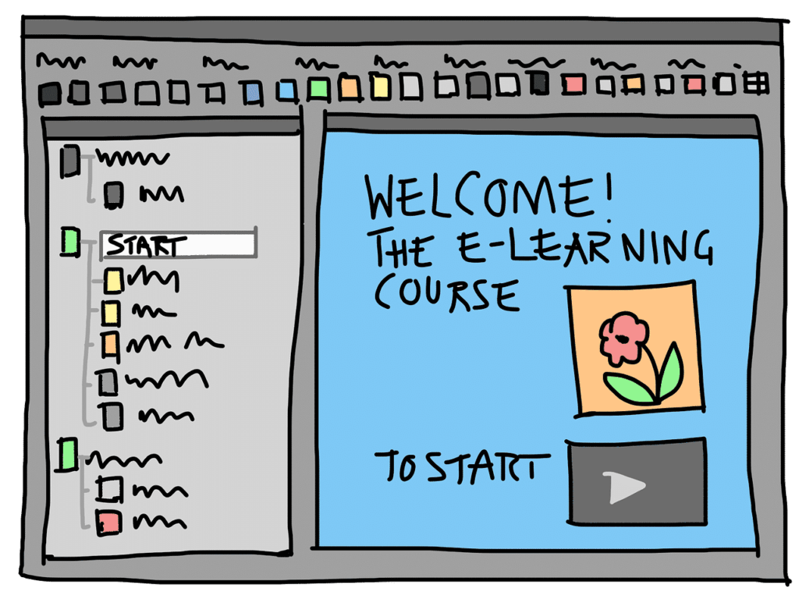

Courses are getting increasingly popular. But why? Because educational fees are exploding every year. And there are no signs of stopping. Students can't afford it. And as a result, student loan debt is also rising every year.

At the same time, the e-Learning market is booming. Because it is flexible, anyone can learn anytime, from anywhere. E-learning has covered almost every topic possible. It is expected to grow past $241 billion by 2022.

And it’s a lot cheaper also. Technologies also have advanced a lot. Now tutors can discuss complex theories and provide sophisticated and interactive instructions on a video. So, the best courses from the experts are now being created.

Many people are earning millions of dollars selling their course programs. You can also make a lot of money from a successful online course in a short period.

But there are thousands of experts to compete with you. So, to stand out from the crowd, you’ve to produce the best course possible. If you’ve got an excellent idea in your head, then the next step is creating it.

#### How to Create and Sell A Course

You should choose an online course creation tool instead of WordPress or WooCommerce to create a course. The two best tools among them are Kajabi and Udemy. Udemy is the most popular course-building tool. But, Kajabi also has all the features one needs, has beautiful designs, and is more user-friendly.

To create a course, first, add a landing page and some content pages. You should assume each content page as a lesson and group them into modules.

After the course has been created, you have to get it to as many people as possible. Kajabi has a unique *Pipelines* feature for this to automate all the processes of marketing.

After you’ve done marketing, you should add coupons and offers to increase sales. You must invite and manage affiliates to promote your course. You should also automate the whole process of sharing revenue with them. Kajabi has built-in features for managing all of these.

*Effective marketing* is a must to get enough sales for anything. You must email your subscribers and your potential customers. You can also start a blog series before publishing your course.

#### How Much Money Can You Earn Online Selling Courses

Many tutors are already earning hundreds of thousands of dollars online. You can make that also if you can come up with a comprehensive course and market it effectively.

Like software, you’ll have to set a high-enough price for your course that is both reasonable to you and your customers. For example, you should charge around $100 for a medium-size course program.

But you can clearly charge $300-$500 or even more for a comprehensive course that explains everything in-depth.

If you are charging $200 for your course, you can easily earn $20,000 a month!! And you need only 100 sales a month for this!

#### Essential Websites & Apps: Kajabi, Udemy, Teachable

### 8\. Start Freelancing

Freelancing means working freely with many companies at the same time. You aren’t limited to just a single organization. Freelance projects aren’t long-term like your day job. Most of them are short-term. And you can work on different projects at the same time. This makes freelancing a great way to earn money online.

To become a successful freelancer, you should do some basic things first. You should build a portfolio website to highlight your works. And try to be a specialist in a particular niche, not a generalist. It’ll help you to be an expert in your working sector and let you charge premium rates for your works.

If you’re just starting as a freelancer, you’ll face many difficulties. At first, perhaps you can’t charge a decent rate for your work. Because everyone wants to hire an expert and not an inexperienced beginner.

To gain some experience and knowledge first, you can start blogging. You’ll be able to represent your content before your clients. It can help you greatly to collect potential clients.

You should create accounts on as many freelancing websites as possible. Doing this will increase your chances of getting work. Some popular freelancing sites are Upwork, Freelancer.com, Fiverr, PeoplePerHour, Guru, etc.

SolidGigs and FlexJobs are also two great curated-job platforms to get freelancing jobs. There are also particular freelancing platforms for each category. Such as Contena for writers, Gun.io for developers, 99designs for designers, etc.

Most of the freelancing websites will cut a percentage of your earnings as a fee. So, you’ll not be able to get the full amount to keep. And also, you might not get paid well because you’ll have to bid to win a job. And many times, the lowest bidder wins the job.

And even if a freelancing platform doesn’t have fees for a freelancer, it’ll charge a fee to the employer. If he doesn’t want to spend extra, he can end up paying you less.

So, once you’ve gained some experience, you should start receiving clients directly through your blog or cold-emailing. Or, you should focus on the category-based platforms. Social Media is also a great place to collect potential clients.

#### How Much Money Can You Earn Online Freelancing

You’ll not earn much as a new freelancer. Perhaps, you’ll get paid only $10 an hour. But you’ll become skilled and gain a reputation progressively. Then you can certainly charge much more than $10.

Some successful freelancers charge up to $250/hr or even more. It translates into an annual salary of whopping $500,000!!! And you’ll earn much more than that if you work more than 8 hours a day!

#### Essential Websites & Apps: Freelancer.com, Fiverr, Upwork, PeoplePerHour, Guru, TopTal, FlexJobs, SolidGigs, Contena, Gun.io, Gigster, 99designs, ZipRecruiter, Behance, Photography Job Central, Belay

### 9\. Work on a Remote Job Online (Part-time or Full-time)

Working from home was a dream of many people in the past. But now, millions of people are working from home and making more than their day job. So, what are you waiting for?

Remote-working has many advantages. Such as, it’ll save you a lot of time every day. You can be more productive and earn more money. And besides, you’re the boss of yourself.

The online job industry is enormous. You’ll find a job no matter what you are. You can be a web developer, digital marketer, writer, editor, online tutor, or anything. Many of the methods I’ll be talking about here are about remote jobs. Just keep reading the guide to find the best suitable way for you.

Many websites list remote jobs. FlexJobs, SolidGigs, WeWorkRemotely are some of the best of them. You can also directly approach a client through cold emailing. You can also get a remote job through networking.

#### How Much Money Can You Earn Online from A Remote Job

Many people think that a remote worker is paid less. But it is just the opposite of the truth. On average, a remote worker earns $4,000 more than most of the on-site workers annually.

And also, only 8% of on-site workers earn more than $100,000 a year, while a hefty 26% of remote workers earn more than 100,000 a year. This statistic says how much more a remote worker is paid generously than an on-site worker.

And as you’re working from home, you may need a lot less time than an on-site worker. You can utilize your extra time behind starting a profitable side-hustle and making more money.

#### Essential Websites & Apps: FlexJobs, SolidGigs, WeWorkRemotely

### 10\. Write Ebooks

Ebooks have gained so much popularity that it has occupied 20% of the entire book industry. And many writers are earning millions just by writing and selling ebooks.

Writing and publishing an ebook has become easier than ever before. Because of the self-publishing platforms, anyone can now self-publish their own books online. So, the royalties are much higher than paperbacks.

#### How to Make Money Writing an Ebook

If you want to write an ebook, a niche is crucial. Because if you’re writing your first ebook, perhaps no one will buy it. As there are books from many established writers.

After you’ve selected a niche, write the ebook. If you have a blog, then creating an ebook might be easier for you. As you may already have content for your ebook in your blog. You just have to repackage those.

After you’ve written an ebook, get it proofread by an expert. And you need to design a great cover also. You should hire someone to do this for you because you might not be good at this. And the first impression is the last impression!

If you’re done with designing a great ebook cover, quickly publish it. Amazon Kindle, Nook, Apple Books, Kobo, etc. are some great places for publishing your ebook.

Amazon Kindle is the biggest self-publishing platform. It has more than 300 million monthly readers. You’ll also get 70% royalty if your ebook is priced between $2.99-$9.99. You must publish your book on Kindle if you want to get many sales.

But you should try to make as many sales as possible on your own. Because you can keep all the profits of the sales.

You should spend enough time marketing your ebook. You can use your blog, social media followers, and contact famous authors, your friends, and your family.

#### How Much Money Can You Earn Online Selling Ebooks

The highest-earning author in 2019, *J.K. Rowling*, the author of the famous title *Harry Potters*, earned an astounding $92 million in 2019!!

Not everyone makes millions of dollars writing ebooks. But you can easily earn a decent amount if you can write a great book.

You can know how much you can earn writing ebooks by doing simple math. If the price of your book is $5, and it sells 1000 copies every month, you’ll make $2,500 from just one ebook, even after cutting 50% as a commission. And considering you’ll write multiple books, it can be a great source of passive income.

#### Essential Websites & Apps: Amazon Kindle, Nook, Apple Books, Kobo

### 11\. Build Websites

The importance of online presence is now more than ever before. As a result, the number of websites is increasing rapidly. And to help the webmasters, website building tools have been emerged to make their work easy.

But still, it isn’t so easy to build a great website without knowing codes. And doing technical things and customization can be confusing for many people also. And concentrating on learning codes rather than the business might not be the best choice.

So, web developers are still hired and paid generously. If you know HTML, CSS, and some basics of JavaScript, you can start your career or a side-hustle as a web developer. You can also extend your knowledge by learning PHP, Ruby on Rails, and some other languages. These will help you to land higher-paying jobs.

If you have the necessary knowledge, then the next step is getting clients. The market is full of developers. So, you’ve to work hard to stand out.

First, make sure what services you can offer. If you can only build websites, then don’t try to develop web apps. Work in a specific niche. A niche is vital for every sector. Because it helps to gain expertise quicker and find potential clients.

At first, no one might want to hire you. So, try to get your first client from your friends and family to build some portfolio first. Also, join freelancing platforms such as Freelancer.com, Upwork, Fiverr. There are also specialized platforms for skilled developers, such as Gun.io, TopTal, Lemon.io, etc.

Local businesses need their own websites also. Email them offering to build their websites. LinkedIn and FlexJobs are also two great places to find potential clients.

If you’ve found a client, now it’s time to start working. You should use the website builders and CMSs available. These will help you to boost your speed. Some of the best website builders are Wix, SquareSpace, and WordPress (combined with a page builder). You’ll also find many pre-made templates on BootstrapMade, WrapBootstrap, and StartBootstrap.

Communicate with your client as much as possible to know what he or she needs. It'll help you to build a perfect site that can fit all the needs of your client. And also try to divide the works into several milestones. It'll make sure that you don’t work more getting paid less.

#### How Much Money Can You Earn Online Building Websites

For a standard website, you can charge between $1,000-$1,500. And if you build only 4 sites a month, you’ll be able to earn $4,000-$6000 monthly!

#### Essential Websites & Apps: Freelancer.com, Upwork, Fiverr, Gun.io, TopTal, Lemon.io, LinkedIn, FlexJobs, SolidGigs

### 12\. Sell Websites

Like building websites, selling websites is also an excellent way to earn money online. Thanks to the developers, building a website has become easier than ever. Anyone can create a website and launch it in just a few hours. It just needs buying a domain name and web hosting. And then installing WordPress to create a website easily.

To create a website for selling, you must build a niche-site. Because only niche-sites are perfect for sale. You must buy a great domain name also, which represents the niche. Then just set up web hosting and install WordPress to build the websites.

Two types of websites are sold. The first one is a starter website. A starter website won’t make you rich. But a site that took you just a few hours to build can be sold at $1000 or even more.

Or, you can post some content on your site. Do proper keyword research and build links. Once it starts making some money, you list it for sale. You can ask 15X-36X money than the monthly revenue!!!

There are many websites where you can list your website for sale. Flippa and EmpireFlippers are the two most popular sites among them.

You may have to hire a broker to sell a website. He may take around 20% of the sold price as his fee.

#### How Much Money Can You Earn Online Selling Websites

Starter websites are great for making some quick money. It just takes a few hours to build a good-looking website. Probably, you can create 30, 50, or more sites in a month. And, if you can sell only 5 websites a month, you’ll still earn $5,000!!

But established sites are much more profitable if you can work hard. If a website Is making $3,000/mo, then you can get anywhere between $45K-$108K selling the website!!! That’s still a hefty $30K-$80K after all the expenses!!!

#### Essential Websites & Apps: Flippa, EmpireFlippers

### 13\. Proofread Documents

Are you an expert at finding typographical errors? Do you have a great sense of grammar and have a vast vocabulary? Put those skills into work. You can earn good money by proofreading documents.

Proofreading is necessary for every kind of writing. Everyone from bloggers to large brands needs to proofread their content. Many people proofread their documents on their own. But many people will bring in help to take out all the mistakes.

Copyediting is the next level of proofreading. You’ll earn more if you can provide copyediting in addition to basic proofreading. Copyeditors suggest considerable changes to a document. Those changes are far above common grammatical errors and can improve a document’s clarity, conciseness, and consistency.

Many organizations hire experienced and expert proofreaders. But most of them at least require a degree to prove expertise. Some even require a Ph.D. in English.

But these degrees aren't a must as you can freelance your clients. You just need to have proofreading (and copy-editing) skills. You can list your service in freelancing sites or directly email clients with some samples of your work.

You’ll have to practice and practice be a skilled proofreader. You’ll also have to be very fast at proofreading, like 40 pages an hour. And you should add copy-editing to your skill. A copy-editor earns much more than a proofreader.

#### How Much Money Can You Earn Online Proofreading

You may earn a lot less in the beginning. But as you make progress, you’ll be able to charge higher rates such as $30/hr or more, as for most projects, you’ll get paid at a flat rate, try to work quickly. If you can proofread 2X fast, you’ll make 2X money!!

A copy-editor earns much more than a proofreader. Even an amateur copy-editor can charge up to $25/hr. While an experienced one can charge up to $100/hr. Generally, a copy-editor edits 2-5 pages an hour. So they earn over $500 to up to $5,000 just from a 100-page book!

#### Essential Websites & Apps: Fiverr, Freelancer.com, Upwork, ProofreadingServices, WordVice, Gramlee, Edit911, EditFast

### 14\. Broker Online Services

Brokerage isn’t just limited to the real estate and stock market in this online world. It has spread beyond real life to the internet. It has become a popular business model and exists everywhere on the internet.

For example, finding a talented worker and getting a potential client both aren’t easy. So, brokers are hired very often to solve this kind of problem.

The job of an online broker is quite exciting. They find out both clients and workers or sellers and connect them. And if both sides agree to make a deal eventually, he gets a commission.

Don’t think that you've never met a broker online. Big companies like Upwork, Freelancer.com, Fiverr, all are brokers. And they make millions of dollars from brokering.

As a broker, you have to look out for opportunities. Such as, if you want to broker freelancing services, you’ve to find freelancing jobs first. There are many unfinished projects in the freelancing sites. You'll also find many people posting jobs or their services in Facebook groups. If you can make a deal between them, then you can charge them a commission.

You can provide your service in web development, website & domain buying-selling, freelancing services, or in any other sector. You can also broker real estate or become a stockbroker, but you need a license for this.

#### How Much Money Can You Earn Online Brokering Services

You can earn a decent amount of money as a broker. And, if you’re a stock or real estate broker, then the number can exceed a million. In the US, a broker generally earns around $50K-$75K to up to $2M or even more.

#### Essential Websites & Apps: Freelancer.com, Upwork, Flippa, EmpireFlippers, DigitalExit, FoundersIB

### 15\. Teach People Online

I previously talked about why the e-Learning market is booming while talking about building courses. But you can’t teach online only by selling courses. There are many other ways to earn money online for tutors. And they also have great earning potential.

But to make money online from teaching, you need to be an expert in a subject. You can’t start teaching people knowing very little.

Students can learn online in many ways. But everything starts with a web search. It can send him to a course, a blog, or an expert. But, course programs are the most popular among the students. Because it's the most convenient way to learn online. They can get a certificate also.

So, you can build and sell a course to make money teaching online. Or, you can start a blog or a YouTube channel. You cannot only post helpful content there but also provide services like consultation services. You can also teach students via video or audio calls for an hourly fee.

You can also try all the methods combined. Three of those together will help you to gain popularity and expertise quicker, and you may also earn more money.

#### How Much Money Can You Earn Online Teaching

How much you will earn online depends on various factors. Such as how many sources of income you have, the potential of your income sources, etc.

Generally, a teacher can expect to get around $20-$25 per hour. Some even charge $40+ per hour. So, you can earn $5K/month if you work only 125 hours a month!

If you have a blog and have built a course, you'll earn passive income also. So, let’s do some simple math to calculate how much money you can make.

I’ve told you that a successful blog can make you $5K-$6K per month, and a comprehensive course can make $20K per month easily. Though those can take months or years to build, you’ll earn a steady passive income every month.

So, after adding all the amounts, a successful online teacher can earn a decent $30K or even more every month!!! So, if you’re only 20% successful, that’s still a cool $72K per year!

#### Essential Websites & Apps: Udemy, Kajabi, Teachable, Zoom, Skype, BlueHost, YouTube

### 16\. Craft and Sell Handmade Things

Do you have a knack at crafting handmade things? Are you a housewife or stay at home mom who loves knitting and sewing? Many people are making extra bucks or even their living online selling handmade crafts. And you can make it too!

You need an online presence first to sell your crafts. The best way is to start an Etsy store. Etsy is the most popular place for selling handmade crafts. It's like the Amazon of handmade crafts. It is also a budget-friendly option, and also you can easily set up a store. You can also link your website or blog to your Etsy shop.

You can also set up your store via Shopify. It is a premium service, but it’s an all-in-one package. You won’t need to build the website from scratch also. Just pick a pre-made template and start working.

You can also set up a WordPress store using the WooCommerce plugin.

After you’re have done the technical things, now is the time to build crafts. If you want some ideas about what you should craft and sell, you can check out this post on *87 Crafts You Can Make and Sell* from *Elna Cain*.

#### How Much Money Can You Earn Online Selling Handmade Things

Building a successful craft business takes time. You’ll not become a millionaire overnight by selling crafts. You need to be a passionate crafter, and your passion will drive you to success. And once you’ve earned success, you can earn even more than $50K per month.

#### Essential Websites & Apps: Etsy, Shopify, WooCommerce

### 17\. Become an Online Writer

Writing is an excellent way to earn money online. Many writers are earning millions of dollars online. And if you’re a great writer, you’ll be able to make a decent amount of money writing online.

But you need to keep in mind that you can’t be rich just writing anywhere. But it is very possible to meet your need. You can offer different types of writings, such as technical writing, copywriting, or creative writing.

If you want to offer writing services to clients, then you mightn’t get the best value for your work. Because a writer is generally poorly-paid. You’ll earn as high as $50 per 1000 words, while the median is around just $10-$20. And you’ll also have to do research before writing. So, it’s not a great way to earn money writing online.

There are many other ways to earn money online writing. The best way is to start a blog. You’ll be able to make a decent amount of money from a successful blog.

Or, you can write an ebook and sell it on Kindle, Nook, Apple Books, etc. Some authors are earning even eight-figures writing ebooks!!!

#### How Much Money Can You Earn Online as a Writer

If you’re a freelance writer, you can earn anywhere between $2K-$6K per month. I’ve already talked about blogging and selling ebooks. Check out those above.

#### Essential Websites & Apps: Contena, ProBlogger, SmartBlogger, Freelancer.com, Kindle, Barnes & Nook, Kobo, Apple Books

### 18\. Earn Money Online as A Programmer

The days are gone when knowing how to code was a must to use a computer. Today we don't need to write a single line of codes to do anything, not even to build a website. It's called the no-code revolution.

But don't think that programmers have gone useless. They’re the men who made using the internet and computer so easy for us. They’re the people who have started the no-code revolution, not us.

There are numerous programming languages, and the number is still growing. Of these, the fundamentals are C, C++, Objective-C, Swift, Python, HTML, CSS, PHP, etc.

A programmer has to know multiple programming languages. But don't think that you need to learn all the languages to start making money.

You just need to learn the essential languages. For example, to develop an iOS app, you must learn Swift and Objective-C. If you want to build websites, then you’ve to learn HTML, CSS, and JavaScript.

If you know how to program, then probably you'll want to apply for a Software Engineer's position. A software engineer is paid generously. But it's not the single way to utilize your knowledge.

I’ve already talked about how to earn money online by building and selling software. You can also go ahead and develop your own app. It can be a great source of income if you can come up with a useful tool.

Game-building is also as good as building software. You can make a lot of quick money if you can create an exciting game. But keep in mind that, though game-building may be more profitable and lucrative, it takes much more time and money than developing software.

Python is a highly valuable programming language. But it's not so hard to learn. It is used for data analytics, data protection, machine learning, to optimize data algorithm, build websites, and for many other purposes. Many companies hire Python developers. And they’re willing to pay you over $100K a year if you’re an expert in Python.

Not just Python, you can get hired if you know any programming language. Many entrepreneurs want to build their own software. But they don’t know to program, or it isn’t possible to finish the work for one person. You’ll find such jobs in the freelancing marketplaces. Or, you can directly approach a client with your own idea, if you think they are interested.

Again, you can make money by offering your programming services. You can use the freelancing sites, social media, your website, cold emailing to get clients.

Teaching is also a great way to earn side income as a programmer. You can start a blog or a YouTube channel and produce helpful content, build and sell courses, write an ebook, etc. Many people are interested to learn different programming languages. So, it’ll not be hard to get students.

#### How Much Money Can You Earn Online as a Programmer

A software engineer is paid generously. And using the other online methods like blogging, courses, YouTube channel, you can boost your earnings. Some programmers like *Sergey Aleynikov* make more than a million per year!

#### Essential Websites & Apps: Udemy, Kajabi, BlueHost, YouTube, FlexJobs, LinkedIn, Gun.io, TopTal

### 19\. Become a Graphic Designer

Graphic-designing is a highly sought-after skill. Because everyone wants eye-catching graphics wherever they are present on the internet. On our website, social media posts, company logo, etc. And if you have the necessary skills, then you can make good money online from it.

As a Graphic Designer, you’ve so many opportunities to earn online. There's no shortage of how many things you can do. You can design logos, custom fonts, Pinterest pins, advertisements, ebook covers, textures, t-shirts, and many other graphics.

Now, it comes to getting clients. I’ve already talked about it a lot of times. Use social media, freelancing sites, and cold email potential clients. And be selective about taking works. Only work on the projects you know you are capable of completing.

You should also create and sell digital files in online marketplaces. You can create reusable templates, fonts, images, textures, and list those for sale. You can sell those individually or as a media kit. You can definitely get $5 for a single graphic, and $500 for a media kit that has 100 graphics. This makes it a great source of passive income.

Building and selling WordPress Themes is also an excellent idea. It is a highly profitable business model. Many theme companies have been evolved just for building WP Themes. And they are making millions of millions of dollars. So, it can be a great source of income if you can come up with one or multiple awesome themes.

Many people are interested to learn Graphic Designing. And you can make money by sharing your knowledge with them. And the best way to do this is to start a blog and teach people how to become a graphic designer. You can also create a YouTube channel, build and sell courses, host workshops, write an ebook, etc.

#### How Much Money Can You Earn Online as A Graphic Designer

The median salary of a graphic designer in the US is just over $40,000. But with so many options available online for graphic designers, such as selling designs, courses, WP themes, starting a blog, YouTube channel, a graphic designer can definitely bring in another cool $5K-$6K per month.

Freelance graphic designers can earn even more. Even an inexperienced designer can get around $25/hr, and some experienced designers charge up to $200, $300, or even more per hour!!!

#### Essential Websites & Apps: Fiverr, Freelancer.com, UpWork, 99designs

### 20\. Utilize Your Cooking Skill

Everyone loves delicious foods. Because people don’t eat to live, they live to eat! And if you cook well, you can make good money online from your cooking skill.

If you’re thinking about earning money cooking, then probably you’ll want to go for traditional ways like starting a restaurant or being a chef.

These ideas can be turned into a million or billion-dollar business if done effectively. But if you want to earn some side cash or something less time-consuming, then you can go for the ways that are entirely online-based.

There isn’t any delicious ingredient online to cook foods. But there are many helpful websites and programs to make money. And cooking is also not excluded.

The best way to earn money online by cooking is starting a YouTube channel. Nowadays, people are searching for video tutorials for every type of recipe. They are trying new things and improving their cooking skills.

You aren’t limited to just a YouTube cooking channel. You can start a food blog, build and sell courses, etc.

You can also build and sell a cooking course. And I think it'll not be hard for you. Because you may already have a lot of YT videos and blog posts.

You can also host meals at your house and invite guests who'll pay you to taste your foods. It can be a great way to earn a quick few hundred bucks if you want to experiment with new dishes.

Another way to earn money online is by writing for famous magazines. Some magazines and websites are willing to pay you over $500 if you can pitch them with a great recipe.

You can also sell your recipes online. Fiverr, Facebook Marketplace, and Craigslist are the best places if you want to sell your recipes.

The door of freelancing is open for cooking too. You can freelance clients for local catering services or get yourself hired as a personal chef. Some great places to find such a job are TakeYourChef, ChefDeHome, AtYourHome, etc.

#### How Much Money Can You Earn Online from Your Cooking Skill

You'll be able to make at least a decent $9K-$12K a month from your cooking skill online if done right. And, some cooking experts are making millions of dollars from those sources.

#### Essential Websites & Apps: Facebook Marketplace, Craigslist, Fiverr, TakeYourChef, ChefDeHome, AtYourHome, Online Magazines, BlueHost, YouTube, Kajabi, Udemy

### 21\. Become A Data Analyst

Data is the most valuable property in this global village. From small to large, most businesses are collecting data from their customers. And, they’re using the data insights to improve their strategy and grow their business.

But not everyone knows how to play with numbers. So, businesses hire a player who can play with numbers. Those players are called data analyst. If you’re a numbers man, then you can use your skill to make money online.

Though you may not need a background in data analysis, you’ll need various skills to be a data analyst. Just having an analytical mindset won't work. You need to-

- Know at least a data-processing language like SQL, Python, Java, Scala, R, MATLAB, C, C++, Swift, etc.
- Be familiar with data-processing applications like R and Excel
- Know how to summarize the analysis result
- Have proper knowledge about creative data-visualization

As a data analyst, you’ll be hired to turn analysis data into reports, visualize the data, create dashboards, clean data sets, enter data into spreadsheets or online systems, etc. So, you’ve to learn these basics of data science first.

Upwork and Freelancer.com are two of the best places to get data analysis jobs. You can also offer your service in Fiverr. Kaggle is another community dedicated to data analysts. It can be a great place to meet with other data analysts and get higher-paying jobs.

Another great way to earn money online as a data analyst is by teaching people how to analyze data. And the best way to do this is by starting a blog on data science. Building online courses on data analysis is also a profitable teaching idea.

#### How Much Money Can You Earn Online as A Data Analyst

A data analyst is paid generously. In the US, the average annual salary of a data analyst is over $70K.

Freelance analysts earn slightly more, $74K+ per year, on average. Some experienced data analysts charge even more than $200/hr! And as a freelancer, other sources of income are available to you, such as blogging, courses, YouTube channel, etc.

#### Essential Websites & Apps: Upwork, Freelancer.com, Kaggle, Fiverr, BlueHost, YouTube, Kajabi, Udemy

### 22\. Become an English Tutor

We need English in our everyday life even if we aren't native. But probably you’re a native English speaker. And many people are willing to pay you a decent amount of money to learn English.

When you’re thinking of making money online by teaching people English, a TEFL course will help you a lot. Because many websites have some requirements, and most of them require a TEFL. Some even require a degree. But don’t worry if you’ve neither. You can still earn good money teaching English online.

There are many websites to teach English online. Some are exclusive to English, while most of them allow teaching other languages. Among them, the bests are VIPKid, English First, Italki, Verbling, PalFish, Tandem.

You can set your own hourly rates when you’re teaching English online. The websites will only charge you a commission. And they make sure that you get paid. Students will pre-pay you, and you’ll receive the money before or right after the lesson.

#### How Much Money Can You Earn Online Teaching People English

An English tutor may get around $15-$25 per hour, plus bonuses (if available). But an experienced tutor with a degree can earn 2X or even more than that. But without TEFL, you can expect to get around $10-$12 per hour.

#### Essential Websites & Apps: VIPKid, English First, Italki, Verbling, PalFish, Tandem

### 23\. Teach People Languages Online

I’ve already talked about earning money online by teaching English. But maybe, it didn’t work for you. Because English wasn’t your language.

But still, you can earn money online if you’re an expert in your own language!

Like teaching English, a degree can be helpful in the case of other languages. But just like teaching English online, don’t worry if you don’t have one.

There are many websites where you can teach people language online. But all of them mightn’t work for you. Because every language isn't available on all the websites. So, you must check each website whether your language is available or not.

If you find that you can’t teach your language on any one of those websites, you can still earn money online. You’ll have to offer your service in the freelancing sites, such as Fiverr, Upwork, Freelancer.com, etc.

Italki is the largest online language teaching platform with 10,000+ teachers from more than 130 countries and more than 5 million users. It has a fair commission rate also. Italki charges only a 15% commission on lesson fees. Two other excellent alternatives to Italki are Verbling and Tandem.

#### How Much Money Can You Earn Online Teaching People Languages

It depends on what language you are teaching and your students' country. But still, you’ll be able to earn around $20/hr to up to $80/hr.

#### Essential Websites & Apps: Italki, Verbling, Tandem

### 24\. Network Marketing

Network Marketing means recruiting people to sell products. It is also known as MLM (Multi-Level Marketing).

It exists for a long-time. But it had bad reputations in the past. Because then, they only focused on recruiting, not on selling products. And many companies had to shut down due to a lack of sales.

But days have changed. Now, many companies are getting more sales using network marketing.

Network Marketing is an excellent way to make money online. It’s nothing unfamiliar. It is just a variation of Affiliate Marketing.

You’ll get paid for every sale you and your recruiters make. If you’re promoting a product priced at $100, and the commission is 20%, then you’ll earn $20,000 monthly if you can make 2000 sales each month.

There are also no shortages of available products to promote. Starting from a few cents to as high as thousands of dollars. The commission rates can range from as low as 1% to 50% or even more. And if someone sign-ups to the program using your referral link, then you’ll also earn for each sale they make.

To make enough sales, you need to work hard to promote the product. And a blog is the best place to do it. Start a blog and start building an email list. You can also use social media to increase sales. But do it wisely.

#### How Much Money Can You Earn Online from Network Marketing

How much money you’ll earn depends on how much sales you make. The more you make, the more you get. And the less you make, the less you get.

If the average commission rate of the products you’re promoting is 20%, and the average price is $100, and if you make 100 sales per month, then you’ll earn $2,000 monthly. And if you make 10,000 sales, you’ll earn $200,000 monthly!!!

#### Essential Websites & Apps: BlueHost, Facebook, Twitter, Instagram, Pinterest

### 25\. Sell Stock Photographs

Do you’ve got a hand on photography? Or are you a professional photographer? If your answers are yes, then you can make good passive income from stock photographs and videos.

Because every people who have a business online, from a blogger to a billion-dollar businessman, need stock photographs.

Though stock photographs are inexpensive, it is a good source of passive income. Because probably you’ll shoot hundreds or thousands of photos every month. And you’re not limited to just one website. You can upload your photographs and videos on many websites.

But you can’t just upload a lot of photos and hope they sell. You’ll have to upload the photographs that actually sell.

You need to use the right keywords for your photos. Use keywords that aren’t too broad. Probably many photographers are already competing for those keywords.

You shouldn’t capture anything you think great. Try to pick a niche to shoot for. And use Google Trends to check what is trending now.

There are many websites to publish your photos and videos. But the problem is, you don’t give them a commission. Instead, they give you a commission for each download. Still, of them, the best websites are:

- **Shutterstock:** Though Shutterstock is the biggest stock website, it is the lowest-paying (or the greediest). They only pay a 15% commission at Level 1. And you need more than 25,000 photos and video downloads to get to Level 6. At level 6, you’ll get a 40% commission for every download. To make the thing worse, levels on photo-licensing and video-licensing are different. And, to make things even worse, all the progress reset on the first day of a new year.
- **Pond5:** Pond5 commission rates are much better than Shutterstock. They share 40% of revenue for non-exclusive video licenses and 60% revenue share for exclusive video licenses. And 35% revenue share for music and sound effects, and 50% for photographs.
- **iStock:** iStock also has the lowest commission like Shutterstock. Only 15% for photos, and 20% for videos and illustrations. And for an exclusive license, commission rates start at 25% and goes up to 45% commission on each sale.
- **Adobe Stock:** Adobe Stock has a commission rate of 33% for photos and vector arts, and 35% for videos.
- **500px:** 500px has a better commission structure than most other websites. It gives 60% to their contributors for exclusive-licenses, and 30% for non-exclusive licenses.

You can also start your own website to show your works, and if someone finds that your photos are great, they can license those paying a fee. You’ll also get the full amount to keep.

#### How Much Money Can You Earn Online Selling Stock Photographs

How much money you'll earn depends mainly on three factors. Such as how much you're getting per photo, how many downloads you get, and the commission rates.

If you are getting $4 per photo on average, and your photos get 1,000 downloads per month, then you can earn anywhere between $600-$2,400 per month.

It means that you’ll earn more if you get a higher commission and more downloads. So, try to shoot as many stock-quality photos as possible and upload them on as many websites as possible.

If your photos get more than a million downloads per month, you can expect to earn even $600,000 up to $2.4M a month!!! And, if you’re selling your photos on your website, then that’s even more, $4M!!!!

#### Essential Websites & Apps: Pond5, 500px, Adobe Stock, ShutterStock, iStock

### 26\. Start a Facebook Fan Page

Nowadays, most Facebook users have a page of their own. Many even have multiple pages.

But not every page is popular. Gaining popularity isn't so easy. Only a few pages can make it to millions of followers!!

It has become too hard to grow your audience organically. Because Facebook has changed its algorithm a lot in the last few years.

But you can’t just blame Facebook. There are millions of Facebook pages. So, getting thousands of likes isn't so easy at all.

But you can invite all of your friends and ask them to invite their friends. It’ll help you to collect a few hundred likes on your page.

Publishing posts regularly on your page is very important. And rich media are more engaging than texts on social platforms. So, try to add shareable images and a video if you can.

After you’ve managed to get a high enough number of followers, you can start making money from your page. If you’ve 100,000 followers, the best way to monetize your page is *Sponsored Post*. You can earn around $1500 for a single sponsored post if you have 100,000 followers.

But if your page doesn’t have that number of followers, then you can use affiliate marketing to generate some income. Or, you can do what everyone is doing, direct your followers to your website. You can also set up a store on your page.

#### How to monetize a Facebook page via Facebook Monetization

Recently Facebook has introduced Facebook Monetization for videos like YouTube Monetization. There are 4 ways to monetize a FB page. These are:

- **In-stream Ads:** You can display short ads on your videos to earn money. To be eligible for *In-stream Ads*, you need to have at least 10,000 followers and 30,000 1-minute views for 3-minute videos in the last 60 days.
- **Fan Subscription:** You can charge your fans a monthly subscription fee to enjoy exclusive benefits. *Fan Subscriptions* is an invite-only feature.
- **Stars:** Your viewers can buy and send you *Stars* when they are watching videos. And you’ll get $0.01 for each _Star_. It's an invite-only feature.
- **Brand Collabs Manager:** Partner with the brands who want to collaborate with you. To be eligible, you need to have at least 1,000 followers, and 15,000 post engagements or 180,000 minute-views or 30,000 1-minute views for 3-minute videos.

#### How Much Money Can You Earn Online from A Facebook Page

There is no accurate answer to this question, only calculations. Facebook is mainly used by bloggers to drive traffic to their websites. And then, they earn money from ads, affiliate links, etc.

So, if the average RPM of your website is $10, and you are getting 100,000 monthly readers from your FB page, then you’ll earn $1,000/mo. And if you do three sponsored posts per month, then that’s another $3K-$4.5K.

You can also make money from your videos through FB monetization. If your videos are getting 100,000 ad views per month, and your CPM rate is around $2, then you’ll earn $2K/mo.

If you have also set up a store on your page, then you’ll also earn money from your store. If you’ve 1 million followers, then you may be able to sell 10-100 products per month. So, if you are making $10-$100 per sale, then you’ll earn $100-$10K per month.

So, from the above amounts, I can say that you can earn around $5K-$15K/mo from a single FB page that has 1 million followers!

#### Essential Websites & Apps: Facebook

### 27\. Become an Instagram Influencer

Instagram is the third most popular social media platform. More than 800 million people actively use Instagram every day. It says how popular Instagram is! And it is showing no sign to stop growing.

And many people have established themselves as Instagram Influencers. They’ve millions of followers, and they’re making a decent amount of money every month from Instagram.

It is simple to create an account on Instagram. Anyone can create one. But it is tough to build an engaged followers base. But, once you’ve made it, you can make thousands of dollars for each of your posts.

You don’t need to have millions of followers to start making money on Instagram. But you need at least 3K followers to earn something meaningful.

The most popular way to earn money on Instagram is *Sponsored Post*. The more followers you have, the more you can charge per post. You can make anywhere from $75 to over $1 million per sponsored post!!!

To get paid for your post, you’ve to contact brands. You can outreach to brands or search for a brand on a marketplace. Some of the best influencer marketplaces are Tribe, HYPRBrands, Influicity, HypeTap, etc.

*Sponsored Post* isn’t the only way to make money on Instagram. Another great way is charging other Instagrammers for shoutouts. ShoutCart is a great place to find businesses for shoutouts.

As high-quality images are crucial on Instagram, you can make good money selling your Instagram photos also. You can sell them like other stock photos on Shutterstock, Gettyimages, Fotolia, etc. Or, you can look for other choices that fit Instagram better, like 500px, Twenty20, or Foap.

These three ideas are probably the best ideas to earn money on Instagram. But if they don’t fit you, then you can go for the other general ways. You can use your Instagram follower to drive traffic to your website. And make money from your website by selling your products or affiliate marketing.

#### How Much Money Can You Earn Online from Instagram

Most of the earnings of an Instagrammer comes from sponsored posts. Kylie Jenner is the highest-paid Instagram Influencer. She gets $1.2 million for a single sponsored post!!! She also has an impressive 181 million followers!!

But perhaps, you aren’t that popular on Instagram. But if you’ve 10,000 followers, then you’ll still be able to charge around $100 per post! And as there are more ways to make money from Instagram, you’ll earn even more!

##### Essential Websites & Apps: Tribe, HYPRBrands, Influicity, HypeTap, ShoutCart, 500px, Twenty20, or Foap

### 28\. Become a Virtual Assistant

The job of a VA or Virtual Assistant is assisting the client, but virtually. One man isn’t an expert at everything. So, they need to bring in more people to help them. But it is always not possible to hire a full-time employee. So, they outsource some of the works to VAs.

Virtual Assistants need to have some skills. They need to have organizational skills, communicational skills, and good knowledge and understanding of the internet. These are the skills that are a must for a VA.

If you have the skills, you can start earning money online as a VA. First, you need to get clients. The same things, join the freelancing platforms, use social media and your website, cold emailing, to find potential clients.

As you’re working as a VA, you’re freelancing. And if you want to succeed at freelancing, then try to be a specialist, not a generalist. Don’t think that as you’re narrowing down your working sector, you’ll get fewer jobs. You’ll get more potential clients who will pay you much more for the same work only for your expertise.

Having a specialty means working in a single sector. Like if you’re an expert at managing social media, then you should only manage social media accounts or pages for your clients. The same thing applies if you’re at good at administrative support, website management, finance management, digital marketing, customer service, etc.

#### How Much Money Can You Earn Online as A VA

VAs aren’t paid generously. You’ll need to work hard to earn a good income. At first, you can get even around $6/hr. But as you progress, you can charge higher rates. Experienced assistants charge more than $25 per hour. Some VAs even earn more than $10K per month!

#### Essential Websites & Apps: Zirtual, VANetworking, Freelancer.com, Upwork, FreeeUp, Fiverr

### 29\. Work as Customer Support Staff

Working from home is no longer a dream. Many people are working from home. It is boosting their performance, and they are taking less time. Furthermore, the earnings are much better than their day job.

Remote jobs are available in every field. And customer support is one of the largest sectors among them. Businesses need a lot of staff to support their technical, sales, and other general issues.

Don’t think that you’ve to go out to offer customer services. You can work entirely from home online as support staff. And the hourly pay rate is also good enough. You can earn anywhere from around $12.5 to $37.5 per hour.

And being a specialist is profitable here also. You’ll earn much more than a generalist.

As it is much the same as the job of a VA (Virtual Assistant), you’ll need to be good at organizational and communicational skills.

There are different types of customer service jobs. Such as, if you’re an expert at how things work, then many businesses will be willing to hire you as technical staff.

Or, if you’re good at managing sales, you can apply for a sales staff’s job.

If you’re good at communicating with people via phone call or SMS, then you can apply for a call agent’s or chat agent’s job.

Finding a customer service job might not be that difficult. Because there is a high need for support staff. A single company needs multiple employees for just customer support.

You can join the freelancing sites, use social media, or you can directly outreach to businesses for a position of support staff. There are also some websites dedicated to customer service jobs.

#### How Much Money Can You Earn Online as A Customer Support Staff

Like a VA’s job, customer service isn’t so easy. You’ll need to work hard if you want to earn good money. If you’ve no experience, you can’t expect to get more than $15/hr. But as you progress, you’ll be able to earn up to $25 or more per hour.

#### Essential Websites & Apps: Freelancer.com, Upwork, CustomerServiceJobs

## **Excellent Ways How to Earn Money online On the Side**

### 30\. Start a T-shirt Business

Everyone loves t-shirts. Because it’s comfortable and fashionable. And also, it can reflect our beliefs, personality, and interests. For this, it has become one of the most popular things to make and sell online.

Starting a t-shirt business is a lucrative venture. Therefore, so many people have started designing and selling t-shirts. You can also launch your own t-shirt business as a side-hustle or a full-time business.

A lot of effort isn't needed to start a t-shirt business. So, many people have taken this as a side-hustle. And you can also add an extra highly-profitable business to your source of income.

Shopify is the best choice when it comes to building an e-commerce website. It also comes with a 14-day trial. And it is also easy enough to integrate your shop with a print-on-demand or dropshipping service provider to fully automate the process. BigCommerce is also a great alternative to Shopify.

A niche is necessary for every part of the graphic industry. By targeting everyone, you’ll end up targeting no-one.

After you’ve defined your niche, then comes the part of designing. You need a beautiful and attractive design. It doesn’t mean you need something complicated. A simple design is enough.

Though a simple design is enough, it is better to hire a designer if you’re not good at designing. Because without a great design, you can’t attract customers. Dribble and 99designs are two excellent places to find a skilled designer.

If you’ve created the design, now is the time to validate it. You should leverage social platforms for this. Reddit is the best social platform in this case. You’ll get honest, unbiased feedback on how to further improve your design.

After this, you’ve to source t-shirts and printers. Don’t compromise in quality to reduce the cost. You can’t even make sales if the t-shirt shrinks or rips after a few wears. So, opt for the highest quality you can afford.

There are mainly three types of printing techniques. The first method is screen printing. It is best for high-volume print, but time and cost-ineffective for more than 4-5 colors. Heat transfer is the second technique. It's best for printing photographs or abstract designs, but it is less durable. Direct-to-garment is the third method. It is best for complicated and colorful designs, but not cost-effective for high-volume printing. Choose the technique that best fits your need.

Buying and holding an inventory might increase the profit margin. But a print-on-demand service reduces the risks and takes a lot less time. And you may probably make more money as you’ve to do fewer works. And you don’t also need to spend much money upfront. Some best print-on-demand dropshipping services are Printful, TeeLaunch, TeeSpring, PrintAura, Printify, etc.

If you’ve completed all the steps, now launch the product. Buy domains and web hosting from BlueHost to build a website quickly. Use social media, connect with influencers to maximize t-shirt sales. You should also leverage retargeting campaigns, social media ads to bring more customers to your e-store.

Learn from failures and come back with a better product. If you succeed, design new t-shirts to keep the cash-flow steady.

#### How Much Money Can You Earn Online from A T-shirt Business

How much you’ll earn will depend on how much a tee cost you to produce and how much profit you are making. If you are getting $5-$10 profit per t-shirt and selling 1,000 t-shirts per month, then you’ll earn $5K-$10K monthly. And this is a decent amount both for a full-time worker or a side-hustler.

#### Essential Websites & Apps: Shopify, Bigcommerce, Bluehost, Dribble, 99designs, Printful, TeeLaunch, TeeSpring, PrintAura, Printify

### 31\. Start Trading Online

Many people invest in the stock market to make a profit. On average, the share market grows by 10% every year. But most of the traders leave trading after losing money. They fail due to ineffectively execute a strategy.

Investing in the stock market involves risks. But with the rise of the internet, there are numerous free and paid educational resources on how to successfully trade in the stock market, everywhere on the internet. It has made the risk reduced a lot.

If you want to start investing in the stock market, then you can start right now online! To start trading online, you need to pick a trading website that is best for you. There are different trading websites for every country. For beginners in the US, TD Ameritrade is a great website.

Before buying any stock, conduct enough market research first. A good trading website always has all the research tools needed.

You should play safely in the share market. If you’re just starting, you should only buy stocks in the mid-cap or high-cap companies. You can also buy dividends to make sure-money. Another safe investment can be purchasing an IPO. Because many times, it’s the lowest price a stock receives in its life.

To make a profit in the share market, you need to buy low and sell high. So, keep patience. Don’t sell low and buy high in panic. Prices of stocks can go low but don’t sell it. And probably it is the best time to buy more.

The key to success in the stock market is patience. Buy only good stocks, and keep them for a long time before selling. Day-trading might be lucrative for a short time but involves high risk. You can lose all your money in greed.

#### How Much Money Can You Earn Online Trading Stocks

If done right, you can expect to get at least 9%-10% yearly returns. And successful day-traders can get even 17%-18% monthly returns!

But there are high risks involved in the share market. Don’t greed. Play safe. Otherwise, you may lose all your money and go bankrupt.

#### Essential Websites & Apps: TD Ameritrade, Fidelity, Scottrade, TradeKing

### 32\. Narrate Audiobooks

While the publishing industry is declining every year, electronic formats are becoming increasingly popular. And the Audiobook industry is just booming! The short answer to why is, people aren’t going blind, but people are being busier (or LAZIER!).

But hard-working people are always rewarded. And if you’re well at voice-acting, you can make good money narrating audiobooks online.

Anyone can read, but very few people can express their imagination through their voices, like one in a thousand. So, narrating audiobooks might not be for you if you’re not among those few people.

ACX (Audiobook Creative Exchange), owned by Amazon and Audible, lets you connect with people who want to convert their book into an audio format. Joining ACX is very simple, sign up, put some samples, and do auditioning for jobs. ACX won’t cut a single penny from your earnings.

The auditioning system of ACX is also simple. You’ll have to narrate one or two pages, and then submit the audio file. Then the *Rights Holder* will review your narration, and if he/she thinks you are the best, you’ll get the job.

You can get paid in three ways in ACX. Per-Finished-Hour, 50/50 Royalty Share, or a combination of both. The employer will select the payment method, but you can still set your preference in your profile.

Probably, an employer won’t resist a single compromise in audio quality. So, a good microphone is a must. And a good mic stand, pop filter, headphone, and a quiet space is also as necessary as a mic.

You’ll also need an audio-editing software to edit the audio file. Adobe Audition and Reaper are the two best software for audio editing. But these aren’t a must to produce a great audiobook. A free tool like Audacity is much more than enough.

If you’ve gained experience in the ACX, you should start offering your service on the other freelancing platforms. In ACX, you’ll generally make $80-$100 per audio-hour. But as a professional narrator, you can earn $200 per audio hour or even more!

#### How Much Money Can You Earn Online as An Audiobook Narrator

An audiobook narrator can earn as high as $200 or even more per audio hour. And if you take the same time to edit the audiobook, then it’s still $100/hr. If you get regular works, then that translates into an annual salary of $200K!!

Many narrators even earn passive income narrating audiobooks by revenue share. They earn $2,500 or more passive income monthly. And some of them are making it just from a single book!

#### Essential Websites & Apps: ACX, Audacity

### 33\. Buy and Sell Domains

Domains are the real estate of the virtual world. Domain Flipping or buying & selling domain names are much like selling ready-made websites. But the price of a premium domain is much more volatile than the price of a website.

Domain flipping is coming as a popular way to earn money online. Because it is a lucrative business (you can also take it as a side-hustle). If you can properly execute the plan, you can earn even millions of dollars for a single domain.

Great domain names have been sold at $5 million, $7 million, $16 million (insure.com), $35 million (Vacation Rentals)! Or, even more, $90 million (LasVegas.com)!!! Or, even more at a staggering $842 million (Cars.com)!!!!!!!

But getting this type of price for a single domain name has become impossible nowadays. Because millions of people and thousands of flippers are registering millions of domain names every day. As a result, it has become tough to even sell a great domain name for over $1K or even $100.

But still, thousands of flippers are flipping domains every day. But why? Because they know how to execute a strategy.

Selling domain names for making money isn’t as easy as buying a domain for your blog or website. You’ve to care about many things when purchasing a domain name. A great domain name is:

- Not your nickname. Your nickname might be suitable for your own blog. Some have even made thousands of dollars selling it. But not everyone is this lucky. And those lucky men had to wait years to get an offer. So, reconsider your choice.
- A brandable name
- A dictionary word
- A top keyword
- A name that represents a niche
- A name that people are interested in
- Most of the times a .com domain

If you’ve cracked out a great domain name, it isn’t all. You must avoid any legal risks involved. If you think of buying a domain name similar to Facebook.com or a new TLD of Facebook, your domain name can get forfeited. So, don't try to trick anyone!

If the domain name you want is available, then buy it cheap at Porkbun or GoDaddy. But if it is unavailable, then leave it. If you still want the domain name, you can contact the owner by checking the information at WhoIS.com.

Flippa and SEDO are also two great places to buy domains. There you’ll find a lot of brandable, top keyword, dictionary word domain names. But as you’re buying from a flipper, you’ll have to spend much more to get the ownership of the domain name.

You can also search for the domain names that are going to be expired soon or have gone recently at ExpiredDomains and JustDropped. Because they can be great domain names. And you’ll get them at the same price as new domain names.

If you’ve bought the domain names, now you’ve to list in a marketplace for sale. SEDO and Flippa are the two best websites for selling a premium domain name. GoDaddy is another great place if you want to sell the domain names at an auction.

#### How Much Money Can You Earn Online Buying and Selling Domain Names

If you want to sell a domain name quickly, then you can get $40-$4K or more per domain. It varies by domain names.

But if you want to sell the domain names for a higher price, you may need to hold the domains for a long time. You can get a few hundreds of thousands of dollars or even millions like the above domain names. But it can also happen that you’ll never be able to sell the domain names.

If you go for the quicker process, and sell 100 domain per month, and get $50 per domain on average, then you’ll earn $5K a month! And if you buy the domain names from other flippers at $40, you’ll still earn $1K. And you’ll definitely make more than this if you can sell 100 domains a month. As you’ll get over $50, or even $100 for at least some domain names.

#### Essential Websites & Apps: Flippa, SEDO, EmpireFlippers, Porkbun, GoDaddy, NameCheap

### 34\. Write for Medium Partners Program

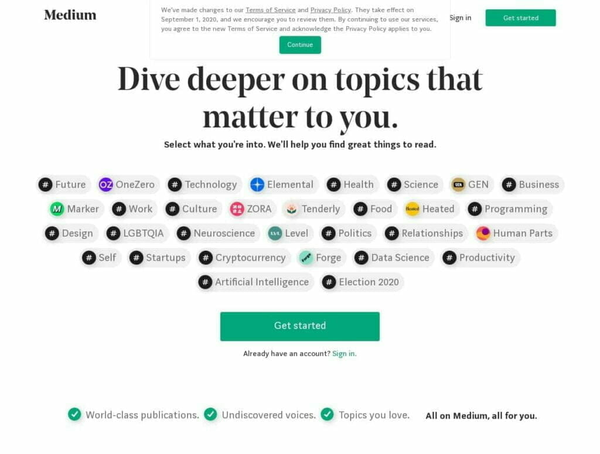

Medium is a publishing platform that was launched in 2012. Now, around 100 million readers read Medium articles every month. It is a platform open to every blogger. Here anyone can write articles and make money.

Medium is free for writers. Anyone can publish articles in Medium for free and also make money.

But readers have to buy a membership of $5/mo or $50/yr to read articles. And, if a reader likes your content, he/she can clap. And for each clap, you’ll get compensated from their subscription fees.

Medium doesn't disclose its algorithm. So, there is no way to know how a writer is paid. But generally, how much you’ll earn for each clap depends on how much articles a reader claps a month. For example, if a reader does only 2 times a month, you’ll earn around $2.5 for a single clap, but if he does 100 times, you’ll get just $0.05.

Medium is an excellent platform for experimenting with blogging-skills also. You’ll also make good money from its vast amount of readers. If you have a blog already, then Medium is a great place also to republish your posts.

#### How Much Money Can You Earn Online from Medium Partners Program

Many Medium bloggers are making over $5K per month!! In June 2020, the highest amount earned by an author was $33,617.89, and the highest amount earned for a single story was $6,386.48!!!

The better your content is, the more you’ll earn. Medium has its own curator team. If your story is good, and it gets curated, you can expect to get $200 or more for that single story. And if your article is so great that it gets featured in Medium, you can earn even $1K+!

#### Essential Websites & Apps: Medium

### 35\. Host Corporate Workshops Online

Attending workshops is a great way to learn something. And hosting a corporate workshop is also an excellent way to earn money. And if you already have an established business, it can work great for you.

Thanks to the developers who have taken the internet to this far. Now, you can meet people from any part of the world. So, you can host and attend a workshop online wherever you live.

A workshop isn’t only useful for making money. Attendees also get great value for what they pay. They learn and gain experience in many things. They get actionable advice that helps them to grow their own business.

To host a workshop, you’ve to build credibility first. What will you teach if you yourself know nothing? You should have a blog, write in Medium and LinkedIn Pulse regularly. And participate actively in social platforms, Do all the things needed to harden your online presence.

Don’t think that you won’t need a venue as you’re hosting online. You should host both in-person and live. So, you must set a date and choose a venue to host at. You need a place that is big enough for at least 50 to 100 people. And also, set a price for the ticket that is fair enough for both you and the attendees.

There are numerous video conferencing solutions online beside Zoom, Crowdcast.io, GoToMeeting, EasyWebinar. It is up to you what you’ll choose.

You have to promote your workshop well to collect as many attendees as possible. You’ll have to use all the things you’ve, your blog, your newsletter subscribers, your social media followers, etc. And also reach out to the people and businesses that can be benefited from your workshop. You should start advertising at least two weeks before the set date.

#### How Much Money Can You Earn Online Hosting Workshops

There are no exact numbers. But if you charge $300 per ticket and 100 tickets get sold, then you’ll still earn $30K hosting a single workshop!!! And if you spend even $10K behind hosting the workshop, you’ll still earn $20K!!

### 36\. Make Money from Your House

Many people buy a beautiful house by spending a lot of money just to sell it a few years later. But it takes years after years to sell the house for a profitable price. So, why not start making money from your home right now?

There are many business ideas to make money from your house. Of them, the best ideas are:

- **Rent out rooms or your entire apartment, or add a rental suite (if possible):** It is the most popular way to make money from a house. Generally, 1% of an apartment's net worth is charged monthly. So, if your home is valued at $250,000, you'll be able to ask renters around $2,500 per month. If you want to add a rental suite, then keep in mind that you need to be able to charge at least 2% of your total cost. So, if it cost you $50K to build, you should charge the renters $1K monthly.
- **Essential Websites & Apps:** Craigslist, Airbnb, Zillow, Apartment List, Rentals
- **Rent out storage units:** If you’ve storage units at your house, you can rent out those units. You’ll get $1-$2 per sq feet per month. You can charge more if your units are climate-controlled.
- **Essential Websites & Apps:** Craigslist, Storage.com
- **Rent out your backyard:** You can rent out your apartment backyard for up to $2,000 or more per month.
- **Essential Websites & Apps:** RentTheBackyard
- **Run a B&B (Bed & Breakfast):** If done right, a B&B business can be highly profitable. If you have a five-room property, you can make $500 per night, if you charge $100 per bed. And you’ll earn more if you have more rooms.
- **Essential Websites & Apps:** AirBnB. Craigslist
- **Host meals and invite guests:** If you can cook well, you can easily make a few hundred bucks hosting a meal. Continue reading the post to get more details.
- **Essential Websites & Apps:** TravellingSpoon, EatWith, Feastly, NewGusto, VizEat, Bon Appetour
- **Sell or rent out your household items:** If you’ve got a lot of unnecessary stuff at your house, you can sell them or rent them for a decent amount of money. Continue reading the post to get more details.
- **Essential Websites & Apps:** Craigslist, eBay, RentNotBuy
- **Sell home-grown produce:** People want organic foods. If you grow vegetables and fruits in your garden, you can sell them to your neighbors or local restaurants to make a decent amount of money.
- **Essential Websites & Apps:** Food4All, RipeNear.me

### 37\. Design Logos for Companies

Every business needs a logo. Because it is what a business use to represent their moto. It tells an organization's goals and beliefs. So, an excellent logo design is a must for a business.

But not everyone is skilled at creating an awesome logo. As a result, they make what they can. Or, they hire someone professional to design a great logo. And they pay the designer very well.

Logo-designing is just a part of graphic-designing. But a logo-designer may know much more about a logo than a general graphic-designer. And businesses always want to hire an expert.

If you have the necessary skills for designing a logo, you can start making money online designing logos. You need to know how to express words through graphics, how to play with colors, and what they mean. You also have to be skilled at Photoshop or any other image-editing applications.

To offer your service to businesses, you can use freelancing marketplaces and social media. Fiverr is the king of freelancing platforms when it comes to graphic designing. You can offer your services from $5 and keep increasing it for a higher-level of works.

Another way to grab logo-designing jobs is finding businesses that have a poorly-designed logo. You can directly contact them and offer them a price. And they may be very interested in having a great logo.

Some agencies also hire logo-designers. If you want to gain some experience at first, you can join those agencies. They’ll cut a portion of your earnings as a fee. BrandCrowd and Sellfy are two of the best logo-agencies available online.

#### How Much Money Can You Earn Online Designing Logos

If you’re working at Fiverr, you may get $5 (actually $4) per logo you design. Though it is underpaid, you’re not building a unique logo, and it may take only a few minutes.

If you are an inexperienced logo designer, you can still earn around $100 per logo. And once you’ve gained some experience and expertise, you can get $1K, $10K, or even over $1M for designing a single logo!!!

#### Essential Websites & Apps: Fiverr, Sellfy, BrandCrowd, Freelancer.com, Upwork, Facebook

### 38\. Fix Google! (And Bing Also)

Have you ever searched on Google and found a strange result? I've seen it many times, and probably you’ve also. Google, Bing, and other search engines are consistently improving their algorithms to provide better search results. But machines can’t do everything.

That’s when humans play their roles. They’re called *Search Engine Evaluator*. *SE Evaluators* clean up and improve the search engines through their humanistic touch. If you're interested, you can also apply for an evaluator’s position.

Currently, three companies, Appen, Lionbridge, and Teemwork.ai, hire SE evaluators. Anyone over 18 years from any part of the world can apply. You just need to fill up a form with the necessary information.

Search Engines also directly hire evaluators frequently. You can keep an eye at FlexJobs, and Google & Bing’s career page if a job is currently available.

You’ll work as an *Independent Contractor* when working as a SE evaluator. And you’ll also have to sign an *NDA (Non-Disclosure Agreement)*.

_**Note:** Appen & Lionbridge work for Google, and TeemWork.ai works for Bing._

#### How Much Money Can You Earn Online as A Search Engine Evaluator

The job of a SE Evaluator is fascinating. You can expect to get between $12-$18/hr to up to $24/hr. It is not a high amount. But you’ll learn many things while working as an evaluator.

#### Essential Websites & Apps: Appen, LionBridge, TeemWork.ai

### 39\. Provide Consultation Service to SMBs

Thousands of businesses hire consultants to receive actionable advice. A consultant can play a vital role in growing a business. Because of this, the consultation service is a highly-profitable business.

Consultants exist in every niche and sector possible. A consultant is basically an expert who earns money selling actionable advice. If you’re an expert on just anything, you can start making money online right now.

Consultation service is a highly-flexible work. You’ll not need to leave your day-job or your online business. You just have to answer your client’s questions with details. And that doesn’t take hours!

If you’re a blogger, consultation service can be an additional source of revenue for you. Many successful bloggers are offering consultation services and earning a decent amount of money as a side-hustle.

Freelancing platforms mightn’t be the best option for finding clients for your consultation service. If you are a successful blogger, you shouldn’t miss the chance to get clients directly from your audience.

Outreaching is the best way to get clients for your consulting business. For example, if you’re a marketing consultant, search for companies and blogs who aren’t maximizing their marketing efforts and offer them your consultation service. Or, if you’re an SEO expert, offer them SEO consultation services.

Though freelancing platforms, in this case, aren’t the best choices, they’re not the worst. You should use both freelancing and social sites to get more consultation jobs. Those can be a great choice if you’re just starting.

Note: As a consultant, provide only the actionable advice you know will work. You’ll also need to outsource any work you aren’t expert at. Because if you fail in any one of the two cases, it can be a big turndown for your business.

#### How Much Money Can You Earn Online as A Consultant

How much you’ll earn as a consultant depends on your expertise, niche, specialty, method of payment, etc. If you charge your clients $500 per month and work with five clients every month, then you can earn $30K/yr.

So, if you charge more, you’ll earn more. Many consultants charge $2,500 or more per month per client. Again, some consultants demand even more than $1K per hour per client!!!

#### Essential Websites & Apps: Your Own Blog, Freelancer.com, Upwork

### 40\. Receive Calls and Share Your Expertise

Are you an expert in a subject? Do you think that you can solve people’s problems? Then you can earn money sharing your expertise through phone calls.

It is very much the same as earning money by answering questions. But in this case, you’ll be solving much more complex problems, instead of answering just a simple written question.

There are different ways to start earning money online in this way. One of the best ways is joining a company as a phone support staff. You’ll be paid a flat salary or per-call basis. Or, you can directly outreach to different companies or offer your service in the freelancing platforms.

You can also join some websites like PrestoExperts, 6ya, Ether, etc. You can set your own rate, the rate at which people will call you. You’ll be able to make around $2/min. And as usual, those companies will cut a commission from your earning.

Another great idea is starting a phone support business of your own. It can happen by both audio and video calls, or offline and online calls. The best way is grabbing a *Revenue Generating Number*, where a caller will have to pay to call you.

#### How Much Money Can You Earn Online Sharing Expertise Through Phone Calls

In the US, the average annual salary of a customer service job is just over $36K. If you want to join a website like PrestoExperts, you’ll get paid $2 per minute. After deducting all the fees and other expenses, you may earn around $1.20/min.

If you want to start a phone support business, you may be able to charge callers up to $2 or more per minute. For this, you can use the online calling platforms or set up some premium-rate numbers.

#### Essential Websites & Apps: Upwork, Freelancer.com, PrestoExperts, 6ya, Ether, TethrIt

### 41\. Edit Videos Online

With the growth of internet speed and bandwidth, videos have covered 80% of the total size of the internet. Businesses need videos, advertisers need videos, YouTubers need videos, everyone needs videos. And all these videos must be of high-quality.

But producing a high-quality video isn’t easy. A good camera is nothing if you can’t edit a video properly. Editing is the most crucial phase of processing a video. Therefore video-editing is a highly sought-after skill.

Editing a video isn’t an easy process. Though many excellent video editing tools have been evolved, and some are entirely free. And most of those are also beginner-friendly. But professional-quality video-editing still takes years to learn.

So, if you’re a skilled video editor, you can earn big bucks online. Every people and business who have an online presence will want to hire you. And you’ll get paid well to edit their videos.

You’ll need a proper video-editing application first. No doubt that tools like Adobe Premiere Pro CC and Final Cut Pro X (Mac) are the king of video-editing software. But they’re not a must to produce a great video.

Budget-friendly options like Filmora, Davinci Resolve are extremely good at what they do. Though Adobe Premiere Pro CC isn’t packed into them, they can fulfill most needs. And once you’ve started earning, you can easily upgrade to a better option.

But keep in mind that a video-editing tool costs only a few hundred dollars, or sometimes less than $100. But you’ve to spend a considerable amount of money on upgrading your PC. A high-end or at least mid-high-end pc is a must for video-editing.

And a high-end PC can cost even more than $1000! If you don’t want to spend that much, you should at least grab an 8GB RAM stick and a Core-i5 or Ryzen5 CPU.

You’ll find lots of video-editing jobs in the freelancing platforms like Upwork, Fiverr, Freelancer.com. There are also some websites like Mandy, MOFILM, ViEdit, Tongal, which are dedicated to video creation.

Social sites are also great for finding video-editing jobs. You can join FB groups on video-editing. Another excellent way to get video-editing jobs is directly contacting famous YouTubers, agencies, or businesses if they’re hiring.

#### How Much Money Can You Earn Online as A Video Editor

If you’ve no previous working experience as a video editor, you can expect to earn around $15-$20/hr. But as you progress, you’ll be able to charge more, up to $100/hr! This translates into an annual salary of $200K!!

#### Essential Websites & Apps: Adobe Premiere Pro CC, Final Cut Pro X, Filmora, Davinci Resolve, Upwork, Mandy, Freelancer.com, MOFILM, ViEdit, Tongal, Fiverr

### 42\. Do Voice Overs

Many businesses need voice-over jobs for various purposes. I’m not talking about music production at all. There are other jobs such as narrating audiobooks, radio & TV commercials, video-game scripts, phone-call greetings, cartoons, and animations, etc.

If you’ve got a perfect voice, or you are great at voice-acting, you can use your voice to make money online. It is an excellent way for you to earn money online.

You’ll find such jobs in the freelancing platforms like Upwork, Freelancer.com, or Fiverr. There are also other platforms dedicated to voice overs.

Voices.com is one of the best sites to get voice-over jobs. It has all kinds of voice-over jobs from broadcast to non-broadcast, narration, anime voice, game voice, etc.

Snap Recordings is another website that specializes in phone-call greetings. There are also other websites such as Ear Works, Voice Bunny, Voice123, Voice Crafters, etc.

#### How Much Money Can You Earn Online Doing Voice Over Jobs

With no previous experience, you may earn around $15-$20/hr. But established voice actors are paid much more than that. Some even make $150+ an hour. Three famous voice actors from *The Simpsons*, _Dan Castellaneta_, _Yeardley Smith_, and *Julie Kavner*; are paid $300,000 per episode!!!

#### Essential Websites & Apps: Voices.com, Ear Works, Voice Bunny, Voice123, Voice Crafters, Snap Recordings

### 43\. Be a Tasker at TaskRabbit

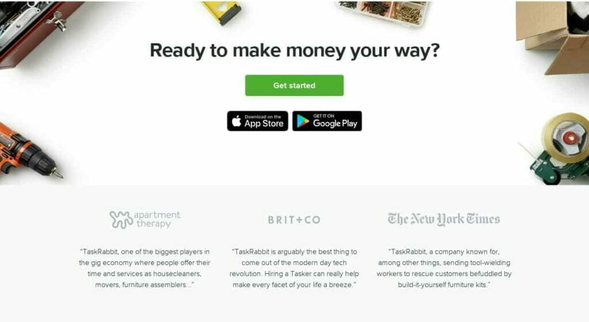

People need some help with this and that often. But it was hard to find someone for assistance with these works. TaskRabbit is solving this problem since it was launched in 2008. If you can do these odd jobs, you can earn money working at TaskRabbit.

TaskRabbit is now available across 54 cities in the U.S. It has also expanded its service in the UK, Canada, and Germany. It is also available in Paris and Barcelona.

You’ll work as a tasker at TaskRabbit. And people will hire you to get their works done. These odd jobs include cleaning, delivery, furniture moving and assembling, running errands, decoration, etc.

You’ll have to list what services you can offer and how much your hourly rate is for each task. You’ll get paid by clients using the TaskRabbit app. TaskRabbit will cut 15% of your earnings as a fee.

#### How Much Money Can You Earn Online as A TaskRabbit Tasker

It’s up to what you charge per hour. If you charge $30/hr, you can take home $25.5 after cutting the 15% fee. And, many people are charging $60 or even more per hour for complicated tasks. But you’ve to gain experience and get good reviews before charging a high hourly rate.

Customers may also reimburse or tip a tasker. TaskRabbit won’t charge a fee on any tip or reimbursements made. A tasker can keep 100% of these.

#### Essential Websites & Apps: TaskRabbit

### 44\. Become A Babysitter

In today’s world, people are too busy at their job that they don’t even have time to look after their babies. But they don't want to risk their lovely child. So, they need to hire a babysitter to look after their children while they’re outside.

Babysitting is coming as a popular way to make money for university students and teenagers. If you love spending time with kids and want some extra cash, babysitting is an excellent way to make money for you.

It can be tough to get your first babysitting job. Especially if you've moved to a new city. But still, it’s far from impossible. It's best to contact a friend who is already babysitting. You should use social media or freelancing platforms to offer your service.

If you’re trying hard to get babysitting jobs, there are many websites and agencies to help you. You’ll find a lot of babysitting jobs on those websites. Some of the best sites are Care.com, SeekingSitters, Sitter, Bambino, etc.

Some websites also require to have some training first. And as they’re hiring experienced sitters, they usually pay more than others. So, you should better enroll in some courses to add to your expertise.

A babysitter is well paid, but you can offer more services for parents to earn a bit more. Such as you can p services like cleaning, cooking, or even tutoring the baby while babysitting to increase the pay rate.

Another way to charge more money is to offer babysitting services at weekends, or events, or full-night. You should also add your travel expense to your fee to reduce your costs.

#### How Much Money Can You Earn Online Babysitting

In the US, on average, a babysitter earns $15.71/hr and nannies $19.14/hr. But it depends on your age and where do you live. If you’re a teenager below 16, you can expect to get only $5-$10 per hour.

But if you’re over 16 and lives in a higher-paying city like Lost Angeles, you can earn up to $21 per hour or more as a babysitter. You’ll also get more if you can provide additional services or work during weekends, events, or nights.

#### Essential Websites & Apps: Care.com, SeekingSitters, Sitter, Bambino

### 45\. Host Meals and Invite Guests at Your House

Another excellent way to make some extra cash from cooking, serve meals to guests at your home. If you’re good at cooking and also good to meet with new people, it is a perfect way for you to earn money online.

Many people are willing to pay well to taste delicious foods as a guest. They may be foodies. Or they may be traveling and want to taste the local and traditional cuisines.

As you’re the host, it is up to you what you’ll serve and where you’ll host the meal. You’re also free to charge what you want. It is also up to you how many guests you want.

TravellingSpoon and EatWith are two of the best sites where you can find guests for your meal. As they’re providing a service, they may cut a fee from your earnings.

#### How Much Money Can You Earn Online Hosting Meals at Your House

You can earn from a few hundred dollars, up to a few thousand dollars per meal. There is no exact figure of how much money you can make. So, do proper math first. If you’re charging $20 per meal and bringing in 4 guests, you’ll only make a few dollars.

So, charge more for your meal and bring in more guests. Not only tasty dishes are priced high. If you can afford to host an event at an expensive place like a yacht, you can charge even a few hundred dollars each of your guests.

#### Essential Websites & Apps: TravellingSpoon, EatWith, Feastly, NewGusto, VizEat, Bon Appetour

### 46\. Become A Notary

A *Notary Public* needs to be present while signing legal documents. A Notary doesn’t have to do much. He just has to watch people signing documents and verify that no one is blackmailed. But still, they’re paid a hefty fee. Because they’re appointed by the government.

Anyone over 18 can apply to become a Notary Public. But still, some requirements vary state by state to become a Notary Public. Like receiving training and passing an exam, buying a surety bond, etc. Every procedure has a small fee that also varies by state.

You’ve to get approved to start notarizing documents. If you’ve been approved, you’ve to obtain your notary seal paying a small fee.

Now you’ve become a notary. Now what? You’ve to get clients now to earn money. Your friends and family are the best to start selling your services. Then use social media and freelancing platforms to find your potential clients.

As a Notary Public, you’ll get more works at the weekends and in the holidays. Because the banks and other free notary services won’t be available. But you’ll still get a lot of works during the weekdays.

#### How Much Money Can You Earn Online as A Notary

In the US, the average hourly pay-rate of a notary public is $15. But if you are a *mobile notary*, you can make even $75-$200 per hour. A mobile notary is a notary who travels to meet his clients in-person.

#### Essential Websites & Apps: Signing Agent, Indeed, LinkedIn

### 47\. Prepare Taxes

*Tax Preparation* is an intimidating task. Taxpayers need to claim all the credits and deductions to pay only the exact amount of taxes they owe. Or, they could end up paying a lot of extra money.

For this reason, millions of people get their tax prepared by a professional. If you have the necessary skills, you can also leverage your talent to earn a decent amount of money.

You don't need to be a CPA (Certified Public Accountant) to prepare taxes for money. Anyone over 18 years can register as a tax professional.

To start getting paid for preparing taxes for others, you need to do several things first. They’re:

- You must obtain a PTIN (Preparer Taxpayer Identification Number) to receive payments for preparing taxes. It costs $64.24 for the first year and $63 for renewal.
- You also need an EFIN (Electronic Filer Identification Number) for filing tax returns online. You can obtain it for free.
- Even if training isn't a must, you should enroll in a course to gain more knowledge and skills. IRS (The revenue service of the United States federal government) and some states offer both paid and free programs and courses that you can take. There are also many comprehensive courses made by professionals you can take.
- You should also join the AFSP (Annual Filing Season Program) to become an *Enrolled Agent*. Without being an Enrolled Agent, you can’t represent your clients before the IRS. But you’ll be able to receive money for preparing tax returns.
- Check out your state's website if they require any additional certifications.
- Purchase a surety bond to keep your customers safe and form an LLC to keep yourself safe if anything wrong occurs

If you’ve done all of this, now you can start getting clients. You can try searching your inner circle first if anyone needs your service. Use freelancing platforms and social media effectively to market your services and get your potential clients. You can also join in a tax firm like H&R Block or Jackson Hewitt.

You’ll find a lot of people searching for tax professionals during the Tax Season. You can make a decent amount of money at that time. But for the rest of the year, you’ll not get many works.

So, you can add accounting, bookkeeping, or other financial services to your knowledge to land more gigs around the year. Or, you can work more in the tax season to enjoy the rest of the year.

_**Note:**I had to take some of the above information from the official website of the IRS. So, thoseare only applicable to the US residents. If you live outside the US, you need to do some research on your own first._

#### How Much Money Can You Earn Online Preparing Taxes

In the Us, a tax preparer earns around $22 per hour on average. If you can work hard and fast, you can make as high as $40/hr. A tax preparer can earn $50,000 or even more in the 3 months of the tax season!

#### Essential Websites & Apps: Indeed, Upwork, FlexJobs, H&R Block, Jackson Hewitt, Intuit

### 48\. Transcribe Audios

Transcription means the work of converting an audio file into a text file. It is just the opposite of narration. As a transcriptionist, you’ve to write down all you hear in a text file. Transcribing is an excellent way to earn money online if you’ve exceptional hearing power and typing speed.

There are many sites online for transcriptionists. At most of them, you’ll be tested to be qualified. If you pass, you can start earning money by transcribing audios.

You’ll need to be highly selective when choosing a website for transcription jobs. It’s a must for making good money transcribing. Because some companies have pay rates around $0.10 per audio minute, while some have even above $2.5 per audio minute.

SpeechPad, TranscribeMe, Rev, TigerFish, AccuTran are some great transcription service websites. Their pay rates are well. You can also start with a low paying website like Scribie to gain some experience first.

To make good money as a transcriptionist, you’ll have to improve your listening skill and achieve typing speed above 50-60 WPM (Words-Per-Minute). And generally, you’ll get paid much more for an audio file with poor audible quality. You should take the free mini-course from TranscriberAnywhere.

And you should buy a good headphone and a foot pedal to boost your transcribing speed. These are two highly necessary tools you must’ve if you’re serious about making a living transcribing.

#### How Much Money Can You Earn Online Transcribing Audios

The median hourly pay of a transcriptionist in the U.S. is around $15-$16. Skilled transcribers can earn $25-$30 or more per hour.

But how much you'll earn depends on your speed. If you get $1 per audio minute and can transcribe only 4 audio minutes and hour, then you'll make only $4/hr!

But if you are so fast that you can transcribe 30 audio-minutes an hour, then you can earn $30/hr or even more. That translates into an annual salary of $60K!!

#### Essential Websites & Apps: SpeechPad, Rev, TigerFish, GoTranscript, TranscribeMe, AccuTran, Casting Words, GMR Transcription

### 49\. Write Essays for Students Online

earn money writing essays

Earning money writing essays for students is very much the same as making money online selling notes (Continue reading this post to get more details). Not every student is good at writing excellent academic essays, term papers, research papers, etc. So, they bring in help to complete their works.

If you can write excellent academic papers, then you can utilize your skill to make money online writing for other students. Students and also their parents are willing to pay you well to get the papers done.

To get essay writing jobs, you should join essay-writing agencies instead of freelancing clients on your own. There are thousands of essay writing services online. Among those, VIP Writer and iWriteEssays are two excellent essay writing services you can join to start earning money.

Note: Students must write their academic papers on their own. It isn’t ethical to get these written by others for money. And most of the students aren’t actually bringing in help. They’re clearly cheating. If any student does this, he is doing illegal work. And they can also cheat on you. So, I don’t encourage you to engage in this. Beware!

#### How Much Money Can You Earn Online Writing Essays

You’ll get paid for each page you write. You can expect to earn around $9-$15/page. You’ll get paid more than this for a higher-level of papers like graduate-level papers.

#### Essential Websites & Apps: VIP Writers, iWriteEssays, Best Essays, GrabMyEssays, EssayRepublic, TrustMyPaper

### 50\. Distribute Flyers

In these days of online advertising, many companies still rely on hand to hand advertisements. If you’re good at meeting and talking with total strangers, you can make money distributing flyers to people.

*Gumtree, Letterbox Distribution, Royal Mail, Dor2Dor, Mr Flyer, Indeed* are some companies to get a leaflet distribution jobs. You can also contact businesses in your locality if any business pays for distributing leaflets.

Generally, you’ll get paid for how much and what item you’ve distributed. The best option is finding a higher-paying company instead of doing tricks if you want to earn a bit more money.

There are a few tricks you can do to earn a bit more. Try to distribute higher-paying items like catalogs. And try to work for 2, 3, or more companies to distribute multiple times more flyers at the same time.

#### How Much Money Can You Earn Online Distributing Flyers

You can generally earn around $10 per hour as a flyer distributor. But if you do some tricks, you can make 2X-3X money than that!

#### Essential Websites & Apps: Gumtree, Letterbox Distribution, Royal Mail, Dor2Dor, Mr Flyer, Indeed

### 51\. Drive Passengers to Their Destination

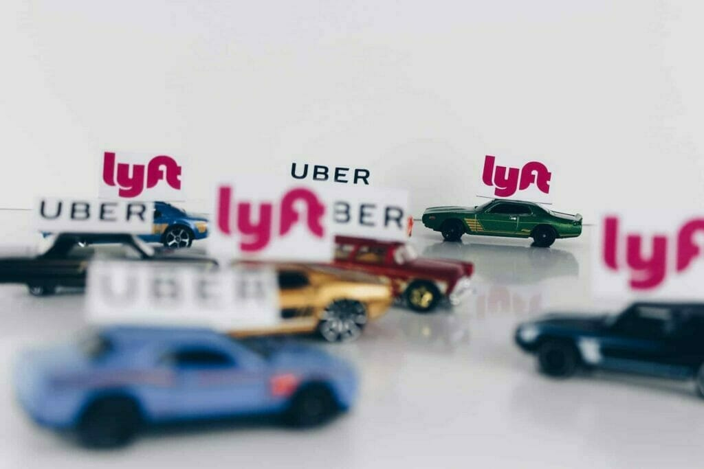

Ridesharing has grown tremendously popular in the past years. Since the launch of Uber in 2009 as the first ridesharing app, many more apps have emerged. Nowadays, it is one of the most popular ways to make money on the side.

Many car owners are driving in their free time to make some extra cash. If you’ve access to a car (not too old model), have some driving experience, and at least 18 years old, then you can also make money driving. It is also possible to earn money if you have a motorbike.

There are many ridesharing apps available in the market around the globe. But not all of them are available in every country or every state. So, check out the apps to find out what works best for you.

Uber is the dominating app in the ridesharing market. The second most popular is Lyft. Both of these apps are great at what they do. Their pricing & pay structure are also very similar. Uber shines in its huge-size, and Lyft is reported as more driver-friendly. They’re both available around the world.

Wingz is another great ridesharing app you can use to schedule a route in advance and at a flat rate. It may better-fit those drivers who want everything calculated.

HopSkipDrive is another ridesharing app made for ridesharing for children. It has a screening process. It requires you to have at least five years of child care experience at driving. As they’re hiring more experienced drivers, you can expect to get better pay-rates at HopSkipDrive.

#### How Much Money Can You Earn Online Driving People

If you live in the US, you can earn around $15-$20 driving per hour, plus bonuses if you drive for Uber or Lyft. HopSkipDrive pays more than the other apps, like $30 per hour, but there aren’t many jobs.

#### Essential Websites & Apps: Uber, Lyft, HopSkipDrive

Note: Time management is crucial to earning a decent amount of money driving. And a lot of people are going in and out of your car. So, you have to keep an eye at expenses for the regular maintenance.

### 52\. Deliver Foods and Products

Food and Product Delivery is another excellent way to make money by using your car. You can also deliver products if you have a scooter, a bike, or a bicycle., or even a truck!

People don’t have much time to spend their free time running errands. Instead, they hire a man to get their foods, groceries, products delivered directly to their house.

Same as ridesharing, there is no shortage of apps for product delivery. And most of them are only available in just one part of the globe. So, you must check out the apps and websites to find out which works best for you.

Postmates, Shipt, InstaCart, GrubHub, UberEats, DoorDash are some of the best apps for making money doing deliveries. Deliv and Caviar are another two apps that claim that their pay-rates are slightly higher than the other apps.

Amazon Flex, UPS & FedEx also hire drivers occasionally. You can expect to get regular works and a better pay-rate from them. But they don’t always hire people, and getting selected is hard also.

GoShare is another platform, especially for truckers. It connects businesses and individuals in your area for cargo deliveries. If you don’t have a truck, you can still apply as a helper. A helper helps truckers to lift heavy products. Both helpers and truckers can earn much more than usual product delivery.

#### How Much Money Can You Earn Online Delivering Products

If you live in the US, you can expect to earn around $8-$22 per hour doing deliveries after deducting expenses. Caviar claims to be the highest-paying product delivery app with an hourly rate of up to $25.

Amazon Flex pays its drivers $18-$25 per hour. FedEx pays at an hourly rate of $18 and UPS $21/hr. These rates are much better than most of the other product-delivery apps.

Truck drivers and helpers can get much more doing deliveries at GoShare. Truckers can expect to earn between $33-$67, and helpers earn $39 on average.

You may earn tips and bonuses while delivering products. There is no fee for these on any platform.

#### **Essential Websites & Apps: Postmates, Shipt, Caviar, InstaCart, GrubHub, UberEats, DoorDash, GoShare. Amazon Flex, FedEx, UPS**

## Excellent Ways How to Make Free Money Online

### 53\. Walk

Yes! You heard it right! You can earn money just by walking! Though you can’t leave your day job, you’ll get rewarded for something that you’re already doing every day.

Many apps pay for walking, exercising, eating healthy food, etc. Though you can’t make more than some cents doing these, you’re doing nothing extra. Some apps let you take some health surveys. You can also get discounts on various products using these apps. Overall, it’s a healthy way to earn money online.

Charity Miles is an app that shows ads while you walk. It pays 25 cents/mile you walk and 10 cents/mile you make bicycling. Another Facebook app named People Walker lets you hire a partner to walk with. Or, you can be that partner to earn money! You can charge around $7/mile.

Achievement is another app where you earn points and redeem a $10 gift card for every 10,000 points. You can earn points by doing various tasks, such as taking health surveys, referring friends, walking, exercising, etc. You can also get bonuses. If you only walk, you may need 4-months to earn 10,000 points! But, some people even earn around $100 every 4 months by taking health surveys and doing other things.

#### How Much Money Can You Earn Online Walking

I have already discussed how much money you can make using each app. You’ll not make much from these apps. But whatever you earn is for something that you do every day.

#### Essential Website & Apps: Charity Miles, Achievement, People Walker, SweatCoin

Note: You can’t make money using Charity Miles. They donate your money on your behalf to your selected charity. They’ve already donated over $2,500,000.

### 54\. Get Cashback on Purchases

_Cashback_ is a great way to save money. It isn’t really a money-making method, but indeed a money-saving method. And the money saved is the money earned. You’ve to do nothing to get cashbacks but buy the products you buy usually.

Cashback apps don’t offer a discount before making a purchase. They give free money after making a purchase. But why do those apps give free money?

Because they've partnered with many brands and retailers. When you make a purchase using their app, those brands give them a portion of their earning. And as you made a purchase using their app, they reward you with free money.

There are many cashback apps and websites. Not all of them are great, nor all of them are legit. But many excellent cashback apps can reduce your expenses by up to 40% or more. Rakuten, Ibotta, ShopKick, Paribus, TopCashbacks are some of the best cashback apps.

Rakuten (Formerly Ebates) is probably the best among them. It works with more than 2500 retailers. So, you can get cashbacks on many more products than other apps. Ibotta is another excellent cashback app. It works best for grocery shopping.

ShopKick is a little bit different. It lets you earn money without actually buying the products. You just have to walk into stores and scan the barcodes of the products. But to get a cashback, you've to buy something.

#### How Much Money Can You Earn Online from Cashback Apps

It depends on the amount of cashback. If you get 10% cash back on every purchase and spend $1,000 every month, then you’ll make $100 per month. If it is 20%, then you’ll save $200. If you get 20%-30% cashback on average, then it translates into a whopping $2400-$3600 free money annually!!

Tips: Apply a coupon code combined with a cashback

There are many coupon websites and apps online. You can use them to get a discount on a product. After that, you can still use the above apps to get a cashback (if available). You may make $600 instead of $300 when a coupon is combined with a cashback. So, you’ll have to spend $400 to buy a $1,000 product!!!

#### Essential Websites & Apps: Rakuten, Ibotta, ShopKick, TopCashbacks

### 55\. Claim Cashback on Price Drop on Purchased Products

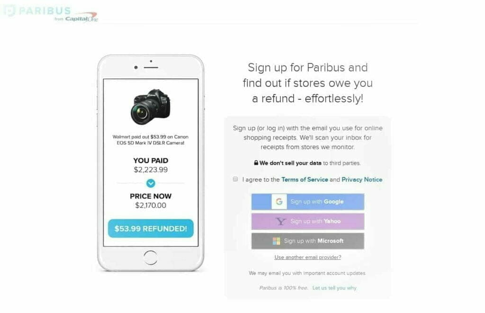

How will you feel if you buy a product and find that the price drops just after a few days? I know it’s really frustrating. So, I have come with an app named Paribus to help you.

Paribus is a cashback app, but it works differently. It negotiates with brands and refunds your money if the price drops a few days after you buy a product online. It generally takes around 7-days to get the money back.

You’ll have to grant access to your email account to Paribus. Because Paribus has to check your emails to know what purchases you’ve made. If a price-drop happens, it’ll automatically ask the retailer for a refund. But for a few retailers, it’ll only notify you to ask for a refund.

Paribus can also monitor the delivery of a product. If any late delivery happens, Paribus will hold the business accountable for this and will ask for compensation.

Paribus is a great app. It can monitor purchases from 25+ primary retailers. Many people complain that it doesn’t work, but it works and works great. It works only if the price drops after a few days. So, you can’t expect to get a refund after weeks or months have passed.

#### How Much Money Can You Earn Using Paribus

You’ll get the full amount of refunded money to keep. Paribus won’t cut a single penny from your earnings.

#### An Alternative to Paribus

There is also another app like Paribus. Its name is Earny. It can also refund your money on the occurrence of a price-drop. But there are some differences between Earny and Paribus. Of them, the key differences are:

- Paribus is a free service, while Earny is a paid service. You have to pay $47.99 annually or $7.99 monthly to use their service.
- Paribus works with 25+ retailers when Earny can monitor price-drops from 15 retailers.
- Earny shares your contact information with its partners. Paribus doesn’t. Earny does this to get you promotional deals from its partners.
- Earny can also offer price-protection on credit cards. Paribus doesn’t have this feature.

#### Essential Websites & Apps: Paribus, Earny

### 56\. Wrap Your Car with Ads

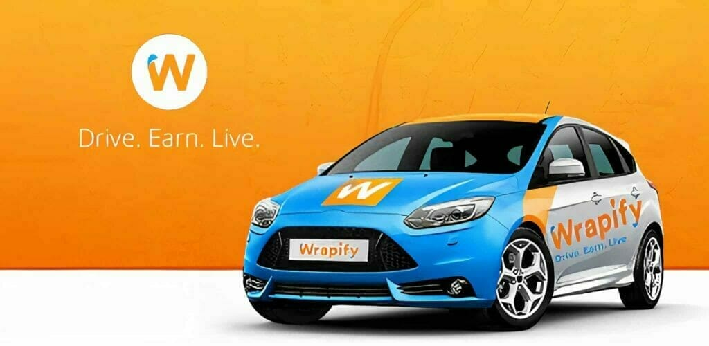

Wrap your car with advertisements. It is another excellent way to make money from your car. If you live in a busy city and drive a lot, it can be an excellent source of passive income.

Anyone can’t earn money wrapping their cars with ads. There are several eligibility requirements. Such as, you must have a driving license and at least 18 years old. You must drive your car regularly. You also can't apply if you committed a crime in the past.

Wrapify and Carvertise are two excellent websites to find advertisers for your car. You can also contact a local advertising agency for ads.

#### How Much Money Can You Earn Online Wrapping Your Car with Ads

How much money you’ll earn varies on different factors. Such as how much time you spend driving, where you live, which roads you drive in, etc. But you can still earn at least $100 to as high as $500 a month. So, it’s a good source of passive income.

#### Essential Websites & Apps: Wrapify, Carvertise, Nickelytics, StickerRide, Adverttu, Car Quids

### 57\. Sell your Private Data

Data is the new property of this modern world. Big companies like Facebook & Google track every movement of your finger & cursor. And they analyze it to make billions of dollars.

A good example is *targeted ads* from Facebook. Facebook analyzes your browser cookies and your past behavior to show you the ads most relevant to you. Many websites use your data for various purposes. But you don’t get paid a single penny for it.

You’re using their service after agreeing with their terms & conditions. So, you can’t claim that they’re illegally using your data. But it is unfair none the less.

But many market research companies pay you for your data. You’ve to do nothing but install their apps and keep them. It’ll collect your usage data and, you’ll get paid yearly, monthly, or weekly for it.

Nielsen Panel is one such app. You just have to install the app and keep it. You’ll get around $50 a year.

If you think $50/yr is much less, then Google Screenwise Panel is for you. You can earn up to $7/week and $350/yr. You’ll also get a $50 bonus for connecting it to your router and TV, and $5 for connecting to your smartphone, tablet, and browser.

Some other apps are DataWallet ($1-$50 every 2 months), Placed Panel (around $50/yr.), Smart Panel ($110/yr.), Media Insiders Panel (up to $200/yr.).

#### How Much Money Can You Earn Online Selling Your Data

You'll not become rich by installing these apps. But you'll get something rather than getting nothing. And it's also not a bad deal. If I add all of the earnings from these 6 apps, then you can earn up to free $1189 a year! And also, there are more apps like these!!

#### Essential Apps & Websites: Screenwise Panel, Media Insiders Panel, Smart Panel, Nielsen Panel, Placed Panel, DataWallet

### 58\. Sell your Emails

Now and then, we receive junk emails in our inbox. But how would it be if you could make money from it? Yes, you heard it right! There’s a company called SBKC (Small Business Knowledge Center) that pays for junk mails.

But why do they pay for those junk? Because they conduct researches on junk mails. And as you’re helping them, they’re rewarding you.

You just need to fill up a form and send them for approval. If you get approved, you’ll get paid for your junk mails. The major con of SBKC is, they only work in the US & Canada. So, you may not get approved if you’re outside of these two countries.

SBKC members are called *Panelist*. General panelists are called *Consumer Panelist*. But if you’re a business owner or self-employed, you can join as a *Producer Panelist*.

You’ll receive a prepaid envelope one time a month from SBKC. You need to put your junk mails in it and send it to them. But anytime you can send them your junk emails. You just have to forward them to SBKC.

#### How Much Money Can You Earn Online Selling your Junk Mails

You’ll earn points for every junk mail. When you'll have accrued 2000 points, you'll be able to withdraw a $20 gift card. It isn't much, but it can be a good source of passive income if you receive a lot of junk mails every month.

It can take you 6-10 weeks to get a $20 gift card, but if you have a business, you may just need around a week or less.

#### Essential Websites & Apps: SBKC

### 59\. Claim Unclaimed Property from Government

Escheatment is a process in which process properties are sent to the state-run unclaimed property offices when a business or institution owes someone property but fails to deliver those to him.

Unclaimed property can come in various ways. Probably an employer couldn’t find you to pay you your wages. Perhaps you got tax refunds. But the money wasn’t delivered to you because you had moved to another place. Or, a financial institution has been failed where you invested your money.

You’ve to go to the official website of your state to check if you have any unclaimed property. If you see that they have funds that belong to you, then you can claim that to get back.

Some states provide online forms to claim property, some don’t. If you see that an online claim form isn’t present, then you’ve to send an email to them claiming your property.

Get your documents ready before doing it. You’ve to send them a copy or a photo of one of your state-issued IDs, such as a driving license, to prove your identity.

It’ll take time to get back your money or property back. You may need to wait for a few days to a few months. So, keep patience.

#### How Much Money Can You Earn Online Claiming Unclaimed Property

There is no fee to search and claim your property. But if you hire a finder or locator, you may need to pay him a percentage of your property. It can be as high as 10%.

## Excellent Ways How to Earn Money Online Selling, Renting out or Reselling Things

### 60\. Sell Your Old Books Online

Probably you’ve left college many days or years ago. But do you still have your textbooks at your home? If you have, then I think you don’t need them now. You may also have many other books here and there at your home.

So, why are you keeping those when you can turn them into cash? The online marketplaces have opened up opportunities to sell used books for a fair price that you could never before.

Probably you’ll want to sell your books at a garage sale or a second-hand book store. But you’ll end up selling your books at cheap. So, consider selling your books online to get better deals.

Many companies buy back used books. And BookScouter is an excellent website for this. It compares the buy-back price of a book from various companies. And then it shows you the best price you can sell your book for.

You just need to enter the book name, or its author name or the ISBN. Then, BookScouter will show you which vendor is offering the best buy-back price for your book. It can currently compare buy-back prices from 50 vendors!

Not always, you’ll find a buy-back deal for your book. Companies offer buy-back deals most often for textbooks or other study-books. But there are also other places online to get a fair price for your old book.

If you want to sell your books locally, you can use Craigslist or Facebook Marketplace. eBay is also a great place to get the best possible price for your book.

Amazon also has a Trade-in program. Amazon doesn’t buy all the books, but if you’re lucky, you can expect to get up to 80% of the price you purchased your book for.

#### How Much Money Can You Earn Online Selling Old Books

You'll not get the price you bought the book for. Because people are buying used books to get books at a lower price. If you're lucky enough, you can get 80% or even more of the retail price.

#### Essential Websites & Apps: BookScouter, eBay, Amazon, Craigslist, Facebook Marketplace

### 61\. Buy & Resell Old Books Online

Do you want to do something interesting to make some extra cash? Then you can take your bookselling skill one step further and start a reselling business online.

I just talked about making money online selling old books. If you’ve followed my steps and sold those, now you can start buying some. And sell them for a higher price to make a profit.

For the internet, it has now become easy to sell a used book for a fair price. But lots of books are still being sold cheaply. And you can buy those cheap books and resell them for the price they actually worth.

And also, don’t buy just any type of book. Not every kind of used book sells. You should buy only textbooks or publications from a famous writer, or first-editions. Collectible books are also great for purchasing, but it depends on their rarity.

Auctions, garage sales, and thrift stores are the best places to find cheap books. You can also ask your friends and family members if they want to sell their books.

After you’ve bought a book, spend some time to give it a better look. You should clean it properly and check if any page is missing. A well-looking book will certainly sell at a higher price.

First, check BookScouter to compare the buy-back deals available. If any offer is available, sell the book quickly to keep the focus on selling another book. It's a great tool you must have to make a decent amount of money reselling books.

But if a buy-back deal is currently not available, then the best option left is eBay. There are already thousands of buyers (or resellers like you) at eBay who are looking to buy used books. And, you'll also get a higher price on eBay.

#### How Much Money Can You Earn Online Reselling Books

You’ll have to buy a book for a lower price to increase the profit margin. So, use BookScouter to check if a buy-back deal is available before you buy a used book. It'll help you to avoid any loss and let you know how much money you'll be able to earn.

If you make $10 per each book and sell one book every day, you'll still be able to earn a cool $300 a month. And, if you bought those books for a super-cheap price or sell hundreds of books, then you can make 10X-100X, or even more than that!

Book-reselling is a lucrative business. You'll be amazed to know that when Amazon was founded in 1995, it was an online bookstore!!! And, now the net worth of Amazon has crossed $1,500 bn!!!

#### Essential Websites & Apps: BookScouter, eBay

### 62\. Sell Your Old Clothes Online

We don’t wear a dress for years. And maybe, your closet has become full of old clothes. So, why are you keeping those clothes when you can turn them into cash?

I’m talking about earning money online selling old clothes. But you can also new clothes using the following tactics I'll tell you now.

People depend on the photos of a product when they buy online. If you want to start a mini-business online selling clothes, you must upload high-quality pictures. You should-

- Consider purchasing a good camera once you have made some sales.
- Capture pictures of your clothes from every angle possible.
- Capture any flaw or flaws your clothes have.
- Use something like a wooden hanger to give your clothes a better look.

There are many places online to sell clothes. Depop is one app among them. Though it's a newer app, it has gained much popularity in a short time. And now, it's available in 150+ countries. And, many teenagers are making over $300,000 a year selling clothes at Depop. Poshmaker and ThredUp are another two great alternatives.

If you have high-end clothes, then eBay is best for you. You’ll get the best possible price for your clothes there.

You can also sell your clothes locally on Facebook Marketplace or Craigslist. You can keep the full profit you make. Because it doesn't charge a commission over your products.

#### How Much Money Can You Earn Online Selling Old Clothes Online

How much money you’ll earn depends mainly on the condition of your clothes. It also depends on what type of, where, and how many clothes you’re selling, etc.

You can get from a few dollars to a few hundred dollars from your clothes. Some successful cloth reselling businesses earn $300,000 or even more per year!

#### Essential Websites & Apps: Depop, Poshmark, ThredUp, eBay, Facebook Marketplace, Instagram, Vintage

### 63\. Sell Used Phones

Electronic devices have become cheaper than ever before. You can grab a brand new phone at as little as $50.

But still used phones have a large market. And the market has grown much bigger than the past. If you’ve old phones in your house that you aren’t using, you can sell them at a fair price.

Selling a used phone isn't very hard. There are many buy-back companies like Gazelle, who buy-back used phones. You just have to go to their website, and they’ll offer you a fair price after you give them some info about your phone.

Or, if you want to earn some more, you can list your phone on eBay or Craigslist. There are a lot of people to buy your phone. You can also sell your phone to Amazon if you want something quicker. But you’ll get a little bit less than eBay or Craigslist.

Note: Don't try to hide any defect your phone has. You can get engaged in a dilemma or lose money instead of making money.

#### How Much Money Can You Earn Online Selling a Used Phone

It varies phone by phone. There are no exact numbers. If you have a damn old phone or a phone from a less-known brand, you can’t expect to get a high price. For most phones, you can generally get 60-70% of the retail price for a used phone, if it has no defects.

#### Essential Websites & Apps: Gazelle, eBay, Craigslist, Amazon, NextWorth, BuyBackBoss, Decluttr

### 64\. Buy and Resell Used Phones

I just talked about making money from selling your old phone. I won’t talk about the same thing again. I am talking about taking it as a business and entering the big market.

Selling one used phone and starting a business of used phones is a lot different. But this doesn’t mean that it is impossible, nor so hard. You just have to take care of some things.

I said that there are many people on eBay and Craigslist to buy your used phone. The reason for being the number high is that they make money from it. They buy phones at low prices and resell them high to earn a profit.

You’ll find a lot of used phones on eBay, Craigslist, Amazon, and other marketplaces. Try to buy them at a low price. And the trick to turning the price all down is buying a phone with a defect.

Defected phones are much cheaper. And phones with broken screens most common. It’s also easy enough to find a replacement screen at a few dollars.

Replacing the screen gives an old phone a brand-new look. So, the profit margin will be higher than reselling used phones with old screens.

The profit margin is not so high when you’re reselling phones. You’ll not earn hundreds of bucks selling only one phone. So, try to acquire skills like fixing a broken screen and other parts on your own. It’ll save you a lot of money, even though a replacement screen is cheap.

When you buy an old phone, make sure that it isn’t stolen. You certainly won’t want to engage in a hassle. You can check its history using a service called checkMEND. It costs only 1.99£ to check on a phone's history.

After you’ve done all the things required for selling a used phone at a high price, sell it on eBay or Craigslist. Craigslist might be a more lucrative option as it doesn’t charge a fee, and every penny is important.

#### How Much Money Can You Earn Online from A Used-phone Reselling Business

There are no exact numbers I can say. If you gain $50 profit per phone, then you can easily make $350/week or $1,500/mo selling one phone a day. And, you can grow your business once you’ve accumulated a capital.

#### Essential Websites & Apps: eBay, Craigslist, Facebook Marketplace

### 65\. Sell Old Electronics

I’ve only talked about reselling used phones. Because used phones are the highest-selling electronics in the used market. But what's about other electronics? Yes, you can also earn money selling other devices’ electrons.

You can sell any electronic device you have, such as a laptop, DVD, PlayStation, TV, iPhone, iPad, etc. You’ll not get the price you paid for them. But you’ll get paid for some waste.

Gazelle, NextWorth, Decluttr, BuyBackBoss are some of the best websites to sell your electronics directly. They’ll offer you a buy-back deal instantly after collecting some details about your device. If you like the price, you can accept it. You can reject it also. It’s a great way to sell your devices quickly.

But those companies don’t offer you the best price. And also, they don’t accept every device. So, if you want to get a better value for your products, you should sell it locally. Craigslist and Facebook Marketplace are two great places for this. You’ll get a much better price there.

Or, you can also sell your devices on eBay. Often, you’ll get the best price on eBay. And if something like reselling business is in your mind, then eBay might be the best place for you.

#### How Much Money Can You Earn Online Selling Used Electronic Devices

If your devices are in good condition and not too old, you can expect to get around 60-70% of the retail price for your device.

#### Essential Websites & Apps: Gazelle, NextWorth, Decluttr, BuyBackBoss, eBay, Craigslist, Fac6book Marketplace

### 66\. Sell Your Notes Online

Every student has to take notes regularly. If you’re a student, then it might be a part of your daily routine. It is a tedious job and needs a lot of time. Not everyone can do this, nor everyone has this much time.

They need some assistance. And you can help.

But how?

You can give them the notes you don’t need now.

For free?

No, not at all. You’ll sell your notes at a fair price.

If you’ve excellent note-taking skills, then you can make good money selling notes. You can sell study guides, suggestion papers, and other useful study papers also.

There are many marketplaces for selling notes. But not all of them have a high commission rate. All of them aren’t open to everyone also. Some websites are restricted to students of a particular university or a country.

Stuvia, GradeBuddy, NexusNotes, CourseHero are also some great websites to sell your notes. Check out each website to find which best fits you.

#### How Much Money Can You Earn Online Selling Notes

On average, you can expect to get around $20-$30 per note. But you can get more than that. You can even earn $50-$75 or more for a comprehensive study guide. So, if you have 100 notes, and only one copy of each of them sells every month, then you'll earn a decent passive income of $2,000-$7,500 per month!!! And, if the website cuts 50% of your earnings as a fee, you'll still earn $1K-$3.75K/mo.!!!

##### Essential Websites & Apps: Stuvia, GradeBuddy, NexusNotes, CourseHero, NotesGen, NotesMate, StudySoup, OmegaNotes, OxbridgeNotes, OneClass

### 67\. Rent Out Your Car

Is your car sitting around idle? You can rent out that and make some money. The money would be enough to cover the yearly expenses and then some...

There are many websites online where you can list your car for rent. Turo and HyreCar are two popular websites among them. When you’ve got a renter, set up a meeting, and complete the transfer.

#### How Much Money Can You Earn Online Renting Out A Car

It depends on your car’s model, age, where do you live, etc. On average, you can earn $700-$800/mo. or $8,400-$9,600/yr. renting out a car. But you can get anywhere between $300-$2,000 per month per car.

#### Essential Websites: Turo, HyreCar, Avail, GetAround, TravelCar

### 68\. Rent Out Your Clothes

Probably, you have a closet full of clothes. But do you wear all the dresses? I think you don’t. Perhaps, a lot of dresses don’t fit you now. So, why aren’t you renting out the clothes you aren’t using and make some money?!

You can list your clothes for rent on Zilok, Rent Not Buy, StyleLend, etc. All of them will cut a commission on every contract. RentNotBuy is an exception. It won’t charge you any fee, nor show you an ad.

#### How Much Money Can You Earn Online Renting Out Your Clothes

Depending on the gorgeousness, quality, and condition of the clothes, you can get $5-$100 or more per day per cloth! So, if you've 10 gorgeous-looking outfits, and if you're lucky, then you can even earn $30K a month!!!

#### Essential Websites & Apps: RentNotBuy, StyleLend, Rent My Wardrobe, ZIlok, Designer Wardrobe

### 69\. Rent Out Your Parking Space

Do you’ve got a parking space and you aren’t using it? You can rent out that space. It’ll make you some money on the side.

Parking space is limited in many cities in the US, and doesn’t everyone has their own parking space. So, you can make good money by renting out your parking space.

There are many websites to advertise your parking space. Two of them are JustPark, Parklet, etc.

#### How Much Money Can You Earn Online Renting Out Your Parking Space

How much you can earn depends mainly on the scarcity of parking space in your area. So, depending on that, you can expect to get anywhere between $50-$500 per month per parking space. It can be a great source of passive income if your property has a lot of parking spaces.

#### Essential Websites & Apps: JustPark, Parklet, Your Parking Space, CurbFlip, Spacer

### 70\. Rent Out Your Friendship

Don’t be surprised after reading the headline. You can really make money by renting out your friendship. No, it doesn’t mean you’ve to give your friend to someone else. You’ll need to be a friend of someone, for a little time.

Yeah, it sounds awkward, but thousands of people are hiring friends at RentAFriend.com. And it's also a well-paid work. So, you can start earning money by being a friend of one.

People can need a friend for various reasons. Probably a person is new to the city and needs help. Or, a senior citizen needs someone to talk with. Perhaps a boy needs a playmate. Or, someone needs a workmate. Actually, you’re renting out your time, not your friendship.

To start earning money at RentAFriend.com, you just have to fill up your profile details. You can set your own rate. You’ll get paid at an hourly rate. And also, you’ll be able to keep the full amount you earn.

RentAFriend doesn’t take a cut from your earnings. Instead, it charges the renters to access the friends’ directory.

Note: RentAFriend isn’t a dating website. It is strictly a Platonic Friendship website. If you think anything is going wrong, you should directly contact the support team.

#### How Much Money Can You Earn Online Renting Out Your Friendship

You’ll set your own rate at RentAFriend. So, it’s up to you how much you’ll charge. If you charge $40/hr, then you can make $200 a day, just renting your 5 hours of a day.

#### Essential Websites & Apps: RentAFriend

## Excellent & Fun Ways to Earn Money Online

### 71\. Participate in Online Surveys

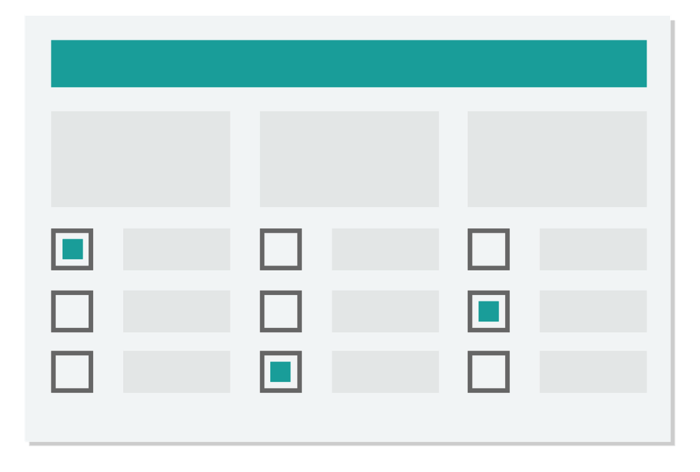

Many market research companies conduct surveys to fit their products according to the needs of consumers. And they reward the users for participating. You can also make some quick money just filling up some forms.

You’ll earn around $1 per survey. Some survey sites like Pinecone Research or Vindale Research pay more like $3 or even more per survey. There are some low-paying sites also.

Every survey site or panel has a limited number of surveys available for each user per month. So, you have to sign up to as many survey sites as possible to earn a decent amount of money from paid surveys.

#### How Much Money Can You Earn Online Participating in Surveys

It takes just a few minutes to complete a form. So, you’ll be able to participate in 5, 10, or even more surveys an hour. That's an easy $10-$20 an hour doing some fun works.

#### Essential Websites & Apps: SurveyJunkie, Swagbucks ($5 sign-up bonus), InboxDollars ($5 sign-up bonus), LifePoints, Pinecone Research, Vindale Research, OnePoll

### 72\. Join a GPT Website

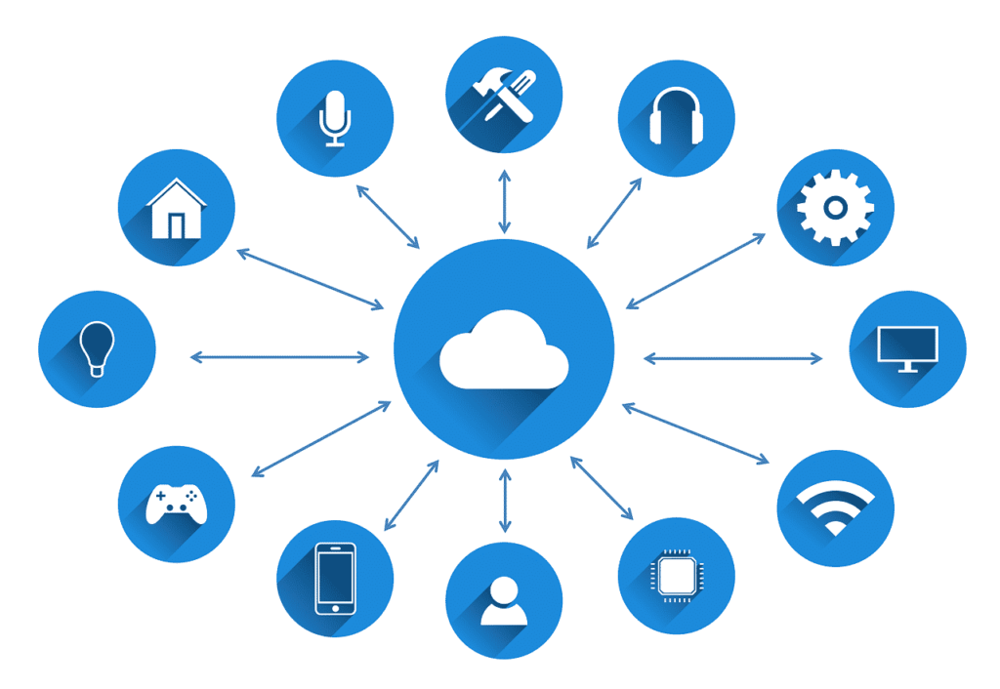

A GPT website is a website where you Get Paid To do various things. Though the primary way is filling up surveys, you’ve access to tens of other ways to make some quick bucks.

You can watch videos, ads, fill up surveys, do mini-jobs, complete offers, answer quizzes, play games, etc. to make money on GPT sites. There are also some other ways like coupons, special offers, cashback deals, joining other survey networks, etc.

A good GPT website also gives great discounts on booking flights & hotel rooms. You can also redeem cashbacks on your daily purchases. And you don’t only save the money but also receive 2X-12X points per dollar!

There are numerous GPT sites on the internet. Many of them are scams. Again, many of them only work in the US and some other first-world countries. So, check out every website before spending time on them.

Some great and legit GPT websites are ySense (formerly ClixSense), Swagbucks, CashCrate, InboxDollars (InboxPounds in the UK), Neobux, etc. Among these, CashCrate is available in the highest number of regions. OMD (Oh My Dosh!) is another new GPT website.

#### How Much Money Can You Earn Online from GPT Websites

A GPT website provides some fun ways to earn money in free time. Though it’ll not help you to be a millionaire, you can make around $10 an hour easily. And, some people are making a decent amount of passive income from their referrals.

#### Essential Websites & Apps: ySense, Swagbucks, InboxDollars, Neobux, CashCrate, Oh My Dosh!

### 73\. Test Websites & Apps

Every website & app needs to be working and user-friendly. So, it needs some testing from an expert to be assured that everything is working fine. An expert can also tell what is missing. It'll help you to further extend the functionalities of your website.

If you know the basics of a website or app, and have a keen eye at UI, then you can earn a decent amount of money testing websites and apps.

As a tester, you’ll need to check a website for errors, poor-design, and missing elements. You also have to check what should be done to improve the site.

Most of the user-testing websites require a screen-recorded video of the testing. So, you’ve to install a screen-recording software to record your screen and your voice. OBSProject is a great free tool for this.

#### How Much Money Can You Earn Online Testing Websites and Apps

Website-testing is a well-paid job. The average payout is around $10 for 15-20-minute testing and $20-$25 for 60-minute. Occasionally you’ll earn even more. Sometimes, you’ll make 2X-4X than that!!!

#### Essential Websites & Apps: Respondent.io, UserTesting, Enroll, TryMyUI, Userlytics, Userfeel

### 74\. Do Microtasks

Micro tasking is getting much popular day by day. A microtask is a task that can be done in a few seconds or minutes. Generally, an employer splits a job into hundreds or thousands of microtasks. And, you get paid for each microtask you complete.

You can earn anywhere between $0.02 to $2 per microtask. Though it is less, you can complete many tasks in an hour. It usually takes around three minutes to complete a task.

Note: Though micro-tasking is getting popular, it is also getting a lot cheaper. And as an employer pays only after getting his works done, they can fraud you easily. And complaint reports never get a reply. And also, most of the employers ask for illegal and immoral things. Like pageviews, filling up surveys, boosting search ranking, etc. So, there is a high risk involved in it also.

#### How Much Money Can You Earn Online Doing Microtasks

Micro-tasking has become a lot cheaper. Gone are the days when you could make $60/hr. You’ll earn as high as $10/hr now. And you can get even around $1 an hour! It’s just peanuts comparing to the time spent. So, it may only work if you live in an area where living-cost is extremely low.

#### Essential Websites & Apps: Amazon Mechanical Turk, ClickWorkers, Picoworkers, Microworkers, Rapidworkers

### 75\. Do Data Entry Tasks

Data entry is an excellent way to earn money for beginners. These tasks are also easy enough that anyone with a little computer knowledge can complete these tasks.

You don’t need to have any special skills to do data entry jobs. But you need to have a fast typing speed. And you need to be familiar with software like MS Excel and Google Sheets.

You’ll find a lot of data entry jobs at the freelancing websites. There are also some companies like Axion, DionData, SigTrack who hire data entry clerks.

You’ll also find a lot of data entry tasks at the micro-tasking sites. But they are very cheap, and also not reliable.

Appen is another excellent place to find data entry tasks. Many PTC and GPT sites offer Appen mini-jobs.

#### How Much Money Can You Earn Online Doing Data Entry Tasks

Doing data entry jobs is an exciting way to earn money online. It's great if you want to work in your free time. But you can’t expect to get a good income from a data entry job.

If you’ve no previous experience, then you can get low-rates like $10/hr. And, you can earn a maximum of $18/hr, even if you’ve previous experience.

#### Essential Websites & Apps: Axion, DionData, BCC, KCC, SigTrack, Appen (Previously Figure Eight), ClickWorkers, Amazon mTurk, MicroWorkers, PicoWorkers, RapidWorkers

### 76\. Work as a Field Agent

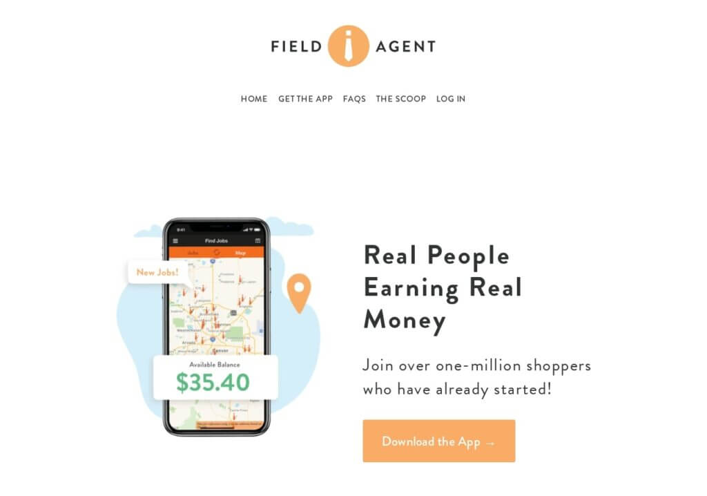

Field Agent is an excellent app available for Android and iOS. It offers various types of jobs where you’ve to work as an agent. Such as auditing, in-store surveys, mystery shopping, customer service quality check, scavenger hunts, etc.

Field Agent offers a higher number of jobs than most other similar apps. These jobs are also easy to complete. Some jobs don’t even require you to go out of home!

You can also filter out the available jobs to find out the perfect one for you. It can take anywhere between a few minutes to 30 minutes to complete a single task. And you can expect to earn between $3-$15 per job.

#### How Much Money Can You Earn Online as A Field Agent

Field Agent is one of the highest paying apps. If you’re getting paid $15 for a job that takes you only 30 minutes, then you can make $30 an hour easily. You can earn even more if you’re fast-working.

#### Essential Websites & Apps: Field Agent

### 77\. Watch Advertisements

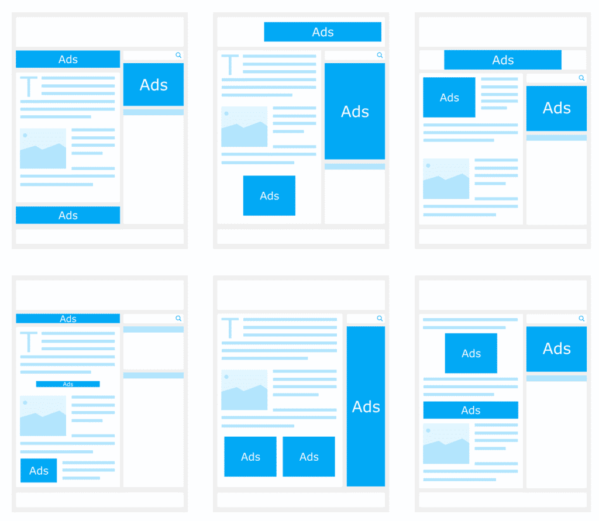

No one likes *advertisements*. But what if you get paid for watching them? Yeah, You heard it right! You can make money online watching advertisements also.

Many websites let you earn money for watching ads. Swagbucks, InboxDollars are two among them. You can also play games, answer questions, watch videos, take surveys besides watching ads to make money.

SlideJoy is another app available or Android and iOS. It shows an ad on the screen whenever someone tries to unlock the phone. You can dismiss the ad or click on the ad. Fortunately, you’ll get the same amount of money! And, considering how many times you unlock your phone-screen a day, it’s a great app to earn money watching ads.

PTC (Paid to Click) sites like Neobux, Scarlet-Clicks also pay for watching ads. You’ll only earn just some cents. But many people make hundreds of dollars daily from a PTC site just properly executing a strategy. They just buy a lot of referrals. And those referrals generate a decent amount of passive income every day.

#### How Much Money Can You Earn Online Watching Advertisements

You can expect to get around $0.001-$0.02 per ad on a PTC or GPT website. And, if you can watch six ads a minute, then you’ll earn as low as $0.36 to as high as $7.2 per hour.

But a website doesn’t have thousands of ads available to watch. So, you’ll only earn a few cents a day even if you get the highest rate possible. But you can make a lot from referrals.

You can earn $10-$15 monthly by just unlocking the phone screen using Slidejoy. That’s great for doing absolutely nothing. No doubt that you’ll get 20X-100X money if you spend all the time behind Slidejoy. But it’s not a good idea.

#### Essential Websites & Apps: Neobux, Ojooo Wad, Scarlet-Clicks, Ayuwage, Innocurrent, Swagbucks, InboxDollars

### 78\. Watch Videos

Watching videos is another easy way to earn money online. It's very much like making money watching advertisements. We spend much of our spare time watching videos on YouTube, social media, and ads. So, you’re getting paid for something you’re already doing.

There are many ways to make money by watching videos. Such as iRazoo, SwagBucks, InboxDollar, SuccessBux, etc. websites let you earn money watching a variety of short videos from news to adverts. You’ll not get much by watching videos on these websites. But they provide a lot of options to earn money alongside just videos.

SlideJoy is another app that pays for watching videos. I’ve already said that it’s a great app to earn money online watching ads. But it's also great if you want to make money watching videos.

Viggle is another app to earn money by watching videos. You just have to tap the app when you’re streaming TV or Amazon, Netflix, or Hulu. You’ll get 1 point per minute. In some shows, you can get even 10 points per minute. You can also get bonuses on some new shows. It also offers in-show games to earn a bit more points.

Nielsen Digital Voice also pays for watching videos. You can also earn money rating TV shows on Nielsen TV Ratings.

Another way to earn money online watching videos is by writing subtitles for videos. You can offer your service in freelancing sites like Fiverr, Freelancer.com, or Upwork.

Note: Keep in mind that many people will try to pay you to watch their YouTube videos. But keep in mind that it is illegal, and you must avoid them.

#### How Much Money Can You Earn Online Watching Videos

You can expect to earn a few cents to a few bucks per hour for watching videos. Though it’s less, actually you’re doing nothing.

In the US, a subtitle writer earns $23/hr on average. It translates into an annual salary of $46K (ranges between $35K-$60K)!

#### Essential Websites & Apps: iRazoo, SwagBucks, InboxDollar, SuccessBux, Slidejoy, Viggle, Nielsen Digital Voice, Nielsen TV Ratings, Fiverr, Freelancer.com, Upwork

### 79\. Play Games

Playing games is the largest source of entertainment for most young people. We all love playing games. And what is better than making money playing games?!

The best way to earn money by playing games is by starting a Twitch or YouTube channel. You can stream your gameplay and upload the videos to your channel to generate revenue. Another way is blogging on gaming.

You can also offer services in the freelancing sites. Such as game-testing or game-training. Fiverr is an excellent platform for this.

There are also some apps and websites where you can make money playing games directly. MistPlay, Gamesville, GSN are three among those.

SecondLife is a game where you can start your second life and earn Linden Dollars. Then, you can withdraw your LDs into cash.

#### How Much Money Can You Earn Online Playing Games

You know how much money you can make from a YouTube channel. And the highest-earning gamer in Twitch, Ninja (Richard Blevins) Gamer, makes more than $400K/mo. As his earnings aren’t disclosed, some think that he earns $800K+ per month.

The job of a game tester is also well-paid. In the US, the annual salary of a game tester starts at around $20K and can go beyond $120K!!

The apps and websites are also great to earn money playing games. Though you’ll not make thousands of dollars like the above jobs, you’ll get something while enjoying the exciting games. Some SecondLife gamers make more than $1,000 per month.

#### Essential Websites & Apps: Twitch, SecondLife, MistPlay, Gamesville, GSN, Swagbucks, InboxDollars

### 80\. Participate in Trivia Shows & Quizzes

Do you enjoy participating in trivia shows and quizzes? Then it can be a fun way for you to earn some extra bucks. Though you’ll make very little, you aren’t participating just for money.

Many trivia apps pay for the right answers. HQ Trivia was probably the first trivia app that started paying real money for correct answers. But now it has gone dead.

But a lot of new trivia apps have emerged also. Of them, some great apps are SwagIQ, Lucktastic, Halftime Live, etc. You can also earn money for answering quizzes in Swagbucks Live.

Again, a lot of apps among the new apps have gone dead also. So, please visit the apps and websites to check if they are working now.

#### How Much Money Can You Earn Online Participate in Trivia Shows & Quizzes

You’ll not make much, perhaps just $1 per trivia show. Check out if any new trivia apps have been launched recently. Because the fewer participants are participating, the more you can earn.

#### Essential Websites & Apps: Swagbucks Live, Halftime Live, SwagIQ, Lucktastic, Cash Show, Hangtime, The Q, HypSports, Beat The Q

### 81\. Search the Web

More than 40 billion searches are made a month in Google. And there are other search engines also. Every day, we search for this and that online. Probably you’ve come to my blog from a Google search.

How if you could make money by just searching the web? Yes, you can make money simply searching!

Qmee is a chrome extension that shows you ads on the sidebar of a search result. You’ll earn some cents if you click on an ad. There’s no minimum payout threshold. So, you can cash out any amount of money you’ve made with Qmee. Or, you can also donate the money.

Bing also has a reward program named Bing Rewards. You’ll earn points for every Bing searches and for shopping online. Every 1,000 points equal to $1.

The problem is there are some quotas. And no point is counted after meeting the limits.

There are also two levels. If you level up, you’ll be able to earn more points.

Swagbucks will also pay you for using its search engine instead of your favorite Google or Bing.

Note: Swagbucks doesn’t have a search engine of its own. It collects the data from Yahoo.

#### How Much Money Can You Earn Online Searching

You can earn $0.05 to $1 per search in Qmee and up to $0.39 per search in SwagBucks. Bing Rewards allows you to get a maximum of 9600 points per month if you’re at level 2. That equals to $9.6. Though it is a lot less, it can be a passive income if you are a savvy Bing user.

#### Essential Websites & Apps: Qmee, Bing Rewards, Google Rewards, Swagbucks Search

### 82\. Research the Web

Are you an expert at searching the web? Can you find any information online? Then, you can use your researching skill to make some money.

AskWonder is an excellent website for getting this type of job. Many people ask their questions there, and your task is to search the web and collect helpful resources to answer that question.

Some companies also hire online researchers. You’ll find such jobs in 10EQS and RWS.

#### How Much Money Can You Earn Online Researching the Web

According to AskWonder, an active researcher can earn up to $2,000 a month. And the annual salary of an online researcher ranges between as low as $30K to over $80K in the US!

#### Essential Websites & Apps: AskWonder, 10EQS, RWS

### 83\. Answer Questions

Are you an expert on a subject? Do you think you can answer the questions that people are asking? If your answers are yes, then you can make some quick income answering questions online.

People ask millions of questions every day on forums, social media, and other websites. But many questions remain unanswered, or the answer was not enough. So, people are willing to pay from their pockets to get their problems cleared.

Some websites are entirely dedicated to earning money online by answering questions. JustAnswer is one of those great websites. Here anyone can ask their questions. And subject experts get paid for answering them.

PrestoExperts is also another great website. You’ll have to answer questions via phone calls here. You can set your fee from $2/min and up. Another two great alternatives are Experts123 and FixYa.

#### How Much Money Can You Earn Online Answering Questions

For every question you answer at JustAnswer, you earn 20-50% of what the questioner pays. You'll get more as you level up.

The minimum price of a question at JustAnswer is $15. And the average is around $30. But it can be as high as $100. So, you’ll at least earn $3-$7.5 according to your level and as high as $50 per question!!

You’ll earn at least $1.17/min or $70.2/hr as a PrestoExpert, after deducting all the fees! If you are answering questions via text in one of the below websites, you can expect to earn around $0.10 per text message.

#### Essential Websites & Apps: JustAnswer, PrestoExperts, Experts123, FixYa, HelpOwl, Earn.com, StudyPool, KGB, 1Q, Wonder

### 84\. Test & Review Products

Do you want to get paid to try out new products? Do you want to earn money for reviewing your everyday products? Then product-testing is an excellent way for you to make extra money on the side.

You’ll earn real-cash or points for every product you test. But earning cash isn’t the most exciting part of product-testing. As a reward, you’ll also get the product to keep for free! Yeah, you heard it right! That’s the most exciting part!

Even if you don’t get cash, you’ll definitely get a free product. And, also you can get any kind of goods to test. From electronics, cosmetics, beauty products, to even mattresses!

There are many consumer-research websites where you'll get products to test. You just have to join their panels to keep updated about if any product is available for testing. Try to join as many websites as possible. As they only have a few hundreds of products for millions of members.

Some of the best websites to find products to test are BzzAgent, Toluna, i-Say, Product Report Card, OneOpinion, Opinion Outpost, etc. Some GPT websites like Swagbucks, LifePoints, Pinecone Research, Vindale Research, InboxDollars also frequently offer products to test.

Another form of product testing is website-testing. You get good money to test websites and apps. But you don’t get the site to keep! I’ve already talked about this earlier in this post.

#### How Much Money Can You Earn Online from Product-Testing

You can earn $50, $100, or even more for testing a product. Sometimes, you'll not get paid. But every time you’ll definitely get a free product. And the price of a free product can be even as high as $1,000.

#### Essential Websites & Apps: BzzAgent, Toluna, i-Say, Product Report Card, OneOpinion, Opinion Outpost, Swagbucks, LifePoints, Pinecone Research, Vindale Research, InboxDollars, Product Testing USA

### 85\. Work as a Mystery Shopper

Mystery Shopping means anonymously visiting various shops to check that the specific standards are met. It is much like auditing, but with mystery. Mystery Shopping is an enjoyable way to make money. And sometimes you can also get freebies.

As a mystery shopper, you’ll have to go in and out of a lot of shops. Then you’ll have to do the work you’re getting paid for. Your employer can ask you to ask questions to the salesperson, take photos of various products, check and rate the service quality, etc. In some cases, you’ll be asked to buy a specific product or taste foods. Then you need to report to your employer to get the money.

Mystery Shopping has grown a lot popular. A lot of people are trying to make money mystery shopping. So, it has become a lot harder to get a job. Due to the high number of available workers, you don’t get paid well for mystery shopping now. But you can certainly get meals, clothes, and other stuff for free.

Many companies provide mystery shopping jobs. Mystery Dining, Market Force, iShopFor Ipsos, ProInsight, Tern, GrassRoots are some of the best mystery shopping companies.

#### How Much Money Can You Earn Online as A Mystery Shopper

You'll be paid per assignment as a mystery shopper. You can earn around $10, up to $100, or even more per work. Sometimes, you’ll be reimbursed for your expenses in addition to your earnings.

Sometimes, you'll not be paid at all. But, in every case, when you'll not be paid, you'll definitely get reimbursed or get free meals/products to keep.

#### Essential Websites & Apps: Mystery Dining, Market Force, iShopFor Ipsos, ProInsight, Tern, GrassRoots, Retail Maxim, GBW, International Service check, ESA Retail

## Wait for More Ways to Earn Money Online

Here ends the ultimate list of 85 Excellent Ways to Earn Money Online. I’ve tried my best to talk about every possible excellent way to earn money online.

I have also included detailed instructions on how to execute each method. I’ve also added the essential links you may need.

But this isn’t the end. I’ll update this post regularly to add more and more ways to earn money online.

Don’t forget to tell me which idea you liked most in the comment section. Share your thoughts and notify me if you think I’ve missed any excellent way to earn money online.
